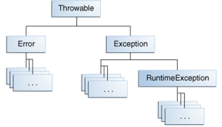

# Лекция 12. Механизм исключений в Java

**Исключение** (**exception**) - это ненормальная ситуация (термин "исключение" здесь следует понимать как "исключительная ситуация"), возникающая во время выполнения программного кода. Иными словами, исключение - это ошибка, возникающая во время выполнения программы (в runtime).

Исключение - это способ системы Java (в частности, JVM - виртуальной машины Java) сообщить вашей программе, что в коде произошла ошибка. К примеру, это может быть деление на ноль, попытка обратиться к массиву по несуществующему индексу, очень распространенная ошибка нулевого указателя (**NullPointerException**) - когда вы обращаетесь к ссылочной переменной, у которой значение равно `null` и так далее.

В любом случае, с формальной точки зрения, **Java не может продолжать выполнение программы**.

**Обработка исключений** (**exception handling**) - название объектно-ориентированной техники, которая пытается разрешить эти ошибки. Программа в Java может сгенерировать различные исключения, например:

- программа может пытаться прочитать файл из диска, но файл не существует;
- программа может попытаться записать файл на диск, но диск заполнен или не отформатирован;
- программа может попросить пользователя ввести данные, но пользователь ввел данные неверного типа;
- программа может попытаться осуществить деление на ноль;
- программа может попытаться обратиться к массиву по несуществующему индексу.

Используя подсистему обработки исключений Java, можно управлять реакцией программы на появление ошибок во время выполнения. Средства обработки исключений в том или ином виде имеются практически во всех современных языках программирования. В Java подобные инструменты отличаются большей гибкостью, понятнее и удобнее в применении по сравнению с большинством других языков программирования.

Преимущество обработки исключений заключается в том, что она предусматривает автоматическую реакцию на многие ошибки, избавляя от необходимости писать вручную соответствующий код.

## Иерархия исключений

В Java все исключения представлены отдельными классами. Все классы исключений являются потомками класса `Throwable`. Так, если в программе возникнет исключительная ситуация, будет сгенерирован объект класса, соответствующего определенному типу исключения. У класса `Throwable` имеются два непосредственных подкласса: `Exception` и `Error`.

Исключения типа `Error` относятся к ошибкам, возникающим в виртуальной машине Java, а не в прикладной программе. Контролировать такие исключения невозможно, поэтому реакция на них в приложении, как правило, не предусматривается. В связи с этим исключения данного типа не будут рассматриваться в книге.

Ошибки, связанные с работой программы, представлены отдельными подклассами, производными от класса `Exception`. В частности, к этой категории относятся ошибки деления на нуль, выхода за пределы массива и обращения к файлам. Подобные ошибки следует обрабатывать в самой программе. Важным подклассом, производным от `Exception`, является класс `RuntimeException`, который служит для представления различных видов ошибок, часто возникающих во время выполнения программ.

Каждой исключительной ситуации поставлен в соответствие некоторый класс. Если подходящего класса не существует, то он может быть создан разработчиком.

Так как в Java **ВСЁ ЯВЛЯЕТСЯ ОБЪЕКТОМ**, то исключение тоже является объектом некоторого класса, который описывает исключительную ситуацию, возникающую в определенной части программного кода.

«Обработка исключений» работает следующим образом:

- когда возникает исключительная ситуация, JVM генерирует (говорят, что JVM ВЫБРАСЫВАЕТ исключение, для описания этого процесса используется ключевое слово `throw`) объект исключения и передает его в метод, в котором произошло исключение;
- вы можете перехватить исключение (используется ключевое слово `catch`), чтобы его каким-то образом обработать. Для этого, необходимо определить специальный блок кода, который называется обработчиком исключений, этот блок будет выполнен при возникновении исключения, код должен содержать реакцию на исключительную ситуацию;
- таким образом, если возникнет ошибка, все необходимые действия по ее обработке выполнит обработчик исключений.

**Если вы не предусмотрите обработчик исключений, то исключение будет перехвачено стандартным обработчиком Java. Стандартный обработчик прекратит выполнение программы и выведет сообщение об ошибке.**

Рассмотрим пример исключения и реакцию стандартного обработчика Java

```java
public static void main(String[] args) {
    System.out.println(5 / 0);
}
```

Мы видим, что стандартный обработчик вывел в консоль сообщение об ошибке. Давайте разберемся с содержимым этого сообщения:

```
"C:\Program Files\Java\jdk1.8.0_60\bin\java"...
Exception in thread "main" java.lang.ArithmeticException: / by zero
       at ua.opu.Main.main(Main.java:6)
       at sun.reflect.NativeMethodAccessorImpl.invoke0(Native Method)
       at sun.reflect.NativeMethodAccessorImpl.invoke(NativeMethodAccessorImpl.java:62)
       at sun.reflect.DelegatingMethodAccessorImpl.invoke(DelegatingMethodAccessorImpl.java:43)
       at java.lang.reflect.Method.invoke(Method.java:497)
       at com.intellij.rt.execution.application.AppMain.main(AppMain.java:144)
Process finished with exit code 1
```

Строка

```
Exception in thread "main" java.lang.ArithmeticException: / by zero
```

сообщает нам тип исключения, а именно класс `ArithmeticException` (про классы исключений мы будем говорить позже), после чего сообщает, какая именно ошибка произошла. В нашем случае это деление на ноль.

Далее сообщается

```
at ua.opu.Main.main(Main.java:6)
```

в каком классе, методе и строке произошло исключение. Используя эту информацию, мы можем найти ту строчку кода, которая привела к исключительной ситуации, и предпринять какие-то действия. Строки

```
at ua.opu.Main.main(Main.java:6)
       at sun.reflect.NativeMethodAccessorImpl.invoke0(Native Method)
       at sun.reflect.NativeMethodAccessorImpl.invoke(NativeMethodAccessorImpl.java:62)
       at sun.reflect.DelegatingMethodAccessorImpl.invoke(DelegatingMethodAccessorImpl.java:43)
       at java.lang.reflect.Method.invoke(Method.java:497)
       at com.intellij.rt.execution.application.AppMain.main(AppMain.java:144)
```

называются **«трассировкой стека»** (**stack tracing**). О каком стеке идет речь? Речь идет о **стеке вызовов** (**call stack**). Соответственно, эти строки означают последовательность вызванных методов, начиная от метода, в котором произошло исключение, заканчивая самым первым вызванным методом.

> Для вызова методов в программе используется инструкция «call». Когда вы вызываете метод в программе, важно сохранить адрес следующей инструкции, чтобы, когда вызванный метод отработал, программа продолжила работу со следующей инструкции. Этот адрес нужно где-то хранить в памяти. Также перед вызовом необходимо сохранить аргументы функции, которые тоже необходимо где-то хранить.
Вся эта информация хранится в специальной структуре – стеке вызовов. Каждая запись в стеке вызовов называется кадром или фреймом (stack frame). 
Подробнее: https://goo.gl/TpuYbS, https://goo.gl/S50lR4, https://goo.gl/CcyKCC, https://goo.gl/0EMyvu

Таким образом, зная, какая строка привела к возникновению исключения, вы можете изменить код либо предусмотреть обработчик событий.

## Классы исключений

Как уже было сказано выше, исключение это объект некоторого класса. В Java существует разветвленная иерархия классов исключений.

В Java, класс исключения служит для описания типа исключения. Например, класс `NullPointerException` описывает исключение нулевого указателя, а `FileNotFoundException` означает исключение, когда файл, с которым пытается работать приложение, не найден. Рассмотрим иерархию классов исключений:

<p align="center">
  
</p>

На самом верхнем уровне расположен класс `Throwable`, который является базовым для всех исключений (как мы помним, JVM «выбрасывает» исключение», поэтому класс `Throwable` означает – то, что может «выбросить» JVM).

От класса `Throwable` наследуются классы `Error` и `Exception`. Среди подклассов `Exception` отдельно выделен класс `RuntimeException`, который играет важную роль в иерархии исключений.

## Виды исключений

В Java существует некоторая неопределенность насчет того – существует ли два или три вида исключений.

Если делить исключения на два вида, то это:

- **контролируемые исключения** (**checked exceptions**) – подклассы класса `Exception`, кроме подкласса `RuntimeException` и его производных;
- **неконтролируемые исключения** (**unchecked exceptions**) – класс `Error` с подклассами, а также класс `RuntimeException` и его производные;

В некоторых источниках класс `Error` и его подклассы выделяют в отдельный вид исключений - ошибки (errors).

### Класс `Error`

Классы этой ветки составляют вид исключений, который можно обозначить как «ошибки» (errors). Ошибки представляют собой серьезные проблемы, которые не следует пытаться обработать в собственной программе, поскольку они связаны с проблемами уровня JVM.

> На самом деле, вы конечно можете предпринять некоторые действия при возникновении ошибок, например, вывести сообщение для пользователя в удобном формате, выслать трассировку стека себе на почту, чтобы понять – что вообще произошло.
Но, по факту, вы ничего не можете предпринять в вашей программе, чтобы эту ошибку исправить, и ваша программа, как правило, при возникновении такой ошибки дальше работать не может.

В качестве примеров «ошибок» можно привести: 

- переполнение стека вызова (класс `StackOverflowError`); 
- нехватка памяти в куче (класс `OutOfMemoryError`), вследствие чего JVM не может выделить память под новый объект и сборщик мусора не помогает;
- ошибка виртуальной машины, вследствие которой она не может работать дальше (класс `VirtualMachineError`) и так далее.

Несмотря на то, что в нашей программе мы никак не можем помочь этой проблеме, и приложение не может работать дальше (ну как может работать приложение, если стек вызовов переполнен или JVM не может дальше выполнять код?!), знание природы этих ошибок поможет вам предпринять некоторые действия, чтобы избежать этих ошибок в дальнейшем. Например, ошибки типа `StackOverflowError` и `OutOfMemoryError` могут быть следствием вашего некорректного кода.

Попробуем спровоцировать ошибку `StackOverflowError`

```java
public class Main {

    public static void main(String[] args) {
        methodA();
    }

    public static void methodA() {
        methodA();
    }

}
```

Получим такое сообщение об ошибке

```
Exception in thread "main" java.lang.StackOverflowError
	at com.company.Main.methodA(Main.java:22)
	at com.company.Main.methodA(Main.java:22)
	at com.company.Main.methodA(Main.java:22)
	at com.company.Main.methodA(Main.java:22)
...
```

Ошибка `OutOfMemoryError` может быть вызвана тем, что ваш код, вследствие ошибки при программировании, создает очень большое количество массивных объектов, которые очень быстро заполняют кучу и свободного места не остается.

```
...
List size: 236557359
List size: 236557360
Exception in thread "main" java.lang.OutOfMemoryError: Java heap space
	at java.base/java.util.Arrays.copyOf(Arrays.java:3511)
	at java.base/java.util.Arrays.copyOf(Arrays.java:3480)
	at java.base/java.util.ArrayList.grow(ArrayList.java:237)
	at java.base/java.util.ArrayList.grow(ArrayList.java:244)
	at java.base/java.util.ArrayList.add(ArrayList.java:454)
	at java.base/java.util.ArrayList.add(ArrayList.java:467)
	at com.company.Main.main(Main.java:13)

Process finished with exit code 1
```

Ошибка `VirtualMachineError` может означать, что следует переустановить библиотеки Java.

В любом случае, следует относиться к типу `Error` не как к неизбежному злу и «воле богов», а просто как к сигналу к тому, что в вашем приложении что-то не так, или что-то не так с программным или аппаратным обеспечением, которое вы используете.

> Справочник по исключениям типа `Error` смотрите [здесь](https://www.tutorialspoint.com/java/lang/java_lang_errors.htm)

### Класс Exception

Класс `Exception` описывает исключения, связанные непосредственно с работой программы. Такого рода исключения «решаемы» и их грамотная обработка позволит программе работать дальше в нормальном режиме.

В классе `Exception` описаны исключения двух видов: **контролируемые исключения** (checked exceptions) и **неконтролируемые исключения** (unchecked exceptions).

Неконтролируемые исключения содержатся в подклассе `RuntimeException` и его наследниках. Контролируемые исключения содержатся в остальных подклассах `Exception`.

В чем разница между контролируемыми и неконтролируемыми исключениями, мы узнаем позже, а теперь рассмотрим вопрос – а как же именно нам обрабатывать исключения?

## Обработка исключений

Обработка исключений в методе может выполняться двумя способами:

- с помощью механизма `try-catch`;
- с помощью ключевого слова `throws` в сигнатуре метода.

Рассмотрим оба метода поподробнее.

### Способ 1. Механизм try-catch

Этот способ кратко можно описать следующим образом: код, который теоретически может вызвать исключение, записывается в блоке `try{}`. Сразу за блоком `try` идет блок код `catch{}`, в котором содержится код, который будет выполнен в случае генерации исключения. В блоке `finally{}` содержится код, который будет выполнен в любом случае – произошло ли исключение или нет.

Теперь разберемся с этим способом более подробно. Рассмотрим следующий пример – программу, которая складывает два числа, введенные пользователем из консоли

```java
Scanner scanner = new Scanner(System.in);

System.out.println("Введите первое число: ");
String firstNumber = scanner.nextLine();

System.out.println("Введите второе число: ");
String secondNumber = scanner.nextLine();

int a = 0;
int b = 0;

a = Integer.parseInt(firstNumber);
b = Integer.parseInt(secondNumber);

System.out.println("Результат: " + (a + b));
```

Первое, что нам нужно определить – и что является главным при работе с исключениями, **какая инструкция может привести к возникновению исключения?**

То есть, мы должны понять – где потенциально у нас может возникнуть исключение? Понятно, что речь идет не об операции сложения и не об операции чтения данных из консоли. Потенциально опасными строчками кода здесь являются инструкции

```java
a = Integer.parseInt(firstNumber);
b = Integer.parseInt(secondNumber);
```

в которых происходит преобразование ввода пользователя в целое число (метод `parseInt()` преобразует цифры в строке в число).

Почему здесь может возникнуть исключение? Потому что пользователь может ввести не число, а просто какой-то текст и тогда непонятно – что записывать в переменную `a` или `b`. И да, действительно, если пользователь введет некорректное значение, возникнет исключение в методе `Integer.parseInt()`.

Итак, что мы можем сделать. «Опасный код» нужно поместить в блок `try{}`
Обратите внимание на синтаксис блока `try`. В самом простом случае это просто ключевое слово `try`, после которого идут парные фигурные скобки. Внутри этих скобок и заключается «опасный» код, который может вызвать исключение. Сразу после блока `try` должен идти блок `catch()`.

```java
...
int a = 0;
int b = 0;

try {
    a = Integer.parseInt(firstNumber);
    b = Integer.parseInt(secondNumber);
} catch (NumberFormatException e) {
    // сохранить текст ошибки в лог
    System.out.println("Одно или оба значения некорректны!");
}

System.out.println("Результат: " + (a + b));
```

Обратите внимание на синтаксис блока `catch`. После ключевого слова, в скобках описывается аргумент с именем e типа `NumberFormatException`.

Когда произойдет исключение, то система Java прервет выполнение инструкций в блоке `try` и передаст управление блоку `catch` и запишет в этот аргумент объект исключения, который сгенерировала Java-машина.

Важно понять, что как только в блоке `try` возникнет исключение, то дальше инструкции в блоке `try` выполняться не будут! А сразу же начнут выполняться действия в блоке `catch`.

Обработчик исключения находится в блоке `catch`, в котором мы можем отреагировать на возникновение исключения. Также, в этом блоке нам будет доступен объект исключения, от которого мы можем получить дополнительные сведения об исключении.

Блок `catch` сработает только в том случае, если указанный в скобках тип объекта исключения будет суперклассом или будет того же типа, что и объект исключения, который сгенерировала Java.

Например, если в нашем примере мы напишем код, который потенциально может выбросить исключение типа `IOException`, но не изменим блок `catch`, то обработчик не будет вызван и исключение будет обработано стандартным обработчиком Java.

### Способ 2. Использование ключевого слова throws

Второй способ позволяет передать обязанность обработки исключения тому методу, который вызывает данный метод (а тот, в свою очередь может передать эту обязанность выше и так далее).

Изменим наш пример и выделим в отдельный метод код, который будет запрашивать у пользователя число и возвращать его как результат работы метода

```java
int a = getNumberFromConsole("Введите первое число");
int b = getNumberFromConsole("Введите второе число");

System.out.println("Результат: " + (a + b));

...

public int getNumberFromConsole(String message) {
       Scanner scanner = new Scanner(System.in);
       System.out.print(message + ": ");
       String s = scanner.nextLine();

       return Integer.parseInt(s);
}
```

Мы понимаем, что в данном методе может произойти исключение, но мы не хотим или не можем его обработать. Причины могут быть разными, например:

- обработка исключений может происходить централизованно однотипным способом (например, показ окошка с сообщением и с определенным текстом);
- это не входит в нашу компетенцию как программиста – обработкой исключений занимается другой программист;
- мы пишем только некоторую часть программы и непонятно – как будет обрабатывать исключение другой программист, который потом будет использовать наш код (например, мы пишем просто какую-то библиотеку, которая производит вычисления, и как будет выглядеть обработка – это не наше дело).

В любом случае, мы знаем, что в этом коде может быть исключение, но мы не хотим его обрабатывать, а хотим просто предупредить другой метод, который будет вызывать наш код, что выполнение кода может привести к исключению. В этом случае, используется ключевое слово `throws`, которое указывается в сигнатуре метода

```java
public static int getNumberFromConsole(String message) throws NumberFormatException {
    Scanner scanner = new Scanner(System.in);
    System.out.print(message + ": ");
    String s = scanner.nextLine();

    return Integer.parseInt(s);
}
```

Обратите внимание на сигнатуру метода. Мы привыкли, что при объявлении метода сразу после скобок входных аргументов мы открываем фигурную скобку и записываем тело метода.

Здесь же, после входных аргументов, мы пишем ключевое слово `throws` и потом указываем тип исключения, которое может быть сгенерировано в нашем методе. Если метод может выбрасывать несколько типов исключений, они записываются через запятую

```java
public void foo() throws NumberFormatException, ArithmeticException, IOException {
    
}
```

Тогда наш код будет выглядеть следующим образом

```java
public static void main(String[] args) {

    int a = 0;
    int b = 0;

    try {
        a = getNumberFromConsole("Введите первое число");
        b = getNumberFromConsole("Введите второе число");
    } catch (NumberFormatException e) {
        // сохранить текст ошибки в лог
        System.out.println("Одно или оба значения некорректны!");
    }

    System.out.println("Результат: " + (a + b));
}
```

Основное преимущество этого подхода – **мы передаем обязанность по обработке исключений другому, вышестоящему методу**.

## Отличия между контролируемыми и неконтролируемыми исключениями

Если вы вызываете метод, который выбрасывает checked исключение, то вы ОБЯЗАНЫ предусмотреть обработку возможного исключения, то есть связку `try-catch`.

Яркий пример checked исключения – класс `IOException` и его подклассы.
Рассмотрим пример – попробуем прочитать файл и построчно вывести его содержимое на экран консоли:

```java
public static void main(String[] args) {
    Path p = Paths.get("c:\\temp\\file.txt");

    BufferedReader reader = Files.newBufferedReader(p);

    String line;
    while ((line = reader.readLine()) != null) {
        System.out.println(line);
    }
}
```

Как мы видим, компилятор не хочет компилировать наш код. Чем же он недоволен? У нас в коде происходит вызов двух методов – статического метода `Files.newBufferedReader()` и обычного метода `BufferedReader.readLine()`.

Если посмотреть на сигнатуры этих методов то можно увидеть, что оба этих метода выбрасывают исключения типа `IOException`. Этот тип исключения относится к checked-исключению и поэтому, если вы вызываете эти методы, компилятор **ТРЕБУЕТ** от вас предусмотреть блок `catch`, либо в самом вашем методе указать `throws IOException` и, таким образом, передать обязанность обрабатывать исключение другому методу, который будет вызывать ваш.

Таким образом, «оборачиваем» наш код в блок `try` и пишем блок `catch`

```java
public static void main(String[] args) {
    try {
        Path p = Paths.get("c:\\temp\\file.txt");

        BufferedReader reader = Files.newBufferedReader(p);

        String line;
        while ((line = reader.readLine()) != null) {
            System.out.println(line);
        }
    } catch (IOException e) {
        // запись ошибки в лог
        System.out.println("Ошибка при чтении файла!");
    }
}
```

Еще один способ - указать в сигнатуре метода, что он выбрасывает исключение типа `IOException` и переложить обязанность обработать ошибку в вызывающем коде

```java
public static void main(String[] args) {
    Path p = Paths.get("c:\\temp\\file.txt");

    try {
        printFile(p);
    } catch (IOException e) {

        // запись ошибки в лог
        System.out.println("Ошибка при чтении файла!");
    }
}

public static void printFile(Path p) throws IOException {
    BufferedReader reader = Files.newBufferedReader(p);

    String line;
    while ((line = reader.readLine()) != null) {
        System.out.println(line);
    }
}
```

Eсли метод выбрасывает checked-исключение, то проверка на наличие `catch`-блока происходит на этапе компиляции. И вы обязаны предусмотреть обработку исключения для checked-исключения.

### Зачем необходимо наличие двух видов исключений?

В большинстве языков существует всего лишь один тип исключений – unchecked. Некоторые языки, например, C#, в свое время отказались от checked-исключений.
Во-первых, мы не можем сделать все исключения checked, т.к. очень многие операции могут генерировать исключения, и если каждый такой участок кода «оборачивать» в блок `try-catch`, то код получится слишком громоздким и нечитабельным.

С другой стороны, зачем нужно делать некоторые типы исключений checked? Почему просто не сделать все исключения unchecked и оставить решения об обработке исключений целиком на совести программиста?

В официальной документации написано, что unchecked-исключения – это те исключения, от которых программа «не может восстановиться», тогда как checked-исключения позволяют откатить некоторую операцию и повторить ее снова.

На самом деле, если вы посмотрите на различные типы unchecked-исключений, то вы увидите, что большинство их связаны с ошибками самого программиста. Выход за пределы массива, исключение нулевого указателя, деление на ноль – большинство из подобного рода исключений целиком лежат на совести программистов. Тогда мы можем сказать, что лучше программист пишет более хороший код, чем  везде вставляет проверки на исключения.

Контролируемые исключения, как правило, представляют те ошибки, которые возникают не из-за программиста и предусмотреть которые программист не может. Например, это отсутствующие файлы, работа с сокетами, подключение к базе данных, сетевые соединения, некорректный пользовательский ввод.

Вы можете написать идеальный код, но потом вы отдадите приложение пользователю, а он введет название файла, которого нет или напишет неправильный IP для сокет-соединения. Таким образом, мы заранее должны быть готовыми к неверным действиям пользователя или к программным или аппаратным проблемам на его стороне и в обязательном порядке предусмотреть обработку возможных исключений.

## Дополнительно об исключениях

Рассмотрим детально различные возможности механизма исключений, которые позволяют программисту максимально эффективно противодействовать исключениям.

### Несколько блоков `catch`

Java позволяет вам для одного блока `try` предусмотреть несколько блоков `catch`, каждый из которых должен обрабатывать свой тип исключения

```java
public static void foo() {

    try {
        // some action
    } catch (ArithmeticException e) {
        // обработка арифметического исключения
    } catch (IndexOutOfBoundsException e) {
        // обработка выхода за пределы коллекции
    } catch (IllegalArgumentException e) {
        // обработка некорректного аргумента
    }
}
```

Важно помнить, что Java обрабатывает исключения последовательно. Java просматривает блок `catch` сверху вниз и выполняет первый подходящий блок, который может обработать данное исключение.

Так как вы можете указать как точный класс, так и суперкласс, то если первым блоком будет блок для суперкласса – выполнится он. Например, исключение `FileNotFoundException` является подклассом `IOException`. И поэтому если вы первым поставите блок с `IOException` – он будет вызываться для всех подтипов исключений, в том числе и для `FileNotFoundException` и блок c `FileNotFoundException` никогда не выполнится.

```java
public static void main(String[] args) {
    Path p = Paths.get("c:\\temp\\file.txt");

    try {
        printFile(p);
    } catch (IOException e) {
        // запись ошибки в лог
        System.out.println("Ошибка при чтении файла!");
    } catch (FileNotFoundException e) {
        // данный блок никогда не будет вызван
    }
}

public static void printFile(Path p) throws IOException {
    BufferedReader reader = Files.newBufferedReader(p);

    String line;
    while ((line = reader.readLine()) != null) {
        System.out.println(line);
    }
}
```

### Один блок для обработки нескольких типов исключений

Начиная с версии Java 7, вы можете использовать один блок `catch` для обработки исключений нескольких, не связанных друг с другом типов. Приведем пример

```java
public static void foo() {

    try {
        // some action
    } catch (ArithmeticException | IllegalArgumentException | IndexOutOfBoundsException e) {
        // три типа исключений обрабатываются одинаково
    }

}
```

Как мы видим, один блок `catch` используется для обработки и типа `IOException` и `NullPointerException` и `NumberFormaException`.

### Вложенные блоки `try`

Вы можете использовать вложенные блоки `try`, которые могут помещаться в других блоках `try`. После вложенного блока `try` обязательно идет блок `catch`

```java
public static void foo() {
    try {
        // some action
        try {
            // some action
        } catch (IllegalArgumentException e) {
            // обработка вложенного блока try
        }
    } catch (ArithmeticException e) {
        // обработка исключения
    }
}
```

### Выбрасывание исключения с помощью ключевого слова `throw`

С помощью ключевого слова `throw` вы можете преднамеренно «выбросить» определенный тип исключения.

### Блок `finally`

Кроме блока `try` и `catch` существует специальный блок `finally`. Его отличительная особенность – он гарантированно отработает, вне зависимости от того, будет выброшено исключение в блоке `try` или нет. Как правило, блок `finally` используется для того, чтобы выполнить некоторые "завершающие" операции, которые могли быть инициированы в блоке `try`.

```java
public static void foo(int a) {
    FileOutputStream fout = null;
    try {
        File file = new File("file.txt");
        file.createNewFile();
        fout = new FileOutputStream(file);
    } catch (IOException e) {
        // обработка исключения при записи в файл
    } finally {
        try {
            fout.close();
        } catch (IOException e) {
            e.printStackTrace();
        }
    }
}
```

При любом развитии события в блоке `try`, код в блоке `finally` отработает в любом случае.

Блок `finally` отработает, даже если в `try-catch` присутствует оператор `return`.

Как правило, блок `finally` используется, когда мы в блоке `try` работаем с ресурсами (файлы, базы данных, сокеты и так далее), когда по окончании блока `try-catch` мы освобождаем ресурсы. Например, допустим, в процессе работы программы возникло исключение, требующее ее преждевременного закрытия. Но в программе открыт файл или установлено сетевое соединение, а, следовательно, файл нужно закрыть, а соединение – разорвать. Для этого удобно использовать блок `finally`.

### Блок `try-with-resources`

Блок `try-with-resources` является модификацией блока `try`. Данный блок позволяет автоматически закрывать ресурс после окончания работы блока `try` и является удобной альтернативой блоку `finally`.

```java
public static void foo() {
    Path p = Paths.get("c:\\temp\\file.txt");
    try (BufferedReader reader = Files.newBufferedReader(p)) {
        String line;
        while ((line = reader.readLine()) != null)
            System.out.println(line);
    } catch (IOException e) {
        // обработка исключения
    }
}
```

Внутри скобок блока `try` объявляется один или несколько ресурсов, которые после отработки блока `try-catch` будут автоматически освобождены. Для этого объект ресурса должен реализовывать интерфейс `java.lang.AutoCloseable`.

### Создание собственных подклассов исключений

Встроенные в Java исключения позволяют обрабатывать большинство распространенных ошибок. Тем не менее, вы можете создавать и обрабатывать собственные типы исключений. Для того, чтобы создать класс собственного исключения, достаточно определить как его произвольный от `Exception` или от `RuntimeException` (в зависимости от того, хотите ли вы использовать checked или unchecked – исключения).

Насчет создания рекомендуется придерживаться двух правил:

- определитесь, исключения какого типа вы хотите использовать для собственных исключений (checked или unchecked) и старайтесь создавать исключения только этого типа;
- старайтесь максимально использовать стандартные типы исключений и создавать свои типы только в том случае, если существующие типы исключений не отражают суть того исключения, которое вы хотите добавить.

### Плохие практики при обработке исключений

Ниже представлены действия по обработке ошибок, которые характерны для плохого программиста. Ни в коем случае не рекомендуется их повторять!

- указание в блоке `catch` объекта исключения типа `Exception`. Существует очень большой соблазн при создании блока `catch` указать тип исключения `Exception` и, таким образом, перехватывать все исключения, которые относятся к этому классу (а это все исключения, кроме системных ошибок). Делать так крайне не рекомендуется, т.к. вместо того чтобы решать проблему с исключениями, мы фактически игнорируем ее и просто реализуем некоторую «заглушку», чтобы приложение продолжило работу дальше. Кроме того, каждый тип исключения должен быть обработан своим определенным образом;
- помещение в блок `try` всего тела метода. Следующий плохой прием используется, когда программист не хочет разбираться с кодом, который вызывает исключение и просто, опять же, реализует «заглушку». Этот прием очень "хорошо" сочетается с первым приемом. В блок `try` должен помещаться только тот код, который потенциально может вызвать исключение, а не всё подряд, т.к. лень обрабатывать исключения нормально;
- игнорирование исключения. Следующий плохой прием состоит в том, что мы просто игнорируем исключение и оставляем блок `catch` пустым. Программа должна реагировать на исключения и должна информировать пользователя и разработчика о том, что что-то пошло не так. Безусловно, исключение это не повод тут же закрывать приложение, а попытаться повторить то действие, которое привело к исключению (например, повторно указать название файла, попытаться открыть базу данных через время и так далее). В любом случае, когда приложение в ответ на ошибку никак не реагирует – не выдает сообщение, но и не делает того, чего от нее ожидали – это самый плохой вариант.
