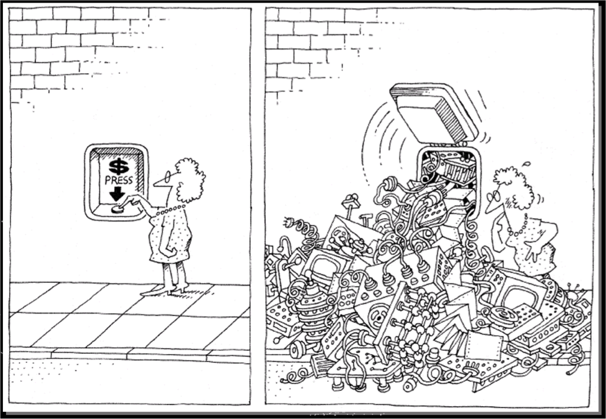
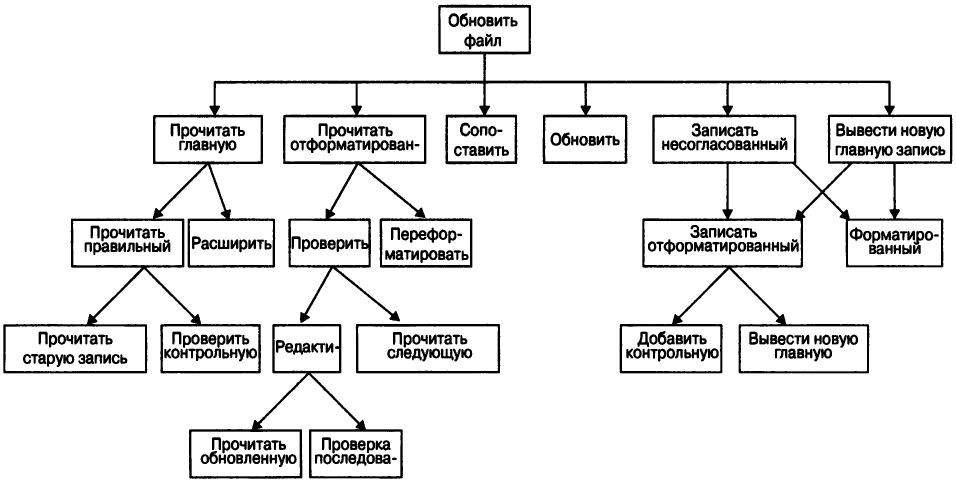
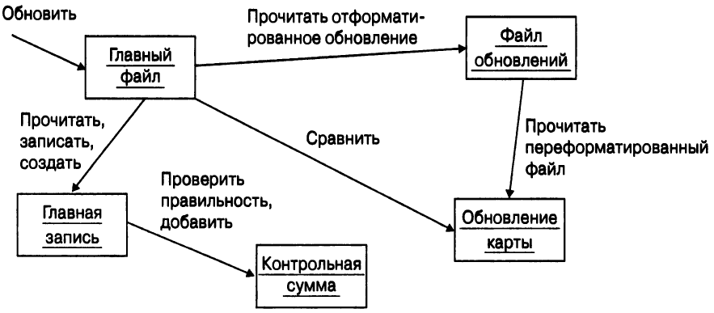

# Базові відомості про OOП

## Складність програмного забезпечення

> Перший ж дятел зруйнував би цивілізацію, якби будівельники будували будинки так само, як програмісти пишуть програми
(c) Другий закон Вайнберга

Однією з головних проблем у розробці програмного забезпечення є складність програм. Цей виклик іноді називають "кризою програмного забезпечення".

Не все програмне забезпечення є складним, існує велика кількість "простих" програм, які розробляються та підтримуються однією людиною. Такі програми, як правило, мають дуже обмежену функціональність і використовуються протягом короткого періоду часу. Із написанням таких програм немає проблем, тому ви можете використовувати майже будь-які мови програмування, технології та методи розробки програмних продуктів для їх написання.

Найбільші проблеми виникають у розробці *корпоративного програмного забезпечення* (*enterprise software*). Такі системи використовуються досить давно (роки та десятиліття), і тисячі і навіть мільйони людей залежать від правильної роботи. Це може бути, наприклад, системи управління повітряним транспортом, залізничний транспорт, банківські системи, комунальні системи, онлайн-ігри, популярні веб-сайти та веб-сервіси тощо.

Найважливішою особливістю корпоративної програми є її висока складність. Один програміст не може вирішити всі проблеми, пов'язані з конструкцією такої системи. Грубо кажучи, складність промислових програм перевищує інтелектуальні можливості окремої людини.

> Деякі експерти вважають, що популярні операційні системи - це найскладніша техногенна система, яку людство коли-небудь створювало.

  

З моменту появи області розробки програмного забезпечення людство накопичило достатньо знань для розробки навіть найскладніших програмних систем, але ми все ще стикаємося з величезною кількістю проблем. У чому ж справа?

Аналізуючи складні системи, ми знаходимо багато компонентів, які взаємодіють один з одним різними досить заплутаними способами, а частини та методи їх взаємодії можуть бути абсолютно різними. 

Розробляючи та організовуючи складні системи, розробнику потрібно багато думати про відразу про багато речей. Наприклад, система управління повітряним транспортном повинна одночасно контролювати стан багатьох літальних апаратів, враховуючи, наприклад, їх розташування, швидкість та курс. На жаль, одна людина не може висвітлювати всі ці деталі одночасно.
Таким чином, у нас є проблема зі складністю - програмне забезпечення стає все складнішим, а можливість впоратися з цією складністю залишається обмеженою. Як вирішити цю проблему?

## Декомпозиція програмних систем

Один із способів впоратися зі складністю програмних систем - це **декомпозиція**. При розробці складного програмного забезпечення необхідно розділити його на все менші частини, кожну з яких можна обробити незалежно одну від одної. Таким чином, замість того, щоб працювати над усією програмною системою, ми будемо працювати з її індивідуальними частинами.

Одним із методів декомпозиції є алгоритмічна декомпозиція (ви зіткнулися з цим типом декомпозиції в перший рік, коли ви вивчали дисципліну "Алгоритмізація та програмування"). Алгоритмічна декомпозиція виконується методом "зверху вниз", де кожна система системи виконує один із етапів загального процесу. На рисунку нижче показана частина програми, яка оновлює вміст основного файлу.

  

Інший тип декомпозиції - це об'єктно-орієнтована декомпозиція, яка вам досі невідома.

Використовуючи цей тип декомпозиції, замість того, щоб ділити систему на етапи, наприклад, "Прочитайте відформатоване оновлення" та "Додати контрольну суму", ми визначаємо об'єкти, такі як "Основний файл" та "Контрольная сума", які створюються при аналізі предметної області. На рисунку нижче показаний приклад об'єктно-орієнтованої декомпозиції для однієї частини програми.

  

У випадку об'єктно-орієнтованої декомпозиції світ - це сукупність автономних агентів, які взаємодіють між собою та забезпечують більш складну поведінку системи. Дія "Прочитайте відформатоване оновлення" вже не є незалежним алгоритмом, ця дія представляє собою операцію, що пов'язана з об'єктом "Файл оновлення". В результаті реалізації цієї операції виникає інший об'єкт - "оновлення карти". Таким чином, кожен об'єкт у такій схемі реалізує власну поведінку, і кожен з них моделює певний об'єкт реального світу.

З цієї точки зору об'єкт є матеріальною сутністю з певною поведінкою. Отримуючи повідомлення, об'єкти виконують певні операції. Така композиція заснована на об'єктах, тому вона називається об'єктно-орієнтованою.

То *який метод декомпозиції необхідно використовувати*? Неможливо використовувати обидва методи одночасно - по-перше, декомпозицію слід виконувати або відповідно до алгоритмів, або об'єктів.

Багаторічний досвід роботи в розробниках програмного забезпечення чітко показує, що **об'єктно-орієнтована декомпозиція має багато надзвичайно важливих переваг перед алгоритмічною**. Декомпозиція повинна починатися з об'єктів, оскільки вона полегшує впорядкування складних систем, таких як програмне забезпечення, комп'ютери, заводи, галактики та великі державні установи.

**Переваги об'єктно-орієнтованої декомпозиції:**

- Розмір систем зменшується за рахунок повторного використання спільних механізмів;
- об'єктно-орієнтовані системи є більш гнучкими і простіше змінюються з часом;
- ризик, який виникає при створенні складної програмної системи, зменшується;
- Об'єктно-орієнтоване розкладання дозволяє краще впоратися зі складністю, характерною для програмних систем.