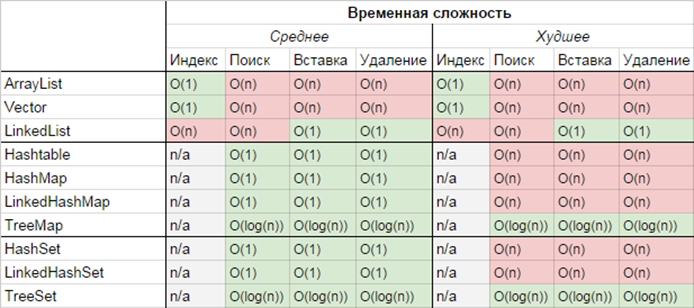

# Лекция 10. Коллекции. Множества и отображения

## Интерфейс `Set`

Множество (`Set`) представляет собой коллекцию объектов, в которой не допускаются дубликаты. Во множестве не могут присутствовать две ссылки на один и тот же объект, две ссылки на пустой элемент `null` или же ссылки вроде `a.equals(b)` на два объекта `a` и `b`.

Хотя в большинстве универсальных реализаций интерфейса `Set` не накладывается никаких ограничений на упорядочение элементов множества, упорядоченные множества все же запрещены. Кроме того, множества отличаются от упорядоченных коллекций вроде списков в основном тем, что у них имеется эффективный метод `contains()`, выполняющийся в течение постоянного или логарифмического времени.

В интерфейсе `Set` не определяются дополнительные методы, помимо тех,
которые определены в интерфейсе `Collection`, но в нем накладываются дополнительные ограничения на эти методы. Так, в методах `add()` и `addAll()` должно соблюдаться следующее ограничение на дубликаты, накладываемое в интерфейсе `Set`: эти методы не могут вводить элемент в множество типа `Set`, если оно уже содержит такой элемент. Напомним, что методы `add()` и `addAll()` определены в интерфейсе `Collection` и возвращают логическое значение `true`, если в результате их вызова изменяется коллекция, а иначе - логическое значение `false`. Это возвращаемое значение уместно для объектов типа `Set` потому, что ограничение на отсутствие дубликатов в множестве означает, что ввод элемента далеко не всегда приводит к изменению множества.

```java
Set<String> set;
```

Интерфейс `Set` не добавляет никакой функциональности по сравнению с интерфейсом `Collection`, поэтому в `Set` нет дополнительный функциональности. Вместо этого `Set` представляет собой разновидность `Collection`.

В таблице ниже перечислены реализации интерфейса `Set` и указаны их особенности. Следует отметить, что класс `CopyOnWriteArraySet` находится в пакете `java.util.concurrent`, а все остальные классы, реализующие множества - в пакете `java.util`.

|Класс|Внутреннее представление|Порядок элементов|Ограничение на членство|Основные операции|Производительность при обхода|Примечание|
|---|---|---|---|---|---|---|
|`HashSet`|Хеш-таблица|Отсутствует|Отсутствуют|$O(1)$|$O(емкость)$|Наилучшая универсальная реализация
|`LinkedHashSet`|Связанная хеш-таблица|Порядок вставки|Отсутствуют|$O(1)$|$O(n)$|Сохраняет порядок вставки
|`EnumSet`|Битовые поля|Объявление перечисления|Перечислимые значения|$O(1)$|$O(n)$|Хранит непустые перечислимые значения
|`TreeSet`|Красно-черное дерево|Сортировка по нарастающей|Сравнение|$O(log(n))$|$O(n)$|Элементы типа `Comparable` или `Comparator`
|`CopyOnWriteArraySet`|Массив|Порядок вставки|Отсутствуют|$O(n)$|$O(n)$|Потокобезопасный без синхронизированных методов

### Интерфейс SortedSet

Интерфейс `SortedSet` расширяет интерфейс `Set` и определяет поведение множеств, отсортированных в порядке возрастания. Интерфейс `SortedSet` является обобщенным.

```java
interface SortedSet<E>
```

Помимо методов, предоставляемых интерфейсом `Set`, в интерфейсе `SortedSet` объявляются методы, упрощающие обработку элементов множеств. Чтобы получить первый элемент в отсортированном множестве, достаточно вызвать метод `first()`, а чтобы получить последний элемент - метод `last()`. Из отсортированного множества можно получить подмножество вызвав метод `subSet()` и указав первый и последний элемент множества. Если требуется получить подмножество, которое начинается с первого элемента существующего множества, следует вызвать метод `headSet()`. А если требуется получить подмножество, которое начинается с последнего элемента существующего множества, следует вызвать метод `tailSet()`.

### Интерфейс `NavigableSet`

Этот интерфейс расширяет интерфейс `SortedSet` и определяет поведение коллекции, извлечение элементов из который осуществляется на основании наиболее точного совпадения с заданным значением или несколькими значениями. Интерфейс `NavigableSet` является обобщенным и объявляется следующим образом

```java
interface NavigableSet<E>
```

В этом интерфейсе появились методы, которые ищут в рамках отсортированного списка элемент, меньше всего отличающийся от заданного значения (в большую или меньшую сторону). Данный интерфейс можно легко реализовать при помощи таких методик, как **список с пропусками**, благодаря которым повышается скорость поиска упорядоченных элементов.

Например, метод `ceiling(E e)` выполняет поиск во множестве наименьшего элемента `e` по критерию `e >= объект`. Если такой элемент найден, он возвращается, а иначе - пустое значение `null`. Метод `floor(E e)` выполняет поиск во множестве наибольшего элемента `e` по критерию `e <= объект`. Если такой элемент найден, он возвращается, а иначе - пустое значение `null`. Подобным образом работают методы `higher()` и `lower()`, но неравенства строгие.

### Класс `HashSet`

Класс `HashSet` расширяет класс `AbstractSet` и реализует интерфейс `Set`. Он служит для создания коллекции, где для хранения элементов используется хеш-таблица. Класс `HashSet` является обобщенным.

```java
class HashSet<E>
```

Хеш-таблица хранит информацию, используя так называемый механизм хеширования, в котором содержимое ключа используется для определения уникального значения, называемого хеш-кодом. Хеш-код затем применяется в качестве индекса, с которым ассоциируются данные, доступные по этому ключу. Преобразование ключа в хеш-код выполняется автоматически - вы никогда не узнаете самого хеш-кода. Также ваш код не может напрямую индексировать хеш-таблицу.

```java
HashSet<String> hs = new HashSet<>();
hs.add("Альфа");
hs.add("Бета");
hs.add("Гамма");
hs.add("Дельта");

System.out.println(hs);

// Будет выведено [Альфа, Гамма, Дельта, Бета]
```

:warning:**Выгода от хеширования состоит в том, что оно обеспечивает константное время выполнения методов `add()`, `contains()`, `remove()` и `size()`, даже для больших объемов данных.**:warning:

Если вы хотите использовать `HashSet` для хранения объектов собственных пользовательских классов, то вы **ДОЛЖНЫ** переопределить методы `hashCode()` и `equals()`, иначе два логически-одинаковых объекта будут считаться разными, так как при добавлении элемента в коллекцию будет вызываться метод `hashCode()` класса `Object` (который вернет разный хеш-код для двух логически одинаковых объектов).

В классе HashSet не определятся никаких дополнительных методов, помимо тех, что предоставляют его суперклассы и интерфейсы. Также важно отметить, что класс `HashSet` не гарантирует упорядоченности элементов, поскольку процесс хеширования сам по себе обычно не порождает сортированных наборов. Если вам нужны сортированные наборы, то лучшим выбором может быть класс `TreeSet`.

### Класс LinkedHashSet

Класс `LinkedHashSet` расширяет класс `HashSet`, не добавляя никаких новых методов. Этот класс является обобщенным.

```java
class LinkedHashSet<E>
```

В классе `LinkedHashSet` поддерживается связный список элементов хеш-множества в том порядке, в каком они введены в него. Это позволяет организовать итерацию с вводом элементов в определенном порядке. Следовательно, когда перебор элементов хеш-множества типа `LinkedHashSet` производится с помощью итератора, элементы извлекаются из этого множества в том порядке, в котором они были введены. Именно в этом порядке они будут также возвращены методом `toString()`, вызываемым для объекта типа `LinkedHashSet`.

```java
LinkedHashSet<String> hs = new LinkedHashSet<>();
hs.add("Альфа");
hs.add("Бета");
hs.add("Гамма");
hs.add("Дельта");

System.out.println(hs);

// Будет выведено [Альфа, Бета, Гамма, Дельта]
```

### Класс `TreeSet`

Класс `TreeSet` расширяет класс `AbstractSet` и реализует интерфейс `NavigableSet`. Он создает коллекцию, где для хранения элементов применяется древовидная структура (сбалансированное красно-черное дерево). Объекты сохраняются в отсортированном порядке по нарастающей. Время доступа и извлечения элементов достаточно мало, благодаря чему класс `TreeSet` оказывается отличным выбором для хранения больших объемов отсортированных данных, которые должны быть найдены. Класс `TreeSet` является обобщенным классом.

```java
class TreeSet<E>
```

:warning:**Для операций `add()`, `remove()`, `contains()` потребуется гарантированное время `log(n)`.**:warning:

```java
TreeSet<String> ts = new TreeSet<>();
ts.add("C");
ts.add("A");
ts.add("B");
ts.add("E");
ts.add("F");
ts.add("D");

System.out.println(ts);

// Будет выведено [A, B, C, D, E, F]
```

Поскольку `TreeSet` реализует интерфейс `NavigableSet`, мы можем использовать методы описанные в этом интерфейсе.

```java
TreeSet<String> ts = new TreeSet<>();
ts.add("C");
ts.add("A");
ts.add("B");
ts.add("E");
ts.add("F");
ts.add("D");

// Будет выведено [B, C, D]
System.out.println(ts.subSet("B", "E"));

// Будет выведено C
System.out.println(ts.higher("B"));
```

## Интерфейс `Map`

Интерфейс `Map` (отображение) описывает коллекцию, состоящую из пар "ключ-значение". У каждого ключа только одно значение, что соответствует математическому понятию однозначной функции или отображения. Такую коллекцию часто называют **словарем** (dictionary) или **ассоциативным массивом** (associative array). Несмотря на то, что интерфейс `Map` входит в список коллекций Java, он не расширяет интерфейс `Collection`.

```java
Map<K, V> map;
```

Здесь в качестве `K` указывается тип ключа, а в качестве `V` - тип значения.

Хотя интерфейс `Map` и считается коллекцией, его тип не происходит от `Collection` (`Map` не наследует интерфейс `Collection`). Одна из причин - для отображения нельзя добавить один итератор, так как для набора ключей и значений нужен отдельный итератор.

Рассмотрим основные методы, объявленные в интерфейсе `Map`.

К самым важным методам в интерфейсе `Map` относится метод `put()`, где определяется пара "ключ - значение" в отображении; метод `get()`, где запрашивается значение, связанное с указанным ключом, а также метод `remove()`, где из отображения удаляется указанный ключ и связанное с ним значение.

Важные особенности `Map`:

- интерфейс `Map` не является коллекцией типа `Collection`;
- ключи из коллекции типа `Map` могут быть представлены как множество типа `Set`;
- значения из коллекции типа `Map` могут быть представлены как коллекция типа `Collection`;
- отображения могут быть представлены как множество типа `Set` объектов типа `Map.Entry`.

|Класс|Внутреннее представление|Пустые ключи|Пустые значения|Примечания|
|---|---|---|---|---|
|`HashMap`|Хеш-таблица|Да|Да|Универсальная реализация|
|`ConcurrentHashMap`|Хеш-таблица|Нет|Нет|Универсальная потокобезопасная реализация (интерфейс `ConcurrentMap`|
|`ConcurrentSkipListMap`|Хеш-таблица|Нет|Нет|Специальная потокобезопасная реализация (интерфейс `ConcurrentNavigableMap`)|
|`EnumMap`|Массив|Нет|Да|Ключи являются экземплярами перечислений|
|`LinkedHashMap`|Хеш-таблица плюс список|Да|Да|Сохраняет порядок вставки или доступа|
|`TreeMap`|Красно-черное дерево|Нет|Да|Выполняет сортировку по значению ключа. Производительность операций $O(log(n))$|
|`IdentityHashMap`|Хеш-таблица|Да|Да|Выполняет сравнение с помощью операции `==`, а не метода `equals()`|
|`WeakHashMap`|Хеш-таблица|Да|Да|Не препятствует сборке ключей в "мусор"|
|`HashTable`|Хеш-таблица|Нет|Нет|Устаревший класс, не рекомендуется для применения|
|`Properties`|Хеш-таблица|Нет|Нет|Расширяет класс `HashTable` методами из класса `String`|

### Интерфейс `Map.Entry`

Этот интерфейс позволяет обращаться с отдельными записями в отображении. Напомним, что метод `entrySet()`, объявляемый в интерфейсе `Map`, возвращает множество типа `Set`, содержащее записи из отображения. Каждый элемент этого множества представляет собой объект типа `Map.Entry`. Интерфейс `Map.Entry` является обобщенным и объявляется следующим образом:

где `K` обозначает тип ключей, а `V` - тип хранимых в отображении значений.

### Интерфейсы `SortedMap`, `NavigableMap` и `ConcurrentMap`

У ассоциативного массива `Map` есть дочерний интерфейс `SortedMap`, который поддерживает элементы в определенном порядке, исходя из значений ключей. Он предоставляет методы `subMap()`, `headMap()` и `tailMap()`, которые позволяют извлекать подмножества отсортированного ассоциативного массива. Как и интерфейс `SortedSet`, он предоставляет метод `comparator()`, возвращающий объект, который определяет то, как именно упорядоченны ключи коллекции.

В Java 7 появился интерфейс `NavigableMap`, который по своим функциям напоминает `NavigableSet`, а именно: он содержит методы для поиска элемента, находящегося в упорядоченном ассоциативном массиве, и меньше всего отличается от заданного значения (в большую или меньшую сторону).

Интерфейс ConcurrentMap входит в состав пакета `java.util.concurrent`. Он наследует базовый интерфейс `Map`, оснащая его атомарными операциями добавления, удаления и замены, которые могут пригодиться при параллельных вычислениях.

Метод

```java
public V putIfAbsent(K key, V value)
```

связывает значение с ключом, но только в том случае, если такой ключ еще не используется. Если ключ уже существует, ничего не произойдет. В противном случае ключ будет создан. Итоговое значение (существующее или новое) будет возвращено в качестве результата.

Метод

```java
public boolean remove(Object key, Object value)
```

удаляет связанные между собой ключ и значение, только если они совпадают с предоставленными аргументами. Если пара была удалена, возвращается `true`, если нет - `false`.

Метод

```java
public boolean replace(K key, V existingValue, V newValue)
```

заменяет значение, связанное с ключом, но только если оно равно аргументу `existingValue`. Если замена была выполнена, возвращается `true`.

Метод

```java
public boolean replace(K key, V value)
```

заменяет значение, но только если оно уже существует дла заданного ключа.

### Класс `HashMap`

Этот класс расширяет класс `AbstractMap` и реализует интерфейс `Map`. В нем используется хеш-таблица для хранения отображений, и благодаря этому обеспечивается постоянное время выполнения методов `get()` и `put()`, даже в случае отображения с большим количеством элементов. Класс `HashMap` является обобщенным и объявляется приведенным ниже образом, где `K` обозначает тип ключей, а `V` - тип хранимых в отображении значений.

### Класс `TreeMap`

Класс `TreeMap` расширяет класс `AbstractMap` и реализует интерфейс `NavigableMap`. В нем создается отображение, размещаемое в древовидной структуре. В классе `TreeMap` предоставляются эффективные средства для хранения пар "ключ-значение" в отсортированном порядке и обеспечивается их быстрое извлечение. Следует заметить, что в отличие от `HashMap`, древовидное отображение гарантирует, что его элементы будут отсортированы по порядку возрастания ключей. Класс `TreeMap` является обобщенным и объявляется следующим образом

где `K` обозначает тип ключей, а `V` - тип хранимых в отображении значений.

## Вспомогательный класс `Collections`

В фреймворке коллекций определяется ряд алгоритмов, которые можно применять к коллекциям и отображениям. Эти алгоритмы определены в виде статических методов класса `Collections`. По сути, класс `Collections` предоставляет огромный набор методов для различных операций с коллекциями.

:warning:**Полный список методов класса `Collections` можно найти [по этой ссылке]()**:warning:

Приведем список наиболее полезных методов класса `Collections`

:warning:**В рамках данного курсе мы не будем подробно рассматривать методы этого класса, важно запомнить одно правило - если вы хотите произвести какие-то манипуляции с коллекцией - сначала попробуйте найти нужный функционал в классе `Collections`. Скорее всего, он там будет присутствовать в виде готового метода.**:warning:

## Вспомогательный класс Arrays

Также, в пакете `java.util` присутствует класс `Arrays`. Класс `Arrays` предоставляет различные удобные методы для работы с массивами. Эти методы помогает восполнить функциональный пробел между коллекциями и массивами. Например, метод `asList()` возвращает список, исходя из указанного массива, а метод `binarySearch()` использует алгоритм двоичного поиска для обнаружения заданного значения.

:warning:**Полный список методов класса `Arrays` можно найти [по этой ссылке]()**:warning:

Приведем список наиболее полезных методов класса `Arrays`

:warning:**Применительно к классу `Arrays` действует то же правило - если вы хотите произвести какие-то манипуляции с массивом - сначала попробуйте найти нужный функционал в классе `Arrays`. Скорее всего, он там будет присутствовать в виде готового метода.**:warning:

## Сравнительная таблица временной сложности основных операций с коллекциями

Ниже приведена таблица, которая позволит вам облегчить процесс выбора нужной коллекции

<p align="center">
  
</p>
