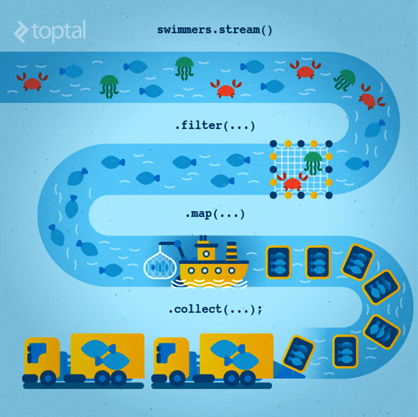
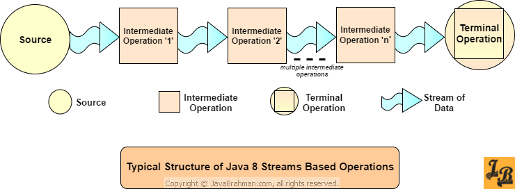

# Лекция 11. Коллекции. Некоторые аспекты

## Специальные коллекции

Помимо методов-оболочек, в классе `java.util.Collections` определяются также служебные методы для создания экземпляров неизменяемых коллекций, содержащих единственный элемент, а также другие методы для создания пустых коллекций. В частности, методы `singleton()`, `singletonList()` и `singletonMap()` возвращают неизменяемые объекты типа `Set`, `List` и `Map`, содержащие единственный указанный объект или же единственную пару "ключ-значение". Эти методы приносят пользу в тех случаях, когда единственный объект требуется передать методу, ожидающему коллекцию.

В состав класса `Collections` входят также методы, возвращающие пустые коллекции. Так, если требуется написать метод, возвращающий коллекцию, лучше всего выбрать вариант, возвращающий пустую коллекцию вместо специального значения (`null`).

```java
Set<Integer> s1 = Collections.emptySet();
List<String> s2 = Collections.emptyList();
Map<String, Integer> m = Collections.emptyMap();
```

Наконец, метод `nCopies()` возвращает неизменяемый список типа `List`, содержащий указанное количество копий единственного указанного объекта

```java
List<Integer> ten_zeros = Collections.nCopies(10, 0);
```

## Паттерн "Итератор"

Представим себе класс `Cart`, который хранит набор положенных в корзину товаров и класс `Order`, в задачу которого входит формирование заказа из помещенных в корзину товаров. Для упрощения примера, представим себе, что "корзина" реализована обычным массивом и можем содержать не более 5 элементов.

Давайте внимательно посмотрим на метод `makeOrder()`. Он получает на вход объект `Cart`, после чего он должен взять каждое наименование и цену товара и, допустим, добавить его в базу данных. Как это сделать?

Самый очевидный способ реализовать перебор товаров - создадим геттер для поля `items` в классе `Cart`, после чего в методе `makeOrder()` с помощью цикла обойдем все элементы массива.

```java
class Cart {
    private Item[] items;
    private int index;

    public Cart() {
        items = new Item[5];
        index = 0;
    }

    public boolean addItem(Item item) {
        // Добавление товара в корзину
        return true;
    }
}

...

Cart cart = new Cart();
cart.addItem(new Item("Часы", 2000));
cart.addItem(new Item("Чашка", 250));
cart.addItem(new Item("Блокнот", 80));

Order order = new Order();
order.makeOrder(cart);
```

Обратим внимание на метод `makeOrder()`. Ему передается ссылка на объект класса `Cart`, после чего он должен взять каждый объект класса `Item`, который находится в корзине и, допустим, добавить его в базу данных. Как реализовать это поведение?

Самый очевидный способ реализовать перебор товаров в корзине - создать геттер для поля `items` в классе `Cart`, после чего в методе `makeOrder()` с помощью цикла обойти все элементы массива.

```java
class Cart {
    private Item[] items;

    ... 

    public Item[] getItems() {
        return items;
    }
}

class Order {
    public void makeOrder(Cart cart) {
        for (int i = 0; i < cart.getItems().length; i++) {
            Item item = cart.getItems()[i];

            // Работа с товаром
        }
    }
}
```

Подобное решение является некорректным с точки зрения дизайна ОО-приложений по следующим причинам:

- нарушается принцип инкапсуляции, так как вы показываете внутреннюю структуру объекта. Сторонний класс может случайно или специально испортить структуру и тогда объектом нельзя будет пользоваться;
- класс `Order` теперь зависит от внутренней структуры класса `Cart` и, если мы каким-то образом изменим внутреннюю структуру класса (например, мы захотим вместо массива использовать какую-то коллекцию), или с помощью наследования модифицируем существующий класс – нам необходимо будет переписывать метод `makeOrder()`;
- мы устанавливаем сильную связь между логически разными классами, которые выполняют разные функции в приложении. Это нарушает принцип модульности.

Необходимо решить следующую задачу: необходимо обойти все элементы «корзины» и добавить их в базу данных, но мы не должны показать внутреннюю структуру объекта типа `Cart`, класс `Order` должен работать успешно при любых изменениях внутри класса `Cart`.

Для решения этой задачи можно воспользоваться часто применяемым и очень простым паттерном проектирования, который называется **Итератор** (он относится к категории паттернов поведения).

Краткое описание паттерна можно сформулировать так: **итератор – это объект, который предоставляет интерфейс последовательного доступа к содержимому составных объектов, не раскрывая другим классам его внутренней структуры**.

Давайте напишем свою версию этого паттерна. Прежде всего, нам необходимо описать интерфейс «Итератор», который будет описывать методы итератора.

```java
interface Iterator<E> {
    
    // Возвращает следующий элемент
    E next();
    
    // Возвращает true, если еще есть
    // следующий элемент, который можно получить с
    // помощью метода next()
    boolean hasNext();
}
```

Так как наш итератор может работать с разными элементами внутри составных объектов, то сделаем его обобщенным. Метод `next()` при каждом вызове возвращает следующий элемент составного объекта. То есть, если мы последовательно будем вызывать метод `next()`, то он будет возвращать первый, второй, третий и т.д. элементы составного объекта.

Метод `hasNext()` возвращает нам сведения о том – есть ли еще элементы, которые мы не обошли с помощью метода `next()`. Если впереди еще есть элементы – метод вернет `true`, если элементы закончились – он вернет `false`.

Итак, мы описали интерфейс для итератора, теперь необходимо создать класс, который будет реализовывать интерфейс итератора. Для этого, необходимо создать так называемый внутренний класс.

```java
class Cart {
    private Item[] items;
    private int index;

    ...

    private class CartIterator implements Iterator<Item> {
        private int cursor = 0;

        @Override
        public Item next() {
            if (hasNext())
                return items[cursor++];
            else
                return null;
        }

        @Override
        public boolean hasNext() {
            return cursor < index;
        }
    }
}
```

В классе `Cart` создадим метод `getIterator()`, который будет создавать объект внутреннего класса `CartIterator` и возвращать его.

```java
class Cart {
    private Item[] items;
    private int index;

    private class CartIterator implements Iterator<Item> {
        private int cursor = 0;

        @Override
        public Item next() {
            if (hasNext())
                return items[cursor++];
            else
                return null;
        }

        @Override
        public boolean hasNext() {
            return cursor < index;
        }
    }
}
```

Теперь вернемся к классу `Order`. В методе `makeOrder()` получим объект итератора и проитерируем товары в корзине.

```java
class Order {
    public void makeOrder(Cart cart) {
        for (int i = 0; i < cart.getItems().length; i++) {
            
            Iterator<Item> iterator = cart.getIterator();
            while (iterator.hasNext()) {
                Item item = iterator.next();
                
                // Работа с товаром
            }
        }
    }
}
```

В результате получилась следующая картина:

- класс `Order` не имеет доступа к внутренней структуре объекта типа `Cart`;
- класс `Cart` может спокойно изменить свою структуру – достаточно лишь переписать методы внутреннего класса `CartIterator`, чтобы реализовать методы итератора с учетом изменений структуры класса `Cart`;
- класс `Order` будет продолжать нормальную работу, если внутренняя структура класса `Cart` изменится – главное, чтобы были корректно реализованы методы итератора;
- вы можете предусмотреть несколько реализаций итератора и метод `getIterator()` может возвращать ту или иную реализацию интерфейса (например, вы можете предусмотреть несколько итераторов для обхода бинарного дерева – каждый итератор будет реализовывать свой способ обхода).

В реальности нам нет нужды создавать свой интерфейс итератора – правильно будет воспользоваться стандартным интерфейсом `java.util.Iterator` и `java.lang.Iterable`. Это «стандартные» интерфейсы итератора, который все используют и в 99.9% случаях вы тоже должны его использовать.

Переделаем наш код для использования стандартных интерфейсов. Для начала перепишем внутренний класс `CartIterator`, чтобы он реализовывал интерфейс `java.util.Iterator`. Он мало чем отличается от нашего «самодельного» интерфейса Итератора. Минимально необходимо реализовать методы `next()` и `hasNext()`. Для полной реализации интерфейса необходимо дополнительно реализовать методы `remove()` и `forEachRemaining()`.

Далее следует указать, что наш класс `Cart` может предоставить итератор для последовательного доступа к элементам составного объекта. Для этого укажем, что наш класс реализует интерфейс `Iterable<Item>`. Для минимальной реализации интерфейса `Iterable` необходимо реализовать метод `Iterator<T> iterator()`, который возвращает объект класса, реализующего интерфейс `java.util.Iterator`.

```java
class Cart implements Iterable<Item> {
    private Item[] items;
    private int index;

    ...

    @Override
    public java.util.Iterator<Item> iterator() {
        return new CartIterator();
    }

    private class CartIterator implements Iterator<Item> {
        private int cursor = 0;

        @Override
        public Item next() {
            if (hasNext())
                return items[cursor++];
            else
                return null;
        }

        @Override
        public boolean hasNext() {
            return cursor < index;
        }
    }
}
```

Таким образом, мы указали, что наш класс `Cart` может вернуть объект итератора для последовательного доступа к элементам своей внутренней структуры. Реализация интерфейса `Iterable<T>` часто бывает полезна: некоторые методы в стандартных библиотеках Java принимают на входы объекты интерфейсного типа `Iterable<T>`, кроме того, вы теперь можете обойти элементы внутри `Cart` с помощью цикла конструкции for-each.

```java
class Order {
    public void makeOrder(Cart cart) {

        for (Item item : cart) {
            // Работа с товаром
        }
    }
}
```

### Итераторы в коллекциях

Поддержка итераторов – неотъемлемая часть работы с коллекциями. В интерфейсе `Collection` определен метод `iterator()`, который возвращает объект итератора. Таким образом, все коллекции, которые реализуют интерфейс `Collection`, имеют реализованный класс итератора.

Работа с итератором коллекции ничем не отличается от использования итератора в нашем примере. Необходимо:

1. Запросить у `Collection` итератор посредством метода `iterator()`. Полученный итератор готов вернуть начальный элемент последовательности;
2. Получить следующий элемент последовательности вызовом метода `next()`;
3. Проверить, есть ли еще объекты в последовательности (метод `hasNext()`);
4. Удалить из последовательности последний элемент, возвращаемый итератором, методом `remove()`.

### Интерфейсы `ListIterator` и `Spliterator`

Интерфейс `ListIterator` представляет собой более мощную разновидность `Iterator`, которая работает только с классами `List`. Хотя `Iterator` может перемещаться только вперед, итератор `ListIterator` является двусторонним. Он может выдать индексы следующего и предыдущего элементов относительно текущей позиции итератора в списке, а также заменить последний посещенный элемент методом `set()`. Метод `listIterator()` возвращает объект `ListIterator`, указывающий в начало `List`, а вызов `listIterator(n)` создает объект `ListIterator`, изначально установленный в позицию списка с индексом `n`. Подробнее про `ListIterator` смотрите [здесь](http://metanit.com/java/tutorial/5.10.php).

В версии Java 8 появился еще один тип итератора – `Spliterator`. Он позволяет разбивать коллекцию на части, что позволяет обрабатывать коллекции параллельно в несколько потоков. На данном этапе концепция сплитератора может показаться вам непонятной, поэтому оставим его за скобами. Для любопытных – можете почитать [здесь](https://habrahabr.ru/post/256905/).

## Фабрики коллекций

В Java 9 появилось несколько новых удобных способов создания небольших коллекций. Представим себе, что нам необходимо создать небольшую коллекцию из трех объектов. Один из способов может быть такой:

```java
List<String> friends = new ArrayList<>();
friends.add("John");
friends.add("Sam");
friends.add("Peter");
```

Мы можем сократить количество кода с помощью фабричного метода `Arrays.asList()`:

```java
List<String> friends = Arrays.asList("John", "Sam", "Peter");
```

При этом создается список фиксированного размера, значения в котором можно менять, нельзя лишь добавлять и удалять элементы. Попытка добавления элементов приводит к генерации исключения `UnsupportedOperationException`, обновление же списка с помощью метода `set` вполне допустимо:

```java
List<String> friends = Arrays.asList("John", "Sam", "Peter");
friends.set(0, "Mark"); // Допустимо
friends.add("Serge"); // Ошибка! Генерация исключения
```

Для создания множеств можно воспользоваться конструктором класса `HashSet`, который принимает в качестве аргумента список:

```java
Set<String> friends = new HashSet<>(Arrays.asList("Raphael", "Olivia", "Thibaut"));
```

Или можно воспользоваться Stream API:

```java
Set<String> friends = Stream.of("Raphael", "Olivia", "Thibaut")
        .collect(Collectors.toSet());    }
```

В результате мы получим изменяемый `Set`.

### Фабрики списков

Для создания списка достаточно вызвать фабричный метод `List.of()`

```java
List<String> friends = List.of("John", "Sam", "Peter");
```

Полученный список - неизменяемый. Попытка добавить, удалить или изменить элемент с помощью `set()` приводит к генерации исключения `UnsupportedOperationException`. Пустые элементы (`null`) также не разрешены. Поля объектов внутри коллекций можно менять, нельзя менять саму коллекцию.

Если вы не планируете изменять содержимое списка, то лучше воспользоваться именно фабричными методами.

### Фабрики множеств

Аналогично методу `List.of` существует и метод для создания из списка элементов неизменяемого объекта `Set`:

```java
Set<String> friends = Set.of("John", "Mike", "Sam");
System.out.println(friends);
```

Если попытаться создать множество с повторяющимся элементом, будет сгенерировано исключение `IllegalArgumentException`.

### Фабрики ассоциативных массивов

Создание ассоциативного массива - несколько более сложная задача, чем создание списков и множеств, поскольку необходимо указать как ключи, так и значения. Существуют два способа инициализации неизменяемых ассоциативных массивов в Java 9. Первый способ - воспользоваться фабричным методом `Map.of`, который умеет отличать ключи от значений

```java
Map<String, Integer> ageOfFriends = Map.of("John", 30, "Mike", 25, "Sam", 40);
```

Метод удобен для создания маленьких ассоциативных массивов из не более чем десяти ключей и значений. Если этого недостаточно, можно воспользоваться другим фабричным методом `Map.ofEntries`, который принимает объекты `Map.Entry<K, V>`, но реализован на основе аргумента переменной длины. Данный метод требует выделения дополнительной памяти для объектов, служащих адаптерами для ключа и значения

```java
Map<String, Integer> ageOfFriends = Map.ofEntries
    (entry("John", 30), entry("Mike", 25), entry("Sam", 40));
```

## Потоки данных (Stream API)

В механизме потоков данных используется такой прием в программировании как **Method Chaining** (**цепочка вызовов методов**). Рассмотрим этот прием, а потом приступим к изучению потоков данных.

### Прием Method Chaining

Иногда, при использовании или написании больших классов возникает необходимость вызвать подряд несколько методов для объекта этого класса. Это можно сделать традиционным способом

```java
class MyClass {
    
    void foo1(int i) {
        // тело метода    
    }

    void foo2(double d) {
        // тело метода  
    }
    
    void foo3(String s) {
        // тело метода  
    }
}

...

MyClass myClass = new MyClass();
myClass.foo1(100);
myClass.foo2(2.5);
myClass.foo3("John");
```

Для улучшения читабельности исходного кода программы был придуман прием, который называется **Method Chaining** или **Fluent Interface** (текучий интерфейс).

Смысл данного приема заключается в том, что метод в цепочке вызовов возвращает ссылку на текущий объект (ключевое слово `this`), что позволяет в одном выражении вызвать подряд сразу несколько методов.

```java
class MyClass {

    MyClass foo1(int i) {
        // тело метода
        return this;
    }

    MyClass foo2(double d) {
        // тело метода
        return this;
    }

    MyClass foo3(String s) {
        // тело метода
        return this;
    }
}

MyClass myClass = new MyClass();
myClass.foo1(100).foo2(10.5).foo3("John");
```

### Определение потоков данных

Одна из главных причин для внедрения лямбда-выражений в версии Java 8 состояла в том, чтобы упростить в целом весь прикладной интерфейс Collections API и дать разработчикам возможность пользоваться более современными стилями программирования на Java.

Внедрение функциональных коллекций, иначе называемых **потоками данных в Java** (**Java Streams**), ясно отличающихся своим подходом от прежних коллекций, является важным шагом вперед.

<p align="center">
  
</p>

Главной особенностью потокового API является способность выполнять очень сложные операции поиска, фильтрации и преобразования и иного манипулирования данными. Используя потоковый API, можно, например, сформировать последовательность действий, подобных запросам базы данных на языке SQL. Кроме этого, работа потокового API выполняется параллельно, а, следовательно, повышается производительность, особенно при обработке крупных потоков данных.

**Поток данных** - канал передачи данных, последовательность объектов. В самом потоке данные не хранятся, а только перемещаются и, возможно, фильтруются, сортируются или обрабатываются иным образом в ходе этого процесса. Как правило, действие потока данных не видоизменяет их источник.

Потоки данных позволяют выполнять вычисления на более высоком концептуальном уровне, чем коллекции. С помощью потока данных можно указать, что и как именно требуется сделать с данными, а планирование операций предоставить конкретной реализации.

В Stream API определен ряд потоковых интерфейсов, входящих в состав пакета `java.util.stream`. В основе их иерархии лежит интерфейс `BaseStream`. Производными от интерфейса `BaseStream` являются несколько типов интерфейсов. Наиболее употребительными из них является интерфейс `Stream`.

Рассмотрим пример. Допустим, что требуется подсчитать все длинные слова в книге. Сначала считаем файл и выделим отдельные слова в коллекцию:

```java
byte[] bytes = Files.readAllBytes(Paths.get("c:\\temp\\text.txt"));

String file_text = new String(bytes, StandardCharsets.UTF_8);
List<String> words = Arrays.asList(file_text.split("\\PL+"));
```

Теперь попробуем посчитать все слова, длина которых больше 8 символов:

```java
int count = 0;
for (String s : words) {
    if (s.length() > 8)
        count++;
}
```

При использовании потокового API, подсчет осуществляется следующим образом:

```java
long count = words.stream()
        .filter(s -> s.length() > 8)
        .count();
```

Достаточно заменить метод `stream()` на метод `parallelStream()`, чтобы организовать параллельное выполнение операций фильтрации и подсчета строк:

```java
long count = words.parallelStream()
        .filter(s -> s.length() > 8)
        .count();
```

Потоки данных работают по принципу "что делать", а не "как это сделать". В рассматриваемом примере мы описываем, что нужно сделать: получить слова больше 8 символов и подсчитать их количество. При этом мы не указываем, в каком порядке или потоке исполнения это должно произойти.

### Свойства и структура потоков данных

Потоки данных имеют свои особенности:

1. поток данных не сохраняет свои элементы. Они могут сохраняться в основной коллекции или формироваться по требованию;
2. потоковые операции не изменяют их источник. Например, метод `filter()` не удаляет элементы из нового потока данных, а выдает новый поток, в котором отсутствуют отфильтрованные элементы;
3. потоковые операции выполняются по требованию (так называемая **"ленивая инициализация"**, **lazy initialization**). Это означает, что они выполняются до тех пор, пока не потребуется результат.

Вернемся к примеру. Методы `stream()` и `parallelStream()` выдают поток данных для списка слов `words`. А метод `filter()` возвращает другой поток данных, содержащий только те слова, длина которых больше 8 символов. И наконец, метод `count()` сводит этот поток данных в конечный результат.

Такая последовательность операций весьма характерна для обращения с потоками данных. Конвейер операций организуется в следующие три стадии:

1. создание потока данных (метод `stream()`);
2. указание **промежуточных операций** (**intermediate operations**) для преобразования исходного потока данных в другие потоки, возможно, в несколько этапов (метод `filter()`);
3. выполнение конечной операции (terminal operation) для получения результата (метод `count()`).

<p align="center">
  
</p>

Конечная операция **потребляет** поток данных и дает конечный результат, например, находит минимальное значение в потоке данных или выполняет некоторое действие, как это делает метод `forEach()`. Если поток данных потреблен, он не может быть использован повторно.
Промежуточная операция производит поток данных и служит для создания конвейера для выполнения последовательности действий.

### Создание потока данных

Получить поток данных можно самыми разными способами. Вероятно, самый распространенный способ получения потока данных из коллекции. Любую коллекцию можно преобразовать в поток данных методом `stream()` из интерфейса `Collection`.

```java
List<Integer> list = List.of(1, 2, 3, 4, 5);

// Получение потока из коллекции
Stream<Integer> stream = list.stream();

// Работа с анонимным потоком
// Вывод в консоли нечетных чисел в коллекции
list.stream().filter(i -> i % 2 != 0).forEach(System.out::println);
```

Поток данных можно получить и из массива. Это можно сделать несколькими способами, например, с помощью класса `Arrays` и с помощью класса `Stream`.

```java
Integer[] array = new Integer[]{1, 2, 3, 4, 5};

// Метод stream() класса Arrays
Arrays.stream(array)
        .filter(i -> i % 2 != 0)
        .forEach(System.out::println);

// Метод of() класса Stream
Stream.of(array)
        .filter(i -> i % 2 != 0)
        .forEach(System.out::println);
```

Вы также можете сгенерировать поток с помощью метода `generate()` или `iterate()`. Обратите внимание, что метод `generate()` возвращает бесконечный поток, поэтому его бывает полезно ограничить с помощью промежуточной операции `limit()`

```java
// Метод generate() возвращает бесконечный поток, поэтому его 
// целесообразно ограничить с помощью промежуточной операции limit()
// Промежуточная операция distinct() удаляет повторяющиеся элементы 
        long c = Stream.generate(Math::random)
                .filter(i -> i % 2 != 0)
                .limit(100)
                .distinct()
                .count();

// Первый параметр - начальное значение, второй параметр - анонимная // функция. Каждое последующее значение функции получает на вход 
// результат работы предыдущей
        Stream.iterate(1, n -> n * 2).limit(20).forEach(System.out::println);

// В данном случае, второй параметр - условие продолжения 
// последовательности
        Stream.iterate(1, i -> i < Double.MAX_VALUE, i -> i = i * 2)
                .limit(20)
                .forEach(System.out::println);

```

Также следует помнить, что в библиотеках Java существует много методов, которые могут вернуть потоки данных. Например, можно получить поток строк из класса `Pattern` или поток строк из файла из методов класса `Files`

```java
String s = "Строка с данными, например, с содержимым файла";
// Разбиение строки на поток строк с отдельными словами
Stream<String> words = Pattern.compile("\\PL+").splitAsStream(s);

// Получение потока строк из файла и вывод строки в консоль
try (Stream<String> lines = Files.lines(Paths.get("text.txt"))) {
    lines.forEach(System.out::println);
}
```

### Промежуточные операции

В результате выполнения промежуточных операций осуществляется преобразование потока данных в другой поток данных, элементы которого являются производными от элементов исходного потока.

#### Операция filter

В примерах выше рассматривались несколько таких операций, например, метод `filter()`, в результате которого получается новый поток данных с элементами, удовлетворяющими определенному условию. Рассмотрим еще один пример с использованием операции `filter()`

```java
new Random()
        .ints(100, -100, 100) // поток из 100 чисел от -100 до 100
        .filter(i -> i > 0) // отсеиваем отрицательные числа
        .forEach(System.out::println); // выводим их в консоль
```

#### Операция map

Нередко значения в потоке данных требуются каким-то образом преобразовать. Для этой цели можно воспользоваться методом `map()`, передав ему функцию, которая и выполняет нужное преобразование. Например

```java
String s = "Строка с данными, например, с содержимым файла";
Pattern.compile("\\PL+")
        .splitAsStream(s)               // получаем поток данных
        .map(str -> str.toUpperCase())  // получаем новый поток
        .forEach(System.out::println);  // выводим в консоль
```

При вызове `map()` передаваемая ему функция применяется к каждому элементу потока данных, в результате чего образуется новый поток данных с полученными результатами.

#### Операция flatmap

Операция `flatmap()` преобразовывает один объект, как правило составной, в объект более простой структуры, например, массив в строку, список в объект, список списков в один список.

```java
List<Integer> list1 = Arrays.asList(1,2,3);
List<Integer> list2 = Arrays.asList(4,5,6);
List<Integer> list3 = Arrays.asList(7,8,9);

List<List<Integer>> listOfLists = Arrays.asList(list1, list2, list3);

List<Integer> listOfAllIntegers = listOfLists.stream()
        .flatMap(x -> x.stream())
        .collect(Collectors.toList());

// Выведет [1, 2, 3, 4, 5, 6, 7, 8, 9]
System.out.println(listOfAllIntegers);
```

#### Операция limit

Операция `limit()` возвращает новый поток данных, оканчивающийся после `n` элементов или по завершению исходного потока данных, если тот короче. Данный метод особенно удобен для ограничения бесконечных потоков данных до определенной длины. В следующем примере кода мы генерируем поток данных из целых чисел, после чего ограничиваем поток первыми 100 элементами

```java
Stream<Integer> stream = Stream.generate(Math::random)
        .map(i -> i.intValue()) // конвертируем в int
        .limit(100); // Ограничивает поток первыми 100 значениями
```

#### Операция skip

Метод `skip()` выполняет противоположную операцию - отбрасывает первые `n` элементов.

```java
String s = "Один два три четыре пять";
Pattern.compile("\\PL+").splitAsStream(s)
        .skip(2) // Отбросим первые два элемента потока
        .forEach(el -> System.out.print(el + " "));

// Выведет в консоль "три четыре пять"
```

#### Операция concat

Статический метод `concat()` позволяет соединить два потока данных. Первый из этих потоков не должен быть бесконечным.

```java
Stream<Integer> s1 = Stream.of(1,2,3,4,5);
Stream<Integer> s2 = Stream.of(6,7,8,9,10);

// Соединяем два потока в один новый
Stream<Integer> result = Stream.concat(s1, s2);
```

#### Операция distinct

Метод `distinct()` возвращает поток данных, в котором исключены дубликаты.

```java
// В консоли будет выведено 1 2 3
Stream.of(1, 1, 1, 2, 2, 2, 3, 3, 3)
        .distinct()
        .forEach(System.out::println);
```

#### Операция sorted

Для сортировки потоков данных имеется несколько вариантов метода `sorted()`. Один из них служит для обработки потоков данных, состоящих из элементов типа `Comparable`, а другой принимает в качестве параметра компаратор типа `Comparator`

```java
// В данном случае сортируются элементы типа Comparable
// В консоли будет выведено: Анна Василий Иван
        Stream.of("Иван", "Анна", "Василий")
                .sorted()
                .forEach(System.out::println);

// Сортировка происходит по длине строки.
// В консоли будет выведено: Кир Анна Василий
        Stream.of("Василий", "Анна", "Кир")
                .sorted((o1, o2) -> o1.length() - o2.length())
                .forEach(System.out::println);
```

Как и во всех остальных потоковых преобразованиях, метод `sorted()` выдает новый поток данных, элементы которого происходят из исходного потока и располагаются в отсортированном порядке. Метод `sorted()` удобно применять в том случае, если процесс сортировки является частью поточного конвейера.

#### Операция peek

Метод `peek()` выдает другой поток данных с теми же самыми элементами, что и у исходного потока, но при добавлении элемента в новый поток вызывается лямбда-выражение, указанное в качестве аргумента метода `peek()`.

```java
/* В консоли будет выведено: 
Отсортировано. Элемент: Петр
Фильтрация. Элемент: Петр
Отсортировано. Элемент: Василий
Отсортировано. Элемент: Борис
Отсортировано. Элемент: Анна
Фильтрация. Элемент: Анна */
List<String> new_list = Stream.of("Анна", "Борис", "Василий", "Петр")
        .sorted((o1, o2) -> o2.compareTo(o1))
        .peek(e -> System.out.println("Отсортировано. Элемент: " + e))
        .filter(e -> e.length() < 5)
        .peek(e -> System.out.println("Фильтрация. Элемент: " + e))
        .collect(Collectors.toList());
```

Отличие метода `peek()` от метода `forEach()` является то, что метод `peek()` является промежуточной операцией и используется в целях отладки, а операций `forEach()` является конечной операцией, которая запускает конвейер и используется для получения результата работы потока.

### Конечные операции

Конечные операции часто называют **методами сведения**. Они выполняют конечные операции, сводя поток данных к непотоковому значению, которое может быть далее использовано в программе. Некоторые из них уже фигурировали в примерах выше: методы `count()`, `forEach()` и `collect()`.

Метод `count()`, как уже было сказано, возвращает количество элементов в результирующем потоке. Приведем еще один пример

```java
long short_names = Stream.of("Анна", "Борис", "Василий", "Петр")
        .filter(e -> e.length() < 5)
        .count();
System.out.println("Количество коротких имен: " + short_names);
```

К числу других простых методов сведения относятся методы `max()` и `min()` возвращающие наибольшее и наименьшее значения соответственно.

```java
Optional<String> ln = Stream.of("Анна", "Борис", "Василий", "Петр")
        .map(String::toUpperCase)
        .max(Comparator.comparingInt(String::length));

// Выведет "ВАСИЛИЙ"
ln.ifPresent(e -> System.out.println("Самое длинное имя: " + e));
```

Обратите внимание, что эти методы возвращают значение типа `Optional<T>`, которое заключает в себе ответ на запрос или обозначают, что запрашиваемые данные отсутствуют, поскольку поток оказался пустым. Раньше в подобных случаях возвращалось пустое значение `null`. Но это могло привести к исключениям в связи с пустыми указателями в не полностью протестированной программе. Тип `Optional` удобнее для обозначения отсутствующего возвращаемого значения.

Метод `findFirst()` возвращает первое значение из непустой коллекции. Зачастую он применяется вместе с методом `filter()`. Рассмотрим пример:

```java
Stream<String> s =
        Stream.of("Василий", "Петр", "Анна", "Борис", "Ангелина");

Optional<String> name = s
        .filter(e -> e.toLowerCase().charAt(0) == 'а')
        .findFirst();
// В консоли будет выведено 'Анна'
name.ifPresent(System.out::println);
```

Если же требуется любое совпадение, а не только первое, то следует воспользоваться методом `findAny()`. Это оказывается эффективным при распараллеливании потока данных, поскольку поток может известить о любом обнаруженном в нем совпадении, вместо того чтобы ограничиваться только первым совпадением.

```java
Stream<String> text = Files.lines(Paths.get("c:\\temp\\text.txt"));
Optional<String> word = text
        .map(e -> e.split("\\PL+"))  // строку в массив слов
        .flatMap(Arrays::stream)     // массивы в один поток
        .filter(e -> e.length() > 9) // фильтруем поток по длине слова
        .findAny();                  // возвращаем первое попавшееся
word.ifPresent(System.out::println);
```

Если же требуется только выяснить, имеется ли вообще совпадение, то следует воспользоваться методом `anyMatch()`

```java
Stream<String> text = Files.lines(Paths.get("c:\\temp\\text.txt"));
boolean flag = text
        .map(e -> e.split("\\PL+"))     // в массив отдельных слов
        .flatMap(Arrays::stream)        // массивы в один поток
        .anyMatch(e -> e.length() > 9); // ищем слова > 9 символов
if (flag)
    System.out.println("Есть хотя бы одно слово > 9 символов");
```

Имеются также методы `allMatch()` и `noneMatch()`, возвращающие логическое значение `true`, если с предикатом совпадают все элементы в потоке данных или не совпадает ни один из его элементов соответственно. Эти методы также выгодно выполнять в параллельном режиме.

По завершении обработки потока данных нередко требуется просмотреть полученные результаты. С этой целью можно использовать метод `forEach()`, чтобы применить функцию к каждому элементу.

В параллельном потоке данных метод `forEach()` выполняет обход элементов в произвольном порядке. Если же требуется обработать в потоковом порядке, то следует вызвать метод `forEachOrdered()`, что может нивелировать ускорение от распараллеливания потока.

```java
// В консоли будет выведено 1 2 3
Stream.of(1, 1, 1, 2, 2, 2, 3, 3, 3)
        .distinct()
        .forEach(System.out::println);
```

Но чаще всего требуется накапливать результаты в структуре данных (то есть, создать массив или коллекцию, которая будет включать элементы результирующего потока).

Если нужно получить результирующий массив, то можно воспользоваться методом `toArray()`. Создать обобщенный массив во время выполнения невозможно, и поэтому в результате вызова `stream.toArray()` возвращается массив типа `Object[]`. Если же требуется массив нужного типа, то этому методу следует передать конструктор такого массива.

```java
Stream<String> text = Files.lines(Paths.get("c:\\temp\\text.txt"));
String[] words = text
        .map(e -> e.split("\\PL+"))
        .flatMap(Arrays::stream)
        .filter(e -> e.length() > 7)
        .toArray(String[]::new);
```

#### Коллекторы

Для накопления элементов потока данных с другой целью имеется метод `collect(()`, принимающий экземпляр класса, реализующего интерфейс `Collector`. В частности, класс `Collectors` предоставляет немало фабричных методов для наиболее полезных коллекторов. Для накопления потока данных в списке или множестве достаточно сделать один из следующих вызовов

```java
Stream<String> text = Files.lines(Paths.get("c:\\temp\\text.txt"));
List<String> words = text
        .map(e -> e.split("\\PL+"))
        .flatMap(Arrays::stream)
        .filter(e -> e.length() > 7)
        .collect(Collectors.toList());

Set<String> set = text
        .map(e -> e.split("\\PL+"))
        .flatMap(Arrays::stream)
        .filter(e -> e.length() > 7)
        .collect(Collectors.toSet());
```

Если же требуется конкретная разновидность получаемого множества, то нужно сделать следующий вызов:

```java
Stream<String> text = Files.lines(Paths.get("c:\\temp\\text.txt"));
ArrayList<String> arrayList = text
        .map(e -> e.split("\\PL+"))
        .flatMap(Arrays::stream)
        .filter(e -> e.length() > 7)
        .collect(Collectors.toCollection(ArrayList::new));
```

Для накопления символьных строк, сцепляя их, используется следующие вызовы

```java
Stream<String> text = Files.lines(Paths.get("c:\\temp\\text.txt"));
String str = text
        .map(e -> e.split("\\PL+"))
        .flatMap(Arrays::stream)
        .filter(e -> e.length() > 7)
        .collect(Collectors.joining()); // в одну строку подряд

String str = text
        .map(e -> e.split("\\PL+"))
        .flatMap(Arrays::stream)
        .filter(e -> e.length() > 7)
        .collect(Collectors.joining(" ")); // с разделителем
```

Для накопления результатов в словарях используется метод `Collectors.toMap()`, принимающий в качестве двух своих аргументов функции, чтобы получить ключи и значения из отображения. Процесс накопления данных в словарях имеет много нюансов, в рамках данного курса рассматриваются только простые случаи.

```java
Stream<String> text = Files.lines(Paths.get("c:\\temp\\text.txt"));
Map<String, Integer> words_map = text
        .map(e -> e.split("\\PL+"))
        .flatMap(Arrays::stream).distinct()
        .collect(Collectors.toMap(String::toString, String::length));

for (Map.Entry<String,Integer> enrty : words_map.entrySet()) {
    System.out.println(enrty.getKey() + " : " + enrty.getValue());
}
```

Если результаты обработки потока данных требуется свести к сумме, среднему, максимуму или минимуму, можно воспользоваться методами типа `summarizing()`

```java
Stream<String> text = Files.lines(Paths.get("c:\\temp\\text.txt"));
IntSummaryStatistics summary = text
        .map(e -> e.split("\\PL+"))
        .flatMap(Arrays::stream)
        .collect(Collectors.summarizingInt(String::length));

System.out.println("Количество слов: " + summary.getCount());
System.out.println("Средняя длина слова: " + summary.getAverage());
System.out.println("Общая длина всех слов: " + summary.getSum());
```
