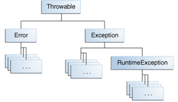

# Лекция 12. Механизм исключений в Java

**Исключение** (**exception**) - это ненормальная ситуация (термин "исключение" здесь следует понимать как "исключительная ситуация"), возникающая во время выполнения программного кода. Иными словами, исключение - это ошибка, возникающая во время выполнения программы (в runtime).

Исключение - это способ системы Java (в частности, JVM - виртуальной машины Java) сообщить вашей программе, что в коде произошла ошибка. К примеру, это может быть деление на ноль, попытка обратиться к массиву по несуществующему индексу, очень распространенная ошибка нулевого указателя (**NullPointerException**) - когда вы обращаетесь к ссылочной переменной, у которой значение равно `null` и так далее.

В любом случае, с формальной точки зрения, **Java не может продолжать выполнение программы**.

**Обработка исключений** (**exception handling**) - название объектно-ориентированной техники, которая пытается разрешить эти ошибки. Программа в Java может сгенерировать различные исключения, например:

- программа может пытаться прочитать файл из диска, но файл не существует;
- программа может попытаться записать файл на диск, но диск заполнен или не отформатирован;
- программа может попросить пользователя ввести данные, но пользователь ввел данные неверного типа;
- программа может попытаться осуществить деление на ноль;
- программа может попытаться обратиться к массиву по несуществующему индексу.

Используя подсистему обработки исключений Java, можно управлять реакцией программы на появление ошибок во время выполнения. Средства обработки исключений в том или ином виде имеются практически во всех современных языках программирования. В Java подобные инструменты отличаются большей гибкостью, понятнее и удобнее в применении по сравнению с большинством других языков программирования.

Преимущество обработки исключений заключается в том, что она предусматривает автоматическую реакцию на многие ошибки, избавляя от необходимости писать вручную соответствующий код.

## Иерархия исключений

В Java все исключения представлены отдельными классами. Все классы исключений являются потомками класса `Throwable`. Так, если в программе возникнет исключительная ситуация, будет сгенерирован объект класса, соответствующего определенному типу исключения. У класса `Throwable` имеются два непосредственных подкласса: `Exception` и `Error`.

Исключения типа `Error` относятся к ошибкам, возникающим в виртуальной машине Java, а не в прикладной программе. Контролировать такие исключения невозможно, поэтому реакция на них в приложении, как правило, не предусматривается. В связи с этим исключения данного типа не будут рассматриваться в книге.

Ошибки, связанные с работой программы, представлены отдельными подклассами, производными от класса `Exception`. В частности, к этой категории относятся ошибки деления на нуль, выхода за пределы массива и обращения к файлам. Подобные ошибки следует обрабатывать в самой программе. Важным подклассом, производным от `Exception`, является класс `RuntimeException`, который служит для представления различных видов ошибок, часто возникающих во время выполнения программ.

Каждой исключительной ситуации поставлен в соответствие некоторый класс. Если подходящего класса не существует, то он может быть создан разработчиком.

Так как в Java **ВСЁ ЯВЛЯЕТСЯ ОБЪЕКТОМ**, то исключение тоже является объектом некоторого класса, который описывает исключительную ситуацию, возникающую в определенной части программного кода.

«Обработка исключений» работает следующим образом:

- когда возникает исключительная ситуация, JVM генерирует (говорят, что JVM ВЫБРАСЫВАЕТ исключение, для описания этого процесса используется ключевое слово `throw`) объект исключения и передает его в метод, в котором произошло исключение;
- вы можете перехватить исключение (используется ключевое слово `catch`), чтобы его каким-то образом обработать. Для этого, необходимо определить специальный блок кода, который называется обработчиком исключений, этот блок будет выполнен при возникновении исключения, код должен содержать реакцию на исключительную ситуацию;
- таким образом, если возникнет ошибка, все необходимые действия по ее обработке выполнит обработчик исключений.

**Если вы не предусмотрите обработчик исключений, то исключение будет перехвачено стандартным обработчиком Java. Стандартный обработчик прекратит выполнение программы и выведет сообщение об ошибке.**

Рассмотрим пример исключения и реакцию стандартного обработчика Java

```java
public static void main(String[] args) {
    System.out.println(5 / 0);
}
```

Мы видим, что стандартный обработчик вывел в консоль сообщение об ошибке. Давайте разберемся с содержимым этого сообщения:

```
"C:\Program Files\Java\jdk1.8.0_60\bin\java"...
Exception in thread "main" java.lang.ArithmeticException: / by zero
       at ua.opu.Main.main(Main.java:6)
       at sun.reflect.NativeMethodAccessorImpl.invoke0(Native Method)
       at sun.reflect.NativeMethodAccessorImpl.invoke(NativeMethodAccessorImpl.java:62)
       at sun.reflect.DelegatingMethodAccessorImpl.invoke(DelegatingMethodAccessorImpl.java:43)
       at java.lang.reflect.Method.invoke(Method.java:497)
       at com.intellij.rt.execution.application.AppMain.main(AppMain.java:144)
Process finished with exit code 1
```

Строка

```
Exception in thread "main" java.lang.ArithmeticException: / by zero
```

сообщает нам тип исключения, а именно класс `ArithmeticException` (про классы исключений мы будем говорить позже), после чего сообщает, какая именно ошибка произошла. В нашем случае это деление на ноль.

Далее сообщается

```
at ua.opu.Main.main(Main.java:6)
```

в каком классе, методе и строке произошло исключение. Используя эту информацию, мы можем найти ту строчку кода, которая привела к исключительной ситуации, и предпринять какие-то действия. Строки

```
at ua.opu.Main.main(Main.java:6)
       at sun.reflect.NativeMethodAccessorImpl.invoke0(Native Method)
       at sun.reflect.NativeMethodAccessorImpl.invoke(NativeMethodAccessorImpl.java:62)
       at sun.reflect.DelegatingMethodAccessorImpl.invoke(DelegatingMethodAccessorImpl.java:43)
       at java.lang.reflect.Method.invoke(Method.java:497)
       at com.intellij.rt.execution.application.AppMain.main(AppMain.java:144)
```

называются **«трассировкой стека»** (**stack tracing**). О каком стеке идет речь? Речь идет о **стеке вызовов** (**call stack**). Соответственно, эти строки означают последовательность вызванных методов, начиная от метода, в котором произошло исключение, заканчивая самым первым вызванным методом.

> Для вызова методов в программе используется инструкция «call». Когда вы вызываете метод в программе, важно сохранить адрес следующей инструкции, чтобы, когда вызванный метод отработал, программа продолжила работу со следующей инструкции. Этот адрес нужно где-то хранить в памяти. Также перед вызовом необходимо сохранить аргументы функции, которые тоже необходимо где-то хранить.
Вся эта информация хранится в специальной структуре – стеке вызовов. Каждая запись в стеке вызовов называется кадром или фреймом (stack frame). 
Подробнее: https://goo.gl/TpuYbS, https://goo.gl/S50lR4, https://goo.gl/CcyKCC, https://goo.gl/0EMyvu

Таким образом, зная, какая строка привела к возникновению исключения, вы можете изменить код либо предусмотреть обработчик событий.

## Классы исключений

Как уже было сказано выше, исключение это объект некоторого класса. В Java существует разветвленная иерархия классов исключений.

В Java, класс исключения служит для описания типа исключения. Например, класс `NullPointerException` описывает исключение нулевого указателя, а `FileNotFoundException` означает исключение, когда файл, с которым пытается работать приложение, не найден. Рассмотрим иерархию классов исключений:

<p align="center">
  
</p>

На самом верхнем уровне расположен класс `Throwable`, который является базовым для всех исключений (как мы помним, JVM «выбрасывает» исключение», поэтому класс `Throwable` означает – то, что может «выбросить» JVM).

От класса `Throwable` наследуются классы `Error` и `Exception`. Среди подклассов `Exception` отдельно выделен класс `RuntimeException`, который играет важную роль в иерархии исключений.

## Виды исключений

