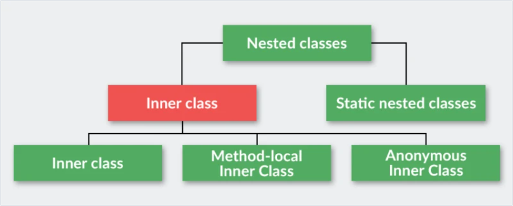

# Лекция 13. Перечисления. Аргументы переменной длины

## Статические поля и методы

Помимо обычных полей и методов в классе могут быть **статические** члены. От нестатических членов статические отличаются тем, что они общие для всех объектов данного класса. Например, если речь идет о нестатическом поле, то у каждого объекта класса это поле имеет свое уникальное значение. Если поле является статическим, то у всех объектов значение этого поля одно и то же. Более того, статические поля существуют вне зависимости от того, создавались объекты данного класса или нет. Примерно такая же ситуация и со статическими методами: они не привязаны к объектам и существуют как бы сами по себе.

Для того чтобы создать такой член класса, достаточно указать в самом начале его объявления ключевое слово `static`. Если член класса объявляется как `static`, он становится доступным до создания каких-либо объектов своего класса и без ссылки на какой-либо объект. Статическому полю можно сразу в описании присвоить значение, которое потом может быть изменено.

```java
public class Main {
    public static void main(String[] args) {
        SomeClass.value = 20;
        SomeClass.foo();
    }
}

class SomeClass {
    public static int value = 10;
    public static void foo() {
    }
}
```

Наиболее характерным примером члена типа `static` служит метод `main()`, который объявляется таковым потому, что он должен вызываться виртуальной машиной Java в самом начале выполняемой программы. Для того чтобы воспользоваться членом типа `static` за пределами класса, достаточно дополнить имя данного члена именем класса, используя точечную нотацию.

Но создавать объект для этого не нужно. В действительности член типа `static` оказывается доступным не по ссылке на объект, а по имени своего класса. Так, если требуется присвоить значение `1О` переменной `count` типа `static`, являющейся членом класса `Timer`, то для этой цели можно воспользоваться следующей строкой кода:

```java
class Timer {
    static int count;
}

Timer.count = 10;
```

Эта форма записи подобна той, что используется для доступа к обычным переменным экземпляра посредством объекта, но в ней указывается имя класса, а не объекта. Аналогичным образом вызываются методы типа `static`. Переменные, объявляемые как `static`, по сути являются глобальными.

В силу этого при создании объектов данного класса копии статических переменных в них не создаются. Вместо этого все экземпляры класса совместно пользуются одной и той же статической переменной. Ниже приведен пример программы, демонстрирующий различия между статическими и обычными переменными экземпляра.

```java
class StaticDemo {
    int х;
    static int у;

    int sum() {
        return х + у;
    }
}

class SDemo {
    public static void main(String args[]) {
        StaticDemo ob1 = new StaticDemo();
        StaticDemo ob2 = new StaticDemo();

        obl.x = 10;
        ob2.x = 20;

        // Все объекты совместно пользуются одной общей
        // копией статической переменной.
        System.out.println("The static variable у is shared.");
        StaticDemo.y = 19;

        System.out.println("ob1.sum() : " + obl.sum());
        System.out.println("ob2.sum(): " + ob2.sum());
        System.out.println();

        StaticDemo.y = 100;
        System.out.println("Change StaticDemo.y to 100");

        System.out.println("ob1.sum() : " + ob1.sum());
        System.out.println("ob2.sum(): " + ob2.sum());
        System.out.println();
    }
}
```

Выполнение этой программы даст следующий результат

```java
The static variable у is shared.
Set StaticDemo.y to 19.
obi.sum(): 29
ob2.sum(): 39

Change StaticDemo.y to 100
obi.sum(): 110
ob2.sum(): 120
```

Метод типа `static` отличается от обычного метода тем, что его можно вызывать по имени его класса, не создавая экземпляр объекта этого класса.

На применение методов типа `static` накладывается ряд следующих ограничений:

- в методе типа `static` допускается непосредственный вызов только других методов типа `static`;
- для метода типа `static` непосредственно доступным и оказываются только другие данные типа `static`, определенные в его классе;
- в методе типа `static` должна отсутствовать ссылка `this`.

### Статические константы

Статические переменные используются довольно редко. В то же время статические константы применяются намного чаще. Приведем пример класса `WiFiManager` из Android SDK

```java
public class WifiManager {
    public static final String ACTION_PICK_WIFI_NETWORK =
    "android.net.wifi.PICK_WIFI_NETWORK";
    public static final String ACTION_REQUEST_SCAN_ALWAYS_AVAILABLE =
    "android.net.wifi.action.REQUEST_SCAN_ALWAYS_AVAILABLE";
    public static final String ACTION_WIFI_NETWORK_SUGGESTION_POST_CONNECTION =
    "android.net.wifi.action.WIFI_NETWORK_SUGGESTION_POST_CONNECTION";
    public static final String ACTION_WIFI_SCAN_AVAILABILITY_CHANGED =
    "android.net.wifi.action.WIFI_SCAN_AVAILABILITY_CHANGED";
    public static final String EXTRA_NETWORK_INFO = "networkInfo";
    public static final String EXTRA_NETWORK_SUGGESTION =
    "android.net.wifi.extra.NETWORK_SUGGESTION";
    public static final String EXTRA_NEW_RSSI = "newRssi";

    ...
}
```

Статические константы можно смело объявлять как `public`, если нужно обеспечить доступ к этим константам в методах за пределами класса, в котором содержатся эти константы.

### Статические блоки

Иногда для подготовки к созданию объектов в классе должны быть выполнены некоторые инициализирующие действия. В частности, может возникнуть потребность установить соединение с удаленным сетевым узлом или задать значения некоторых статических переменных перед тем, как воспользоваться статическими методам и класса.

Для решения подобных задач в Java предусмотрены статические блоки `static`. Статический блок выполняется при первой загрузке класса, еще до того, как класс будет использован для каких-нибудь других целей. Ниже приведен пример применения статического блока.

```java
// Применение статического блока
class StaticBlock {
    static double root0f2;
    static double root0f3;

    // Этот блок выполняется при загрузке класса.
    static {
        System.out.println("Inside static block.");
        root0f2 = Math.sqrt(2.0);
        root0f3 = Math.sqrt(3.0);
    }

    StaticBlock(String msg) {
        System.out.println(msg);
    }
}

class SDemo3 {
    public static void main(String args[]) {
        StaticBlock ob = new StaticBlock("Inside Constructor");

        System.out.println("Square root of 2 is " +
                StaticBlock.root0f2);
        System.out.println("Square root of 3 is " +
                StaticBlock.root0f3);
    }
}
```

Результат выполнения данной программы выглядит следующим образом

```java
Inside static block.
Inside Constructor
Square root of 2 is 1.4142135623730951
Square root of 3 is 1.7320508075688772
```

Как видите, статический блок выполняется еще до того, как будет создан какой-либо объект.

## Вложенные и внутренние классы

*по материалам сайта [Java Rush](https://javarush.ru/groups/posts/2181-vlozhennihe-vnutrennie-klassih)*

**Вложенный класс (nested class)** - это класс, описанный внутри другого класса.

Вложенные классы делятся на 2 вида:

- **non-static nested classes** - нестатические вложенные классы. Иначе их еще называют **inner classes** - внутренние классы;
- **static nested classes** - статические вложенные классы.

В свою очередь, внутренние классы имеют два особых подвида:

- локальный класс (local class) - объявляется и видим внутри метода;
- анонимный класс (anonymous class).

### Внутренние классы

Внутренние классы позволяют выделить в программе некие сущности, которые неразрывно связаны с другой сущностью.

<p align="center">
  
</p>

Рассмотрим пример использования внутренних классов

```java
class Bicycle {
    private String model;
    private int weight;

    public Bicycle(String model, int weight) {
        this.model = model;
        this.weight = weight;
    }

    public void start() {
        System.out.println("Поехали!");
    }

    public class HandleBar {
        public void right() {
            System.out.println("Руль вправо!");
        }

        public void left() {
            System.out.println("Руль влево!");
        }
    }

    public class Seat {
        public void up() {
            System.out.println("Сиденье поднято выше!");
        }

        public void down() {
            System.out.println("Сиденье опущено ниже!");
        }
    }
}
```

Таким образом, мы создали класс `Bicycle`. У него есть 2 поля и один метод - `start()`. Внутри класса `Bicycle` описаны два класса - `HandleBar`(руль) и `Seat`(сиденье).

В данном примере выделение руля и сидения усиливает инкапсуляцию (мы скрываем данные о частях велосипеда внутри соответствующего класса), и позволяет создать более подробную абстракцию.

Возникает вопрос - почему делать эти два класса внутренними? Почему нельзя сделать `HandleBar` и `Seat` обычными классами?

```java
public class HandleBar {
    public void right() {
        System.out.println("Руль вправо!");
    }

    public void left() {
        System.out.println("Руль влево");
    }
}

public class Seat {
    public void up() {
        System.out.println("Сиденье поднято выше!");
    }

    public void down() {
        System.out.println("Сиденье опущено ниже!");
    }
}
```

Дело в том, что руль и сиденье - это составные части велосипеда. Отдельно от велосипеда они не имеют смысла.

```java
public class Main {

   public static void main(String[] args) {
       HandleBar handleBar = new HandleBar();
       handleBar.right();
   }
}
```

Отделив сущность руля от сущности велосипеда, мы потеряли логику нашей программы. С использованием внутреннего класса код смотрится совсем иначе.

```java
public class Main {

   public static void main(String[] args) {

       Bicycle peugeot = new Bicycle("Peugeot", 120);
       Bicycle.HandleBar handleBar = peugeot.new HandleBar();
       Bicycle.Seat seat = peugeot.new Seat();

       seat.up();
       peugeot.start();
       handleBar.left();
       handleBar.right();
   }
}
```

Особенности работы с внутренними классами:

1. Объект внутреннего класса не может существовать без объекта "внешнего" класса. Следующий код не скомпилируется:

```java
class Outer {
    class Inner {}
}

...

Inner inner = new Inner();
```

2. У объекта внутреннего класса есть доступ к переменным "внешнего" класса. Продемонстрируем это свойство на следующем примере

```java
public class Main {
    public static void main(String[] args) {
        Person person = new Person("Сергей");
        Person.PersonInfo info = person.new PersonInfo();
        info.printInfo();
    }
}

class Person {
    private String name;

    public Person(String name) {
        this.name = name;
    }

    public class PersonInfo {
        public void printInfo() {
            System.out.println("Person name is: " + Person.this.name);
        }
    }
}
```

Обратите внимания на рекомендуемый синтаксис обращения к полю name - сначала пишется название внешнего класса (`Person`), потом через точку идет обращение к объекту внешнего класса (`this`), после чего уже идет обращение к полю объекта внешнего класса.

```java
Person.this.name
```

Также обратите внимание, что класс `PersonInfo` имеет доступ к полю `name` даже когда оно объявлено как `private`.

3. Объект внутреннего класса нельзя создать в статическом методе "внешнего" класса. При создании объекта внутреннего класса, в него передается ссылка на объект "внешнего" класса, так как наличие такого объекта - обязательное условие существование объекта внутреннего класса. Но если метод внешнего класса статический, значит, объект внешнего класса может вообще не существовать. Следующий код выдаст ошибку

```java
class Outer {
    public static Inner foo() {
        return new Inner(); // <--- Ошибка!
    }

    class Inner {}
}
```

4. До версии Java 16 существовало ограничение, что внутренний класс не может содержать статические переменные и методы. Логика такого ограничения следующая: статические методы и переменные могут существовать и вызываться даже при отсутствии объекта. Но без объекта "внешнего" класса доступ к внутреннему классу невозможен. Компиляция следующего кода для Java версии 15 и старше вызывала ошибку

```java
class Outer {
    class Inner {
        public static int param; // <--- Ошибка!

        public static void foo() { // <--- Ошибка!
        }
    }
}
```

С появлением **записей** (**record**) в Java версии 16, это ограничение было снято.

5. При создании объекта внутреннего класса важную роль играет его модификатор доступа.

Внутренний класс можно обозначить стандартными модификаторами - `public`, `private`, `protected` и без модификатора (package private).

Если внутренний класс объявить как `public`, его объекты можно создавать в любом другом классе. Единственное требований - объект "внешнего" класса тоже обязательно должен существовать.

```java
public class Main {
    public static void main(String[] args) { 
        Outer outer = new Outer();
        Outer.Inner inner = outer.new Inner();
    }
}

class Outer {
    public class Inner {
    }
}
```

Если же объявить внутренний класс как `private`, доступ к созданию объектов будет только внутри "внешнего" класса. Следующий код вызовет ошибку

```java
public class Main {
    public static void main(String[] args) {
        Outer outer = new Outer();
        Outer.Inner inner = outer.new Inner(); // <--- ОШИБКА
    }
}

class Outer {
    private Inner inner; // <--- ОК

    public Outer() {
        inner = new Inner();
    }

    private class Inner {}
}
```

6. Модификаторы доступа для внутренних классов работают так же, как и для обычных переменных.

Модификатор `protected` предоставляет доступ к переменным класса в его классах-наследниках и в классах, которые находятся в том же пакете.

Так же `protected` работает и для внутренних классов. Объекты `protected` внутреннего класса можно создавать:

- внутри "внешнего" класса;
- в его классах-наследниках;
- в тех классах, которые находятся в том же пакете.

Если у внутреннего класса нет модификатора доступа, объекты внутреннего класса можно создавать:

- внутри "внешнего" класса;
- в классах, которые находятся в том же пакете.

Раньше внутренние классы играли важную роль в лаконичной реализации обратных вызовов, теперь для этого используются лямбда-выражения.

### Вложенные статические классы

При объявлении вложенных классов используется ключевое слово `static`

```java
class Car {
    private static int maxPassengersCount = 5;
    
    public static class Drawing {
        public static int getMaxPassengersCount() {
            return maxPassengersCount;
        }
    }
}
```

В статическом классе `Drawing` можно инкапсулировать всю служебную информацию о машине.

Рассмотрим отличия между статическими и нестатическими вложенными классами.

1. Объект статического вложенного класса не хранит ссылку на конкретный экземпляр внешнего класса - объект статического вложенного класса может существовать сам по себе. В этом плане статические классы более "независимы" чем нестатические.

```java
public class Main {
    public static void main(String[] args) {
        // Нам не нужно создавать объект Car для создания
        // объекта Drawing
        Car.Drawing drawing = new Car.Drawing();
    }
}

class Car {
    private static int maxPassengersCount = 5;

    public static class Drawing {
        public static int getMaxPassengersCount() {
            return maxPassengersCount;
        }
    }
}
```

Возникает вопрос - **в каких случаях стоит использовать статические классы, а в каких - внутренние?**

Вспомним пример класса `Bicycle`. Отдельный объект руля велосипеда чаще всего не имеет смысла (хотя это не всегда так). Сущность же чертежа автомобиля имеет смысл сама по себе. Например, она нужна для инженеров, которые планируют ремонт автомобиля. Кроме того, для всех автомобилей одного класса чертеж все равно будет одинаковым, так что жесткой связи между отдельным объектом автомобиля и отдельным объектом чертежа нет.

2. Разный доступ к переменным и методам внешнего класса. Статический вложенный класс может обращаться только к статическим полям внешнего класса. При этом неважно, какой модификатор доступа имеет статическая переменная во внешнем классе - даже если это `private`, доступ из статического вложенного класса все равно будет. Это же касается и доступа к статическим методам. Следующий код вызовет ошибку.

```java
class Outer {
    int value;

    static class Inner {
        public void foo () {
            value = 50; // <--- ОШИБКА!
        }
    }
}
```

**ВАЖНО!** Слово `static` в объявлении внутреннего класса НЕ означает, что можно создать всего один объект статического вложенного класса.

### Примеры использования статических членов класса и вложенных классов

#### Паттерн "Одиночка" (Singleton)

Одиночка — это порождающий паттерн, который гарантирует существование только одного объекта определённого класса, а также позволяет достучаться до этого объекта из любого места программы.

Существует много способов реализации этого паттерна, рассмотрим один из самых эффективных - **Double Checked Locking & volatile**. Этот способ обеспечивает потокобезопасность, ленивую инициализацию и является высокопроизводительным.

Объявим класс одиночки и создадим приватную статическую переменную типа класса, которую так же объявим как `volatile`.

```java
class DatabaseManager {
    private static volatile DatabaseManager instance;
}
```

> Ключевое слово `volatile` указывается для поля для того, чтобы указать компилятору, что все операции присвоения этой переменной и все операции чтения из неё должны быть атомарными. Атомарность гарантирует, что все потоки всегда будут использовать общее, исходное значение, и они будут видеть изменения этого исходного значения другими потоками сразу же.

Далее создадим статический метод `getInstance()`, который возвращает ссылку на ранее объявленную статическую переменную.

Если опустить момент с потокобезопасностью, логика работы метода следующая - если статическая переменная `instance` равна `null`, то создается новый объект класса одиночки и ссылка на него сохраняется в поле `instance`. Если же переменная `instance` не равна `null`, то будет возвращена ссылка на объект, который записан в поле `instance`.

```java
class DatabaseManager {

    private static volatile DatabaseManager instance;
    
    private DatabaseManager() {}

    public static DatabaseManager getInstance() {
        DatabaseManager localInstance = instance;
        if (localInstance == null) {
            synchronized (DatabaseManager.class) {
                localInstance = instance;
                if (localInstance == null) {
                    instance = localInstance = new DatabaseManager();
                }
            }
        }
        return localInstance;
    }
}
```

Обратите внимание, что объявление приватного конструктора закрывает возможность для внешнего кода напрямую создать объект типа `DatabaseManager`. Таким образом, для того чтобы получить объект `DatabaseManager`, необходимо вызывать статический метод `getInstance()`.

При первом вызове метода `getInstance()` будет создан объект `DatabaseManager`, ссылка на который будет передана внешнему коду. При всех последующих вызовах метода `getInstance()`, внешнему коду будет возвращена ссылка на один и тот же уже существующий объект `DatabaseManager`. Таким образом, мы можем гарантировать, что в программе будет физически существовать только один объект класса `DatabaseManager`.

Также, обратите внимание на то, что объект класса `DatabaseManager` будет создан не в начале работы программы, а в момент первого вызова метода `getInstance()`, в чем и проявляется свойство ленивой или отложенной инициализации.

```java
public class Main {
    public static void main(String[] args) {
        DatabaseManager manager1 = DatabaseManager.getInstance();
        DatabaseManager manager2 = DatabaseManager.getInstance();

        System.out.println("Manager 1 identity hash-code: " + System.identityHashCode(manager1));
        System.out.println("Manager 2 identity hash-code: " + System.identityHashCode(manager2));
    }
}
```

Результат работы кода

```
Manager 1 identity hash-code: 1705736037
Manager 2 identity hash-code: 1705736037
```

Как мы видим, объекты `manager1` и `manager2` указывают на один и тот же объект.

#### Паттерн "Строитель" (Builder)

Цель паттерна **Builder** - отделить строительство сложного объекта от его представления, так что один и тот же процесс строительства может создать разные представления.

Паттерн Builder позволяет создавать различные варианты объекта, избегая загрязнения конструктора. Полезно, когда может быть несколько вариантов объекта. Или когда есть много шагов, вовлеченных в создание объекта.

Представим, что нам нужно создать класс с большим количеством параметров - например, класс `Person`. Какие поля у нас будут? Давайте добавим:

- имя (`name`)
- фамилия (`surname`)
- возраст (`age`)
- рост (`height`)

Таким образом, получится такой класс

```java
public class Person {
 
    private String name;
    private String surname;
    private int age;
    private int height;
}
```

А теперь представим, что мы хотим для данного класса задать все возможные варианты конструкторов, которые нам могут понадобиться. Зачем? Чтобы в разных частях кодах использовать разные конструкторы и создавать экземпляры класса `Person` с разным количеством заполненных полей (например, у нас в классе 4 поля. А мы хотим заполнить только 2 поля).

Более того, очень легко будет случайно перепутать параметры местами. Например, если мы напишем `Person("Doe", "Jane")` вместо `Person("Jane", "Doe")` - перепутаем местами имя и фамилию? Или, например, возраст и рост? Оба параметра имеют одинаковый тип, и мы можем долго не замечать ошибку.

Все эти проблемы нам помогает решить паттерн проектирования Builder. Создадим внутри класса `Person` статический вложенный класс `Builder`.

```java
class Person {

    private String name;
    private String surname;
    private int age;
    private int height;

    public static class Builder {
        private Person newPerson;

        public Builder() {
            newPerson = new Person();
        }

        public Builder withName(String name) {
            newPerson.name = name;
            return this;
        }

        public Builder withSurname(String surname) {
            newPerson.surname = surname;
            return this;
        }

        public Builder withAge(int age) {
            newPerson.age = age;
            return this;
        }

        public Builder withHeight(int height) {
            newPerson.height = height;
            return this;
        }

        public Person build() {
            return newPerson;
        }

    }
}
```

Класс `Builder` можно разделить на три части:

- конструктор, в котором создается объект `Person`;
- перечень методов, каждый из которых устанавливает то или иное поле, после чего возвращает ссылку на объект `Builder`, для которого вызывается метод;
- метод `build()`, который возвращает сформированный объект `Person`.

Далее, рассмотрим пример создания объектов `Person` с помощью `Builder`

```java
public class Main {
    public static void main(String[] args) {
        
        Person p1 = new Person.Builder()
                .withName("Иван")
                .withSurname("Петров")
                .withAge(25)
                .withHeight(180)
                .build();
        
        Person p2 = new Person.Builder()
                .withName("Ольга")
                .withSurname("Сергеева")
                .build();
    }
}
```

Преимущества паттерна:

- код выглядит гораздо читабельнее. Всё, что относится к созданию объекта, вынесено в отдельный класс;
- при заполнении полей объекта теперь параметры трудно перепутать;
- можно заполнять не все параметры класса.

## Механизм перечислений

Механизм перечислений был добавлен в JDK 5 версии и позволяет удобно хранить и работать с так называемыми категориальными данными.

**Категориальные данные** – это данные с ограниченным числом уникальных значений или категорий. Приведем примеры категориальных данных:

- месяц года (12 значений: январь, февраль и так далее);
- пол (мужской, женский, андроген, бесполый и так далее);
- вероисповедание (православие, католицизм, ислам и так далее);
- день недели (понедельник, вторник, среда и так далее).

Рассмотрим пример. Для информационной системы «Электронный институт» необходимо создать класс сотрудника кафедры `DepartmentMember`, в котором, среди прочих атрибутов, есть атрибут `position`. С целью упрощения, предположим, что сотрудники кафедры могут занимать одну из следующих должностей:

- «Инженер» (Engineer);
- «Ассистент» (Assistant);
- «Старший преподаватель» (Lecturer);
- «Доцент» (Senior Lecturer);
- «Профессор» (Professor).

Каким образом закодировать данное значение? Самый первый и очевидный вариант – просто использовать тип данных `String`.

```java
class DepartmentMember {
    private String firstName;
    private String lastName;
    private String position;

    public DepartmentMember(String firstName, String lastName, String position) {
        this.firstName = firstName;
        this.lastName = lastName;
        this.position = position;
    }
}
```

Данное решение имеет несколько очень серьезных недостатков. Вы никак не можете обеспечивать правильность указания должностей и контролировать создание нового объекта класса.

```java
DepartmentMember member1 = new DepartmentMember(
        "Иван",
        "Иванов",
        "доцент"
);

DepartmentMember member2 = new DepartmentMember(
        "Иван",
        "Иванов",
        "старший преподаватель"
);
```

Например, должность старшего преподавателя может быть записано как: «ст. преп, ст. преподаватель, ст.пр.» и так далее, не говоря про возможные орфографические ошибки. С точки зрения формальной логики, это все разные категории должностей и вы не сможете группировать и фильтровать сотрудников кафедры по полю «должность».

Другой вариант – это создать несколько статических целочисленных констант, которые можно использовать вместо строк.

```java
class DepartmentMember {
    public static final int ENGINEER = 0;
    public static final int ASSISTANT = 1;
    public static final int LECTURER = 2;
    public static final int SENIOR_LECTURER = 3;
    public static final int PROFESSOR = 4;

    private String firstName;
    private String lastName;
    private int position;

    public DepartmentMember(String firstName, String lastName, int position) {
        this.firstName = firstName;
        this.lastName = lastName;
        this.position = position;
    }
}
```

Теперь мы сможем использовать именованные константы вместо строго фиксированных строк.

```java
DepartmentMember member1 = new DepartmentMember(
        "Иван",
        "Иванов",
        DepartmentMember.ENGINEER
);

DepartmentMember member2 = new DepartmentMember(
        "Петр",
        "Петров",
        DepartmentMember.PROFESSOR
);
```

Использование именованных констант позволяет отчасти избавиться от недостатков предыдущего подхода, но и этот вариант не является приемлемым.

Ничто не мешает пользователю класса при создании объекта указать любое целое число вместо именованной константы, осуществлять проверку ввода – достаточно трудоемкая задача, если в классе предусмотрено более одного категориального значения будет тяжело определять какие конкретно именованные константы необходимо использовать. К тому же, при использовании конструктора или сеттера поля «должность», нет никакого указания на необходимость использования именованных констант, программист сам должен догадаться о наличии нужных констант или читать сопроводительную документацию.

```java
class DepartmentMember {
    public static final int ENGINEER = 0;
    public static final int ASSISTANT = 1;
    public static final int LECTURER = 2;
    public static final int SENIOR_LECTURER = 3;
    public static final int PROFESSOR = 4;

    public static final int FULL_TIME = 100;
    public static final int PART_TIME = 101;
    
    private String firstName;
    private String lastName;
    private int position;
    private int contractType;

    public DepartmentMember(String firstName, String lastName, int position, int contractType) {
        this.firstName = firstName;
        this.lastName = lastName;
        this.position = position;
        this.contractType = contractType;
    }
}

...

DepartmentMember member2 = new DepartmentMember(
        "Петр",
        "Петров",
        DepartmentMember.FULL_TIME, // ???
        DepartmentMember.PART_TIME  // ???
);
```

Подход с использованием именованных констант напоминает улучшенную версию использования механизма специальных кодов и его не следует использовать при разработке коммерческих программ.

Корректным вариантом решения данной проблемы является использование специального **механизма перечислений** (**enumeration**). По сути, перечисление – это тип, ссылочная переменная которого может принимать одно из нескольких заранее определенных значений. Реализуем класс `DepartmentMember` с помощью механизма перечислений.

```java
class DepartmentMember {
    private String firstName;
    private String lastName;
    private Position position;

    public DepartmentMember(String firstName, String lastName, Position position) {
        this.firstName = firstName;
        this.lastName = lastName;
        this.position = position;
    }

    public enum Position {
        ENGINEER, ASSISTANT, LECTURER, SENIOR_LECTURER, PROFESSOR;
    }
}

DepartmentMember member1 = new DepartmentMember(
        "Иван",
        "Иванов",
        DepartmentMember.Position.ASSISTANT
);

DepartmentMember member2 = new DepartmentMember(
        "Петр",
        "Петров",
        DepartmentMember.Position.PROFESSOR
);
```

Преимущества такого подхода очевидны: поле `position` может принять только один из заранее определенных значений, которые указаны при создании перечислений. При вызове конструктора или сеттера поля `position`, пользователю класса сразу будет понятно, что необходимо передать в качестве аргумента метода.

Обратите внимание на синтаксис перечисления. Перечисление является классом, но очень своеобразным. Вместо ключевого слова `class` используется ключевое слово `enum` (от слова enumeration – перечисление). Вместо полей и методов у перечисления идет просто набор констант через запятую.
Как уже было сказано, перечисление – это класс, а это значит, что он может иметь методы, и мы можем инкапсулировать перечисление и операции работы с ним в одной оболочке.

```java
enum Palette {
    RED("#ff0000"),
    YELLOW("#ffff00"),
    CYAN("#00ffff"),
    GREEN("#008000");

    private final String color;

    public String getColor() {
        return color;
    }

    Palette(String color) {
        this.color = color;
    }
}

public class Main {
    public static void main(String[] args) {
        System.out.println("RED color value: " + Palette.RED.getColor());
        System.out.println("YELLOW color value: " + Palette.YELLOW.getColor());
        System.out.println("CYAN color value: " + Palette.CYAN.getColor());
        System.out.println("GREEN color value: " + Palette.GREEN.getColor());
    }
}
```

Вывод в консоли будет следующим:

```
RED color value: #ff0000
YELLOW color value: #ffff00
CYAN color value: #00ffff
GREEN color value: #008000
```

## Аргументы переменной длины

Механизм **аргументов переменной длины** (**varargs, variable-length arguments**) позволяет упрощать создание методов, принимающих переменное количество аргументов. Метод, который принимает переменное количество аргументов, называется **методом с аргументами переменной длины**.

Очень часто бывает необходимо создать метод, которому требуется передать переменное количество аргументов. Например, метод устанавливающий соединение с Интернетом, может принимать имя пользователя, пароль, имя файла, сетевой протокол и прочие данные, но в то же время выбирать значения, задаваемые по умолчанию, если какие-нибудь из этих данных опущены. В подобно ситуации было бы удобнее передавать только часто аргументов, а для остальных использовать значения по умолчанию. Еще один пример – метод `printf()`, который может принимать переменное количество аргументов.

Механизм аргументов переменной длины был введен в версии Java 5. До появления данного механизма, у нас было два варианта.

Во-первых, если максимальное количество аргументов было небольшим и известным, можно было создавать перегружаемые варианты метода – по одному для каждого из возможных способов вызова метода.

```java
public void connectToSocket(String host, String port) {
    // ...
}

public void connectToSocket() {
    String default_host = "127.0.0.1";
    String default_port = "12345";
    // ...
}

public void connectToSocket(String host) {
    String default_port = "12345";
    // ...
}
```

Во-вторых, когда максимальное количество возможных аргументов было большим или неизвестным, применялся подход, при котором аргументы сначала размещались в массиве, а затем массив передавался методу.

```java
public class Main {
    public static void main(String[] args) {
        String host = "127.0.0.1";
        String port = "12345";
        String login = "admin";
        String pass = "qwerty";

        String[] params = new String[]{host, port, login, pass};
        connectToSocket(params);
    }

    public static void connectToSocket(String[] params) {
        // ...
    }
}
```

Такой подход является более практичным, но создавать массив при каждом вызове такого метода – задача не только трудоемкая, но и чреватая ошибками.

Методы с аргументами переменной длины обеспечивают более простой и эффективный подход к обработке таких аргументов. Для указания аргументов переменной длины служат три точки `(…)`.

```java
public void connectToSocket(String... params) {
    // ...
}
```

В этой синтаксической конструкции компилятору предписывается, что метод `connectToSocket()` может вызываться без аргументов или с несколькими аргументами. В итоге массив `params` неявно объявляется как массив типа `String[]`. Таким образом, в теле метода `connectToSocket()` доступ к массиву params осуществляется с помощью синтаксиса обычного массива.

```java
public void connectToSocket(String... params) throws IOException {
    String host = params[0];
    String port = params[1];
    Socket socket = new Socket(InetAddress.getByName(host), Integer.parseInt(port));
    // ...
}
```

Наряду с параметром переменной длины, у метода могут быть и «обычные» параметры. Но параметр переменной длины должен быть последним среди всех параметров, объявляемых в методе.

```java
public void foo(int... params, float digit) {} // ОШИБКА!
public void foo(float digit, int... params) {} // ОК!
```

Кроме того, метод должен содержать **только один** параметр с переменным количеством аргументов.

```java
public void foo(int...params, String... args) {} // ОШИБКА!
```

### Перегрузка методов с аргументами переменной длины

Метод, принимающий аргументы переменной длины, можно перегружать.

```java
public void foo(String... args) {}
public void foo(int... params) {}  // Первый вариант
public void foo(int value, String... args) {} // Второй вариант
```

В приведенном выше примере демонстрируются два возможных способа перегрузки метода с аргументами переменной длины.

Первый способ состоит в том, что у параметра данного метода с переменным количеством аргументов могут разные типы.
Второй способ перегрузки состоит в том, чтобы добавить один или несколько обычных параметров. При перегрузке метода, принимающего аргументы переменной длины, могут происходить ошибки.

```java
public class Main {
    public static void main(String[] args) {       
        foo(); // Неоднозначность при вызове метода
    }
    
    public static void foo(String... args) {}
    public static void foo(int... params) {}
}
```

Параметр с переменными количеством аргументов может быть пустым, поэтому этот вызов может быть преобразован в вызов метода `foo(int…)` или `foo(String…)`. А поскольку вполне допустимы оба варианта, то данный вызов для компилятора неоднозначен. Рассмотрим еще один пример.

```java
public class Main {
    public static void main(String[] args) {
        foo(99); // Неоднозначность при вызове метода
    }

    public static void foo(int value, int... params) {}
    public static void foo(int... params) {}
}
```

Компилятор не может определить перегруженный вариант метода, `foo(int …)` или `foo(int, int…)`?

Из-за ошибок неоднозначности иногда приходится отказываться от перегрузки или использовать один и тот же метод под двумя разными именами.
