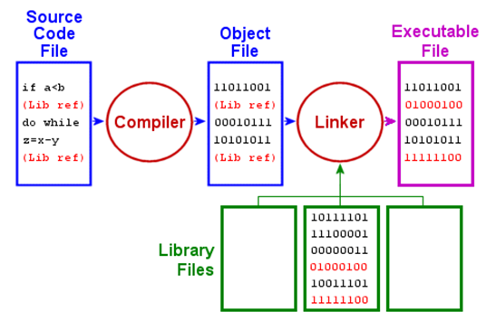

# Внутреннее устройство Java

## Языки программирования и виртуальные машины

Компьютер - это машина, которая может решать задачи, исполняя данные ей команды.

Последовательность команд, описывающих решение поставленной задачи, называется **программой**. Электронные схемы каждого компьютера могут распознавать и исполнять ограниченный набор простых команд. Все программы перед исполнением должны быть превращены в последовательность таких команд. Как правило, это очень простые команды, например:

- сложить два числа;
- проверить, не является ли число нулем;
- скопировать блок данных из одной части памяти компьютера в другую.

Эти примитивные команды в совокупности составляют язык, на котором люди могут общаться с компьютером. Такой язык называют **машинным**. Разработчик нового компьютера должен решить, какие команды следует включать в машинный язык этого компьютера. Это зависит от назначения компьютера и от задач, которые он должен решать. Обычно стараются сделать машинные команды как можно проще, чтобы избежать сложностей при разработке компьютера и снизить затраты на необходимую электронику. Большинство машинных языков крайне примитивны, из-за чего писать на них трудно и утомительно.

С течением времени это привело к построению ряда уровней абстракций, каждая из которых надстраивается над абстракцией более низкого уровня. Именно таким образом можно преодолеть сложности и сделать процесс проектирования систематичным и организованным. Этот подход называют **многоуровневой компьютерной организацией**.

Таким образом, существует огромная разница между языками программирования, которые удобны людям и языками, которые понимают компьютеры.

Эту разницу можно преодолеть двумя способами. Оба способа подразумевают разработку новых команд, более удобных для человека, чем встроенные машинные команды. Эти новые команды в совокупности формируют язык (назовем его **Я1**). Встроенные машинные команды формируют язык **Я0**. Компьютер может исполнять только программы написанные на его машинном языке **Я0**.

Два способа решения проблемы отличаются тем, каким образом компьютер будет исполнять программы, написанные на языке **Я1** - ведь компьютеру доступен только машинный язык **Я0**.

Первый способ называется **трансляция**. Команды программы **Я1** заменяются эквивалентным набором команд на языке **Я0**. То есть программа на языке **Я1** транслируется в программу на языке **Я0**, которую исполняет компьютер.

Второй способ - **интерпретация**. Для этого способа необходимо написать на языке **Я0** специальную программу, которая называется **интерпретатором**. Эта программа поочередно обрабатывает команду на языке **Я1**, преобразует её в эквивалентный набор команд на языке **Я1** и подает набор этих команд на исполнение.

Между трансляцией и интерпретацией много общего. В обоих случаях компьютер в конечном итоге исполняет набор команд на языке **Я0** (эти команды эквивалентны командам **Я1**). Отличие лишь в том, что при трансляции вся программа **Я1** переделывается в программу **Я0**, которая потом загружается в память компьютера и затем исполняется. 

При интерпретации каждая команда программы на **Я1** перекодируется в **Я0** и сразу же исполняется. Программа на **Я0** не создается. Работой компьютера управляет интерпретатор, для которого программа на **Я1** есть не что иное, как "сырые" входные данные. Оба подхода широко используются как вместе, так и по отдельности.

Так как при написании кода программист должен часто взаимодействовать с компьютером и его периферией, для облегчения написания программы на языке **Я1** была введена концепция **виртуальной машины**.

Представим себе гипотетический компьютер, для которого машинным языком является язык **Я1**. Назовем такую виртуальную машину **M1**. Также введем виртуальную машину **М0**, для которой машинным языком является **Я0**.

При написании программ на языке **Я1**, программисты используют концепцию и абстракции машины **М1**, хотя она будет исполняться на языке **Я0** компьютером.

Исходя из этого принципа возникли различные языки программирования, в которых по разному была реализована задача получения программы на языке **Я0**.

Первый подход – **компилируемые языки программирования**. Компилятор – это сложная компьютерная программа, которая принимает на вход код высокого уровня и преобразует его в эквивалентную программу на машинном языке. Компиляторы пишутся для конкретного языка, для конкретного типа процессора и для конкретной операционной системы.
Программа на языке высокого уровня называется исходным кодом, а в результате получается машинный код, который может напрямую выполнять процессор.

<p align="center">
  
</p>

Второй подход – **интерпретируемые языки программирования**. Интерпретатор – специальная программа, которая симулирует компьютер, который понимает язык высокого уровня. Вместо того чтобы преобразовывать (транслировать) исходный код в эквивалентный машинный код, интерпретатор анализирует и выполняет исходный код инструкция за инструкцией (то есть, напрямую с процессором работает не ваш код, а интерпретатор). Интерпретатор еще называют **виртуальной машиной**.

<p align="center">
  
</p>

Существует множество плюсов и минусов того или иного подхода, но сразу стоит отметить одно важное отличие – портируемость (portability). Компилируемые языки программирования имеют низкую портируемость кода за счет того, что необходимо адаптировать код для конкретного процессора и конкретной операционной системы. К тому же, для некоторых конфигурацией может не быть готового компилятора или он может быть неэффективным.

В случае использования интерпретируемых языков, портируемость выше. Разработчики языка, а также сообщество предоставляют интерпретаторы для всевозможных устройств – от микроконтроллеров до полноценных ПК. Разработчикам не надо задумываться о том, где будет запускаться ваш код и нет нужды предоставлять разные версии приложения для разных конфигураций.

Для разработчика программы на интерпретируемом языке программирования, интерпретатор для определенной конфигурации ПК ничем не отличается от интерпретатора, например, для микрокомпьютера Raspberry Pi. Если для того или иного устройства реализован интерпретатор, вы можете запустить на нем ваш код без проблем.

## Схема работы Java

> Ролик о том, как, в общих чертах, работает Java - [ссылка](https://www.youtube.com/watch?v=AnRKrnbiVzU)

Когда мы пишем какое-либо приложение, мы создаем файл с расширением `.java` и помещаем в него код на языке программирования Java. Такой файл называется **файлом с исходным кодом**.

Java - мультиплатформенный язык программирования. Это значит, что программы, написанные на языке Java, можно выполнять на любой платформе, где установлена специальная исполняющая среда Java. Такая система называется Java Virtual Machine (JVM). Для того, чтобы перевести программу из исходного кода в код, понятный JVM, нужно ее скомпилировать. Код, понятный JVM называется **байт-кодом** и содержит набор инструкций, которые в дальнейшем будет исполнять виртуальная машина.

<p align="center">
  
</p>

Для компиляции исходного кода в байт-код существует компилятор `javac`, входящий в поставку JDK (Java Development Kit). На вход компилятор принимает файл с расширением .java, содержащий исходный код программы, а на выходе выдает файл с расширением .class, содержащий байт-код - оптимизированный набор инструкций, необходимый для исполнения программы виртуальной машиной.

<p align="center">
  
</p>

Трансляция программы Java в байт-код значительно упрощает ее выполнение в разнотипных средах, поскольку на каждой платформе необходимо реализовать только виртуальную машину (JVM). Если в отдельной системе можно запустить JRE, то в ней можно выполнять любую программу на Java. Виртуальные машины Java, вне зависимости от платформы, интерпретируют один и тот же байт-код одинаково. Таким образом, разработчикам нет нужды предоставлять различные версии программы для различных платформ.

Тот факт, что программа на Java выполняется виртуальной машиной также способствует повышению ее безопасности. Виртуальная машины управляет выполнением программы, поэтому она может изолировать программу и воспрепятствовать возникновению побочных эффектов от ее выполнения за пределами данной системы.

Недостатком такого подхода можно считать то, что когда программа компилируется в промежуточную форму, а затем интерпретируется виртуальной машиной, она выполняется медленнее, чем если бы она была скомпилирована в исполняемый код. Но в Java это отличие в производительности не слишком заметно. Байт-код существенно оптимизирован, и поэтому его применение позволяет виртуальной машине выполнять программы значительно быстрее, чем следовало ожидать.

<p align="center">
  
</p>

Язык Java был задуман как интерпретируемый, но ничто не препятствует ему оперативно выполнять компиляцию байт-кода в машиннозависимый код для повышения производительности. Поэтому вскоре после выпуска Java появилась технология HotSpot, которая предоставляет динамический компилятор (или так называемый JIT-компилятор, JIT - Just In Time) байт-кода. В этом случае избранные фрагменты байт-кода компилируются в исполняемый код по частями, в реальном времени и по требованию.

<p align="center">
  
</p>

### JVM

В состав JVM выходят различные компоненты, такие как:

- загрузчик классов (Classloader);
- сборщик мусора (Garbage Collector), который отвечает за автоматическое управление памятью;
- интерпретатор;
- JIT-компилятор;
- компоненты управления потоками.

#### Загрузка классов

Чтобы попасть в JVM, класс должен быть загружен.

Загрузка классов - это поиск и загрузка типов (классов и интерфейсов) динамически во время выполнения программы. Данные о типах находятся в бинарных class-файлах.

Подсистема загрузчика классов отвечает не только за поиск и импорт бинарных данных класса. Она также выполняет проверку правильности импортируемых классов, выделяет и инициализирует память для переменных класса, помогает в разрешении символьных ссылок. Эти действия выполняются в следующем порядке:

- загрузка (loading) - поиск и импорт бинарных данных для типа по его имени, создание класса или интерфейса из этого бинарного представления;
- связывание или линковка (linking) - выполнение верификации, подготовки и необязательного, разрешения:
  - верификация (verification) -  проверка корректности импортируемого типа;
  - подготовка (preparation) - выделение памяти для статических переменных класса и инициализация памяти значениями по умолчанию;
  - разрешение (resolution) - преобразование символьных ссылок типов в прямые ссылки.
- инициализация (initialization) - вызов Java-кода, который инициализирует переменные класса их правильными начальными значениями.

**ВАЖНО!** Загрузчик классов, помимо загрузки классов, также отвечает за поиск ресурсов. Ресурс - некоторые данные (данные конфигурации, изображения, аудио-файлы и так далее), которые идентифицируются с помощью абстрактного пути, разделенного символом `/`. Ресурсы обычно упаковываются вместе с приложением или библиотекой для того, чтобы их можно было использовать в коде приложения или библиотеки.

Для этого существуют специальные классы-загрузчики:

- Bootstrap - базовый загрузчик, загружает классы платформы. Этот загрузчик является родителем всех остальных классов и частью платформы;
- Extension ClassLoader - загрузчик расширений, потомок Bootstrap-загрузчика. Загружает классы расширений, которые находятся в папке `jre\lib\ext`;
- AppClassLoader - системный загрузчик классов из `classpath`, который является непосредственным потомком Extension ClassLoader. Он загружает классы из каталогов и jar-файлов, указанных переменной среды `CLASSPATH`, системным свойством `java.class.path` или параметром командной строки `-classpath`;
- собственный загрузчик - у приложения могут быть свои собственные загрузчики.

Понятие `Classpath` - это путь, относительно которого виртуальная машина будет искать пакеты и скомпилированные классы. То есть, таким образом мы говорим виртуальной машине - какие директории в файловой системе являются корневыми для иерархии пакета Java. `Classpath` можно указать при запуске программы с помощью флага `-classpath`.

Главный класс приложения всегда загружается системным загрузчиков, остальные же классы могут быть загружены различными пользовательскими загрузчиками. После загрузки класса начинается этап линковки, который делится на три части.

- верификация байт-кода. Это статический анализ кода, выполняется один раз для класса. Система проверяет, нет ли ошибок в байт-коде. Например, проверяет корректность инструкций, переполнение стека и совместимость типов переменных;
- выделение памяти под статические поля и их инициализация;
- разрешение символьных ссылок - JVM подставляет ссылки на другие классы, методы и поля. В большинстве случаев это происходит при первом обращении к классу.

Класс инициализируется и JVM может начинать выполнение байт-кода методов.

JVM получает один поток байтовых кодов для каждого метода в классе. Байт-код метода выполняется, когда этот метод вызывается в ходе работы программы. Поток байт-кода метода - это последовательность инструкций для виртуальной машины Java. Инструкции выполняются в фрейме стека метода. У каждого метода есть некоторая своя часть в общем стеке. Таким образом, в главном потоке исполнения программы создаются множество подстеков на каждый вызов метода.

<p align="center">
  
</p>

В каждом стек-фрейме хранится массив локальных переменных.

#### Just-in-time (JIT) компиляция

Простыми словами, механизм JIT компиляции заключается в следующем: если в программе присутствуют части кода, которые выполняются много раз, то их можно скомпилировать один раз в машинный код, чтобы в будущем ускорить их выполнение. После компиляции такой части программы в машинный код, при каждом следующем вызове этой части программы, виртуальная машина будет сразу выполнять скомпилированный машинный код, а не интерпретировать его, что естественно ускорит выполнение программы.

Ускорение работы программы достигается за счет увеличения потребления памяти (она используется для хранения скомпилированного машинного кода) и за счет увеличения временных затрат на компиляцию во время исполнения программы.

JIT компиляция - довольно сложный механизм. Всего существует 4 уровня JIT компиляции байт-кода в машинный код. Чем выше уровень компиляции, тем он сложнее, но и одновременно выполнение такого участка будет быстрее, чем участка с меньшим уровнем. JIT-компилятор самостоятельно решает, какой уровень компиляции задать для каждого фрагмента программы, на основе того, как часто выполняется этот фрагмент. Под капотом JVM использует 2 JIT-компилятора - C1 и C2. C1 компилятор так же называется клиентским компилятором и способен скомпилировать код только до 3-го уровня. За 4-ый, самый сложный и быстрый уровень компиляции отвечает компилятор C2.

Для простых клиентских приложений выгоднее использовать компилятор C1, так как в этом случае нам важно как быстро стартует приложение. Серверные, долгоживущие приложения могут стартовать большее количество времени, однако в дальнейшем должны работать и выполняться быстро - тут лучше использовать компилятор C2.

При запуске Java-программы на x32 версии JVM можно при помощи флагов `-client` и `-server` вручную указать, какой режим следует использовать. В х64 версии JVM флаг `-client` игнорируется и по умолчанию используется серверная конфигурация приложения.

Одновременная компиляция всей программы Java в исполняемый код нецелесообразна, поскольку Java производит различные проверки, которые могут быть сделаны только во время выполнения. Вместо этого динамический компилятор компилирует код во время выполнения по мере надобности. Более того, компилируются не все фрагменты байт-кода, а только те, которым компиляция принесет выгоду, а остальной код просто интерпретируется. Тем не менее принцип динамической компиляции обеспечивает значительное повышение производительности.

#### Вызов методов

Java предоставляет два основных вида методов: методы экземпляра и методы класса. Методы экземпляра используют динамическое связывание, тогда как метода класса используют статическое связывание.

Виртуальная машина Java вызывает метод класса, выбирая его на основании типа ссылки на объект, который всегда известен во время компиляции. С другой стороны, когда виртуальная машина вызывает метод экземпляра, она выбирает метод для вызова на основе фактического класса объекта, который может быть известен только во время выполнения. Поэтому для вызова методов используются разные инструкции: `invokevirtual` и `invokestatic`.

### Память в JVM

JVM разделяет память на две основные категории: "кучу" (heap) и "не кучу" (non-heap) или стек. Куча - это часть памяти JVM, с которой разработчики наиболее знакомы. Здесь хранятся объекты, созданные приложением. Они остаются там до тех пор, пока не будут убраны сборщиком мусора. Как правило, размер кучи, которую использует приложение, изменяется в зависимости от текущей нагрузки.

Всякий раз, когда вызывается новый метод, содержащий примитивные значения или ссылки на объекты, то на вершине стека под них выделяется блок памяти. Из этого можно сделать вывод, что стек хранит значения примитивных переменных, создаваемых в методах, а также ссылки на объекты в куче на которые ссылается метод. Когда метод завершает работу, фрейм стека, отведенный для его нужд, очищается, и пространство становится доступным для следующего метода. При этом поток выполнения программы возвращается к месту вызова этого метода с последующим переходов к следующей строке кода.

Особенности стека:

- он заполняется и освобождается по мере вызова и завершения новых методов;
- переменные в стеке существуют до тех пор, пока выполняется метод в котором они были созданы;
- если память стека будет заполнена, Java выбросит исключение `java.lang.StackOverFlowError`;
- доступ к этой области памяти осуществляется быстрее, чем к куче;
- стек является потокобезопасным, поскольку для каждого потока создается свой отдельный стек.

Куча - эта область памяти используется для динамического выделения памяти для объектов и классов JRE во время выполнения. Новые объекты всегда создаются в куче, а ссылки на них хранятся в стеке.

Эти объекты имеют глобальный доступ и могут быть получены из любого места программы.

Эта область памяти разбита на несколько более мелких частей, называемых поколениями:

1. **Young Generation** - область, где размещаются недавно созданные объекты. Когда она заполняется, происходит быстрая сборка мусора;
2. **Old (Tenured) Generation** - здесь хранятся долгоживущие объекты. Когда объекты из Young Generation достигают определенного порога "возраста", они перемещаются в Old Generation.
3. до Java 8 существовала еще одна область **PermGen**, которая начиная с версии 8 была упразднена.

Разработчик может управлять размерами кучи в зависимости от требований.

<p align="center">
  
</p>

Основные особенности кучи:

- когда эта область памяти полностью заполняется, Java бросает `java.lang.OutOfMemoryError`;
- доступ к ней медленнее, чем к стеку;
- эта память, в отличие от стека, автоматически не освобождается. Для сбора неиспользуемых объектов используется сборщик мусора;
- в отличие от стека, куча не является потокобезопасной и ее необходимо контролировать, правильно синхронизируя код.

#### PermGen и Metaspace в среде Java

**PermGen** (Permanent Generation) - это специальное место в куче, отделенное от основной памяти.

<p align="center">
  
</p>

В PermGen виртуальная машина хранит метаданные загруженных классов. Также здесь находится всё статическое содержимое приложения, переменные примитивных типов и ссылки на статические объекты.

Более того PermGen хранит данные о байткоде и JIT информацию. До Java 7 пул строк также является частью PermGen.

По умолчанию, максимальный размер этой области памяти для 32-х битной JVM равен 64 Мб, а для 64-х битной версии - 82 Мб. Однако, вы можете изменять эти значения, используя следующие параметры JVM:

- `XX:PermSize=[размер]` - для установки минимального размера PermGen области;
- `XX:MaxPermSize=[размер]` - для установки максимального размера.

Из-за своего ограниченного размера, PermGen является причиной возникновения ошибки `java.lang.OutOfMemoryError: PermGen space`. Проще говоря, загрузчики классов не обрабатываются сборщиком мусора должным образом, в результате чего появляются утечки памяти. Чаще всего это происходит при создании новых загрузчиков.

**Эта область памяти была полностью удалена в JDK 8**

**Metaspace** - новая область памяти, появившаяся в 8 версии Java и заменившая устаревшую PermGen. Основное их отличие заключается в способе распределения памяти.

<p align="center">
  
</p>

По умолчанию, Metaspace увеличивается автоматически. Однако и здесь есть возможность управления памятью:

- при помощи **MetaspaceSize** и **MaxMetaspaceSize** можно задать границы Metaspace области;
- **MinMetaspaceFreeRatio** - минимальный зарезервированный размер памяти для метаданных классов после сборки мусора. Выражается в процентах от общего размера Metaspace области;
- **MaxMetaspaceFreeRatio** - максимальный зарезервированный размер памяти для метаданных классов после сборки мусора. Используется для предотвращения сокращения объема пространства, заполнение которого вызывает сборку мусора. Также выражается в процентах от общего размера Metaspace.

В результате появления Metaspace, процесс очистки памяти получил некоторые преимущества. Теперь сборщик мусора автоматически удаляет из памяти ненужные классы, когда емкость, выделенная для хранения метаданных, достигает максимального значения. Вместе с этим, уменьшилась вероятность получения ошибки `OutOfMemoryError`.

#### Пример управления памятью

Рассмотрим следующий код

```java
public class PersonBuilder {
    private static Person buildPerson(int id, String name) {
        return new Person(id, name);
    }

    public static void main(String[] args) {
        int id = 23;
        String name = "John";
        Person person = null;
        person = buildPerson(id, name);
    }
}

class Person {
    int id;
    String name;

    public Person(int id, String name) {
        this.id = id;
        this.name = name;
    }
}
```

Рассмотрим выполнение кода по шагам:

1. До начала выполнения метода `main()`, в стеке будет выделено пространство для хранения примитивов и ссылок этого метода:
    - примитивное значение `id` типа `int` будет храниться непосредственно в стеке;
    - ссылочная переменная name типа `String` будет создана в стеке, но сама строка "John" будет храниться в области, называемой **String Pool** (является частью Кучи);
    - ссылочная переменная `person` типа `Person` будет также создана в памяти стека, но будет указывать на объект, расположенный в куче.
2. Для вызова конструктора с параметрами `Person(int, String)` из метода `main()` в стеке, поверх предыдущего вызова метода `main()` будет выделен блок памяти, который будет хранить:
    - `this` - ссылка на текущий объект;
    - примитивное значение `id`;
    - ссылочную переменную name типа `String`, которая указывает на объект строки из пула строк.
3. В методе `main()` дополнительно вызывается метод `buildPerson()`, для которого будет выделен блок памяти в стеке поверх предыдущего вызова. Этот блок снова сохранит переменные способом, описанным выше.
4. Для вновь созданного объекта `person` типа `Person` все переменные будут сохранены в памяти кучи.

<p align="center">
  
</p>


## Сборка мусора и методы завершения

Как было сказано ранее, при использовании оператора `new` свободная память для создаваемых объектов динамически выделяется из пула свободной памяти. Разумеется, оперативная память не бесконечна, и поэтому свободная память рано или поздно исчерпывается. Это может привести к невозможности выполнения оператора `new` из-за нехватки памяти для создания требуемого объекта.
Именно по этой причине одной из главных функций любой схемы динамического распределения памяти является своевременное освобождение памяти от неиспользуемых объектов, чтобы сделать ее доступной для последующего распределения.

Во многих языках программирования освобождение памяти происходит вручную (например, в C++ для этого используется оператор `delete`). В Java применяется другой, более надежный механизм, который называется **сборка мусора**.

Система сборки мусора Java освобождает память от лишних объектов автоматически, без вмешательства со стороны программиста. Эта система работает следующим образом: если ссылки на объект отсутствуют (на объект не ссылается ни одна переменная), то такой объект считается больше ненужным, и занимаемая им память в итоге возвращается в пул свободной памяти и, в дальнейшем, может быть распределена для других объектов. Сборка мусора осуществляется время от времени по ходу выполнения программы (обычно, когда количество свободной памяти подходит к концу).

Сборщик мусора выполняет всего две задачи:

- поиск "мусора";
- очистка памяти от "мусора".

Для обнаружения мусора существует два подхода:

- Reference counting - подсчет ссылок;
- Tracing - трассировка.

Теперь нужно ответить на два вопроса: "Как Garbage Collector обнаруживает мусор?" и "Как очищает память?"

### Обнаружение мусора

#### Reference counting

Суть подхода состоит в том, что каждый объект имеет счетчик. Счетчик хранит информацию о том, сколько ссылок указывает на объект. Когда ссылка уничтожается, счетчик уменьшается. Если значение счетчика равно нулю, то объект можно считать "мусором" и память можно очищать.
Главным минусом такого подхода является сложность обеспечения точности счетчика. Также при таком подходе сложно выявлять циклические зависимости (когда два объекта указывают друг на друга, но ни один живой объект на них не ссылается). Это приводит к утечкам памяти.
В общем, Reference counting редко используется из за недостатков. Во всяком случае HotSpot VM его не использует.

#### Tracing

В методе трассировки главная идея состоит в мысли: "Живые объект - те до которых мы можем добраться с корневых точек (GC Root), все остальные - мусор. Все что доступно с живого объекта - также живое".
Если мы представим все объекты и ссылки между ними как дерево, то нам нужно пройти с корневых узлов по всем узлам. При этом узлы, до которых мы сможем добраться - не мусор, все остальные - мусор.

<p align="center">
  
</p>

Данный подход обеспечивает выявление циклических ссылок и используется в виртуальной машине HotSpot VM. Теперь необходимо понять, что из себя представляет корневая точка (GC Root)? Существуют следующие типы корневых точек:

- основной Java-поток;
- локальные переменные в основном методе;
- статические переменные основного класса.

Таким образом, простое java-приложение будет иметь следующие корневые точки:

- параметры метода `main()` и локальные переменные внутри метода `main()`;
поток, который выполняет метод `main()`;
- статические переменные основного класса, внутри которого находится метод `main()`.

### Очистка памяти

Имеется несколько подходов к очистке памяти, которые в совокупности определяют принцип функционирования GC. JVM HotSpot использует алгоритм сборки мусора типа "Generational Garbage Collection", который позволяет применять разные модули для разных этапов сборки мусора. Всего в HotSpot реализовано четыре сборщика мусора:

- Serial GC;
- Parallel GC;
- CMS GC;
- G1 GC.

Serial GC относится к одним из первых сборщиков мусора в HotSpot VM. Во время работы этого сборщика приложение приостанавливается и возобновляет работу только после прекращения сборки мусора. В Serial Garbage Collection область памяти делится на две части («young generation» и «old generation»), для которых выполняются два типа сборки мусора:

- minor GC - частый и быстрый с областью памяти "young generation";
- mark-sweep-compact - редкий и более длительный с областью памяти "old generation".

Область памяти «young generation» разделена на две части, одна из которых Survivor также разделена на 2 части (From, To).

<p align="center">
  
</p>

#### Алгоритм работы minor GC

Алгоритм работы minor GC очень похож на метод «Copying collectors». Отличие связано с дополнительным использованием области памяти «Eden». Очистка мусора выполняется в несколько шагов:

- приложение приостанавливается на начало сборки мусора;
- «живые» объекты из Eden перемещаются в область памяти «To»;
- «живые» объекты из «From» перемещаются в «To» или в «old generation», если они достаточно «старые»;
- Eden и «From» очищаются от мусора;
- «To» и «From» меняются местами;
- приложение возобновляет работу.

<p align="center">
  
</p>

В результате сборки мусора картинка области памяти изменится и будет выглядеть следующим образом:

<p align="center">
  
</p>

Некоторые объекты, пережившие несколько сборок мусора в области From, переносятся в «old generation». Следует, также отметить, что и «большие живые» объекты могут также сразу же переместиться из области Eden в «old generation» (на картинке не показаны).

#### Алгоритм работы mark-sweep-compact

Алгоритм «mark-sweep-compact» связан с очисткой и уплотнением области памяти «old generation».

<p align="center">
  
</p>

Принцип работы «mark-sweep-compact» похож на описанный выше «Mark-and-sweep», но добавляется процедура «уплотнения», позволяющая более эффективно использовать память. В процедуре живые объекты перемещаются в начало. Таким образом, мусор остается в конце памяти.

При работе с областью памяти используется механизм «bump-the-pointer», определяющий указатель на начало свободной памяти, в которой размещается создаваемый объект, после чего указатель смещается. В многопоточном приложении используется механизм TLAB (Thread-Local Allocation Buffers), который для каждого потока выделяет определенную область памяти.

### Типы ссылок

В Java используются разные типы ссылок: **сильные**, **слабые**, **мягкие** и **фантомные**. Разница между ними заключается в том, что объекты в куче, на которые они ссылаются, имеют право на сборку мусора по различным критериям. Рассмотрим подробнее каждую из них:

1. **Сильная ссылка** - это самые популярные ссылочные типы, к которым мы все привыкли.

```java
MyClass obj = new MyClass();
```

В примере выше мы фактически храним сильную ссылку на объект из кучи. Объект в куче не удаляется сборщиком мусора, пока на него указывает сильная ссылка или если он явно доступен через цепочку сильных ссылок.

2. **Мягкая ссылка** - эти типы ссылок используются для более чувствительных к памяти сценариев, поскольку они будут собираться сборщиком мусора тогда, когда вашему приложению не хватает памяти. Следовательно, пока нет критической необходимости в освобождении некоторого места, сборщик мусора не будет касаться легко доступных объектов. Java гарантирует, что все объекты, на которые имеются мягкие ссылки, будут очищены до того, как будет выдано исключение OutOfMemoryError. Мягкая ссылка создается следующим образом

```java
SoftReference<MyClass> softReference = new SoftReference<>(new MyClass());
```

3. **Слабая ссылка** - попросту говоря, слабая ссылка на объект из кучи, скорее всего, не сохранится после следующего процесса сборки мусора. Слабая ссылка создается следующим образом

```java
WeakReference<MyClass> weakReference = new WeakReference<>(new MyClass());
```

Одним из вариантов использования слабых ссылок являются сценарии кеширования. Представьте, что вы извлекаете некоторые данные и хотите, чтобы они также были сохранены в памяти - те же данные могут быть запрошены снова. С другой стороны, вы не уверены, когда и будут ли эти данные запрашиваться снова. Таким образом, вы можете сохранить слабую ссылку на него, и в случае запуска сборщика мусора, возможно, он уничтожит ваш объект в куче. Следовательно, через некоторое время, если вы захотите получить объект, на который вы ссылаетесь, вы можете внезапно получить значение `null`.

Хорошей реализацией кеширования является коллекция `WeakHashMap<K, V>`. Если мы откроем класс `WeakHashMap`, мы увидим, что его записи фактически расширяют класс `WeakReference` и используют его поле ref в качестве ключа `Map`:

```java
private static class Entry<K,V> extends WeakReference<Object> implements Map.Entry<K,V> {

    V value;
```

После сборки мусора ключа из `WeakHashMap`, вся запись удаляется из Map.

4. **Фантомная ссылка** - ссылка на объект, который был финализирован, но перед тем как занимаемая "мертвым" объектом память будет использована повторно. Фантомные ссылки можно использовать для того, чтобы определить - был ли удален объект из памяти или для улучшения процесса финализации объекта.

Как уже было сказано ранее, освобождением памяти от ненужных объектов Java занимается сборщик мусора (Garbage Collector).

Сборщик мусора удаляет объект в два "прохода".

В первый проход он только сморит на объекты, и, если надо, помечает их как "ненужные и подлежащие удалению". Если у этого объекта был переопределен метод `finalize()`, он вызывается (или не вызывается). Во второй проход сборщика объект удаляется и память освобождается.

Это создает ряд проблем. Мы не знаем, когда именно начнется работа сборщика мусора. Мы не знаем, будет ли вызван метод `finalize()`. Плюс ко всему, во время работы `finalize()` может быть создана сильная ссылка на объект, и тогда он вообще не будет удален. В системах, требовательных к объему свободной памяти, это может легко привести к `OutOfMemoryError`.

Для того, чтобы упорядочить этот процесс, можно использовать фантомные ссылки. Наличие фантомной ссылки меняет поведение сборщика мусора. Если на объект остались фантомные ссылки, то у него:

- вызывается метод finalize() (если он переопределен)
- если после работы finalize() ничего не изменилось и объект все еще может быть удален, фантомная ссылка на объект помещается в специальную очередь - ReferenceQueue.

Самое важное, что нужно понимать при работе с фантомными ссылками - **объект не удаляется из памяти до тех пор, пока его фантомная ссылка находится в этой очереди**. Он будет удален только после того, как у фантомной ссылки будет вызван метод `clear()`.

Фантомные ссылки являются самыми слабыми ссылками из всех. Они вступают в работу только тогда, когда на объект не осталось никаких других ссылок.

Метод `get()` для фантомной ссылки всегда возвращает `null`. Основная область использования фантомных ссылок - сложные процедуры удаления объектов из памяти.