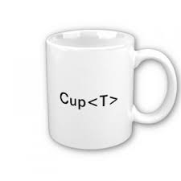

# Лекция 8. Обобщенные типы. Автоупаковка и автораспаковка. Обобщенные интерфейс, метод, конструктор

Обобщения появились в версии Java 5.0 и являлись одним из самых важных новшеств до выхода версии Java 8. Обобщения ориентируются на абстракцию и позволяют создавать классы и методы, которые работают одинаково для разных типов объектов. Понятие **общий** происходит от идеи, что нужна возможность писать общие алгоритмы, которые могут широко использоваться заново во многих типах объектов, а не адаптировать наш код, чтобы он подходил под каждое условие. Обобщение Java не столько добавляют новые возможности языку, сколько делают код Java, который можно использовать повторно, более легким для написания и чтения.

Обобщения переносят повторное использование на новый уровень, делая **тип** объектов, с которыми мы работаем, явным параметром кода. По этой причина на обобщения также ссылаются как на **параметризированные типы**. В случае общего класса, разработчик указывает тип как параметр (аргумент), когда он использует общий тип. Класс параметризируется предоставленным типом, к которому адаптируется сам код.

Применение обобщений позволило создавать классы, интерфейсы и методы, обрабатывающие разнообразные типы данных безопасно. Многие алгоритмы логически идентичны, независимо от того, к данным каких типов они применяются. Например, механизм, поддерживающий стеки, является общим для стеков, хранящих элементы типа `Student`, `String`, `Object` и так далее. Благодаря обобщениям можно определить алгоритм один раз независимо от конкретного типа данных, а затем применять его к обширному разнообразию типов данных без каких-нибудь дополнительных усилий.

> В других языках к обобщениям иногда ссылаются как к шаблонам, что больше является понятием реализации. Шаблоны похожи на промежуточные классы, ожидающие свои параметры типа, и тогда они могут использоваться.

<p align="center">
  
</p>

Обобщенный код будет автоматически работать с типом данных, переданным ему в качестве параметра. Многие алгоритмы выполняются одинаково, независимо от того, к данным какого типа они будут применяться. Например, сортировка не зависит от типа данных, будь то `String`, `Student` или любой другой пользовательский класс, объекты которого можно сравнить между собой. Используя обобщения, можно реализовать алгоритм один раз, а затем применять его без дополнительных усилий к любому типу данных.

Рассмотрим небольшой пример. Рассмотрим класс `Box`, который может содержать в себе один объект.

```java
class Box {
    
    private String item;

    public Box(String item) {
        put(item);
    }

    public void put(String item) {
        this.item = item;
    }

    public String get() {
        return item;
    }
}
```

В данном случае наша коробка хранит объекты класса `String`. Но что, если нам в нашей программе необходима коробка, которая хранила бы не только объекты класса `String`, но и объект любого другого класса, как стандартного из библиотек Java, так и нашего созданного? Как мы можем реализовать это с помощью уже известных механизмов ООП?
Мы можем использовать механизм полиморфизма. Например, мы можем использовать класс `Object`, который, как известно, является суперклассом для всех классов Java.

```java
class Box {

    private Object item;

    public Box(Object item) {
        put(item);
    }

    public void put(Object item) {
        this.item = item;
    }

    public Object get() {
        return item;
    }
}
```

Второй вариант - объявить интерфейс `BoxItem` и использовать его в качестве типа ссылочной переменной. Тогда в коробку можно будет "положить" объект класса, который реализует этот интерфейс.

```java
interface BoxItem {}

class Box {

    private BoxItem item;

    public Box(BoxItem item) {
        put(item);
    }

    public void put(BoxItem item) {
        this.item = item;
    }

    public BoxItem get() {
        return item;
    }
}
```

Метод стал чуть более общим и может использоваться в большем количестве мест. Однако, огромный недостаток такого подхода - необходимость нисходящего преобразования извлеченного из коробки объекта. Если же мы не знаем заранее, объект какого класса будет помещен в коробку, то и нисходящее преобразование реализовать будет достаточно затруднительно.

```java
Box box = new Box(new Item());
Object obj = box.get();

if (obj instanceof Item) {
    Item item = (Item)obj;
}
```

Какой выход может быть из данной ситуации? В Java и других ОО-языках программирования существует **механизм обобщенных типов**. Этот механизм позволяет нам создавать классы, методы и интерфейсы, которые будут автоматически работать с типами данных, которые будут переданы позднее, при создании объекта этого класса.

## Обобщенные классы

Реализуем класс `Box` с помощью механизма обобщенных типов

```java
class Box<T> {

    private T item;

    public Box(T item) {
        put(item);
    }

    public void put(T item) {
        this.item = item;
    }

    public T get() {
        return item;
    }
}
```

Такой класс называется обобщенным классом. Под термином обобщение следует понимать "применимость к большой группе классов". Идентификатор `T` между угловыми скобками `<>` называется **типизированной переменной**. Он указывает, что класс `Box` требует тип Java в качестве аргумента, чтобы сделать его полным. Имя `T` является произвольным, но существуют соглашения (они описаны в конце лекции). В этом случае типизированная переменная `T` представляет тип элементов, который мы хотим хранить в коробке.

Создадим объект класса `Box`

```java
Box<Item> box = new Box<>(new Item());
```

После создания объекта обобщенного класса, вместо `T` будет подставлен тип `Item`

```java
Box<Item> box = new Box<>(new Item());

box.put(new Item());
Item i = box.get();
```

То есть, нам нет необходимости заниматься нисходящим преобразованием и приведением типов - объект класса `Box` будет работать с классом `Item`.

#### ⚠️Механизм обобщения работает только с ссылочными типами!⚠️

Когда объявляется экземпляр обобщенного типа, аргумент передаваемый параметру типа должен быть ссылочным типом. Использовать для этого примитивные типы, например, `int` или `char`, нельзя. Следующий код вызовет ошибку компиляции

```java
Box<int> box = new Box<>(20); // ошибка компиляции
```

Для преодоления этой проблемы в Java предусмотрен механизм **автоупаковки (autoboxing)** и **автораспаковки (unboxing)**, который позволяет использовать классы-оболочки типов данных (их еще называют **"обертки"**, **wrapper**).

## Механизм автоупаковки и автораспаковки

В пятой версии Java были добавлены два очень полезных механизма - **автоупаковка** и **автораспаковка**, которые существенно упрощающих и ускоряющих создание кода, в котором приходится преобразовывать простые типа данных в объекты и наоборот.

Как мы знаем, в Java предусмотрены 8 примитивных типов данных. Примитивные типы данных имеют преимущества по сравнению с объектами, но механизм обобщенных типов и многие структуры данных в Java предполагают работу с объектами и поэтому в них нельзя хранить данные простых типов.

Для решения этой проблемы в Java предусмотрены классы-обертки (wrappers). Классы-обертки реализуются в классах `Double`, `Float`, `Long`, `Integer`, `Short`, `Byte`, `Character` и `Boolean`. Все обертки числовых типов данных являются производными от абстрактного класса `Number`.

Процесс преобразования значения примитивного типа в объект соответствующего класса-обертки называется **упаковкой (boxing)**.
Процесс извлечения значения примитивного типа из объекта-обертки называется **распаковкой (unboxing)**.

**Автоупаковка** - процесс автоматической упаковки (инкапсуляции) простого типа данных в объектную обертку без необходимости явного создания объекта.

```java
Integer i = 5; // автоупаковка
foo(5); // автоупаковка при передачи функции аргумента
Double result = bar(); // автоупаковка при получении результата

void foo(Integer i) {
    ...
}

double bar() {
    return 0.0;
}
```

**Автораспаковка** - это обратный процесс автоматической распаковки (извлечения) значения, упакованного в объектную оболочку.

```java
Integer i = 5;
int a1 = i; // автораспаковка

int a2 = new Integer(10); // старый вариант
int a3 = Integer.valueOf(10); // новый вариант

Integer a4 = 10;
foo(a4); // автораспаковка при передачи функции аргумента

double result = bar(); // автораспаковка при получении результата

static void foo(int i) {
    ...
}

static Double bar() {
    return 0.0;
}
```

## Передача нескольких параметризированных типов

Количество типов, которые можно передать в обобщенный класс, не ограничено. Чтобы передать несколько типов, их нужно перечислить из через запятую. Синтаксис объявления ссылки и создания такого объекта аналогичен созданию объекта с одним параметров.

```java
DualBox<String, Integer> box = new DualBox<>("Вася", 2);

class DualBox<T, V> {
    private T firstItem;
    private V secondItem;

    public DualBox(T firstItem, V secondItem) {
        this.firstItem = firstItem;
        this.secondItem = secondItem;
    }
}
```

## Ограничения типов

Очень часто при использовании обобщений, необходимо ограничить типы, которые могу быть переданы классу. Например, при написании обобщенного класса, который выполняет операции с числами, необходимо указать, что в качестве типа можно передать тип `Number`.
Для этого необходимо после параметра типа написать ключевое слово `extends` и указать имя класса (в этом случае будут доступны объекты этого типа или типов-наследников) или интерфейса (объекты типов, которые реализуют интерфейс). Обратите внимание, что для интерфейса тоже используется ключевое слово `extends`.

```java
class NumericValue<T extends Number> {
    private T value;

    public NumericValue(T value) {
        this.value = value;
    }
}

NumericValue<Double> num1 = new NumericValue<>(100.0);
NumericValue<Integer> num2 = new NumericValue<>(100);
NumericValue<Long> num3 = new NumericValue<>(100L);
```

Если класс принимает несколько типов, то мы можем указать один тип в качестве ограничителя второго. Таким образом, можно гарантировать, что оба класса совместимы друг с другом.

```java
class Pair<T, V extends T> {}
```

При указании ограничений, вы можете определить, что параметр типа должен наследовать класс и реализовывать интерфейс или несколько интерфейсов. Для этого необходимо использовать оператор `&`.

```java
class MyClass<T extends SomeClass & SomeInterface1 & SomeInterface2> {}
```

## Обобщенный интерфейс

Обобщенный интерфейс объявляется также как и обобщенный класс

```java
interface MyInterface<T> {
    void foo(T value);
}
```

Если класс реализует обобщенный интерфейс, то он также должен быть обобщенным. Не обобщенным он может быть только в том случае, если вы явно указываете тип при объявлении класса.

```java
interface MyInterface<T> {
    void foo(T value);
}

// Ошибка, класс должен быть обобщенным
class MyClass1 implements MyInterface<T> {
    @Override
    public void foo(T value) {}
}

// Правильное объявление. Класс реализующий
// обобщенный интерфейс должен быть обобщенным
class MyClass2<T> implements MyInterface<T> {
    @Override
    public void foo(T value) {}
}

// Мы явно указали параметр типа интерфейса
// и класс может быть не обобщенным
class MyClass3 implements MyInterface<Double> {
    @Override
    public void foo(Double value) {}
}
```

В интерфейсе можно указать ограничение с помощью ключевого слова `extends`. Класс, который реализует обобщенный интерфейс с ограничением, также должен соблюдать эти ограничения. При объявлении класса ограничение следует прописать после названия класса, но после ключевого слова `implements` его дублировать не надо.

```java
interface Iface<T extends Number> {}

// Выдаст ошибку
class MyClass4<T> implements Iface<T>{}

// Всё правильно
class MyClass5<T extends Number> implements Iface<T> {}

// Выдаст ошибку
class MyClass6<T extends Number> implements Iface<T extends Number>{}
```

## Передача объекта обобщенного класса в методы

Для того, чтобы иметь возможность использовать обобщенный класс в качестве аргумента метода, необходимо использовать так называемый **"шаблон аргумента" (wildcard)**.

Предположим, нужно реализовать метод, который сравнивает два объекта класса `NumericValue` и возвращает `true`, если оба объекта равны.
Необходимо сообщить компилятору, что входным аргументом является объект обобщенного класса. Написать `NumericValue<T>` не получится, так как это не объявление класса, а записать какое-то конкретное значение мы не можем, так как мы хотим подать объект обобщенного типа с любым допустимым типом данных. Для такого случая используется специальный символ `?`, который и является шаблоном аргумента.

```java
boolean isEquals(NumericValue<?> obj1, NumericValue<?> obj2) {
    double d1 = Math.abs(obj1.value.doubleValue());
    double d2 = Math.abs(obj2.value.doubleValue());

    return d1 == d2;
}

class NumericValue<T extends Number> {
    T value;

    public NumericValue(T value) {
        this.value = value;
    }
}
```

Такая сигнатура метода означает, что метод `isEquals()` принимает на вход аргументы обобщенного типа `NumericValue`, где параметр типа может быть любым допустимым для типа `NumericValue`.

### Ограничение снизу при использовании шаблона аргумента

Кроме "ограничения сверху", мы можем устанавливать "ограничение снизу", то есть установить в качестве корректного типа этот тип и суперклассы выше по цепочке наследования. Это реализуется с помощью ключевого слова `super`.

```java
void foo(GenericClass<? super C> obj1, GenericClass<? super B> obj2) {
    // типы obj1 могут быть C, B, A, Object
    // типы obj2 могут быть B, A, Object
}

class GenericClass<T> {}

class A {}
class B extends A {}
class C extends B {}
class D extends C {}
```

## Обобщенные методы

Методы в обобщенных классах могут использовать параметр типа своего класса, а следовательно, автоматически становятся обобщенными относительно параметра класса. Однако можно объявить обобщенный метод, который сам по себе использует параметр типа. Более того, такой метод может быть объявлен в обычном, а не обобщенном классе.
К примеру, реализуем методы, который будет сравнивать два массива обобщенных типов. Сначала объявим два класса

```java
class Student {
    private String name;
    private int avgMark;

    public Student(String name, int avgMark) {
        this.name = name;
        this.avgMark = avgMark;
    }
}

class PostGradStudent extends Student {
    private String phDTopic;

    public PostGradStudent(String name, int avgMark, String phDTopic) {
        super(name, avgMark);
        this.phDTopic = phDTopic;
    }
}
```

Далее объявим метод `compareArrays()`

```java
public <T extends Comparable<T>, V extends T> boolean compareArrays(T[] arg0, V[] arg1) {
    if (arg0.length != arg1.length)
        return false;
    
    for (int i = 0; i < arg0.length; i++) {
        if (!arg0[i].equals(arg1[i]))
            return false;
    }

    return true;
}
```

Выражение `T` extends `Comparable<T>` означает, что тип `T` должен реализовывать обобщенный интерфейс `Comparable<T>`, то есть чтобы мы могли сравнить объект типа `T` с другим объектом типа `T`. Выражение `V extends T` означает, что тип `V` должен быть или типом `T` или производным от `T` типом.

Создадим два массива и попытаемся вызвать метод `compareArrays()`.

```java
Student[] students1 = new Student[10];
PostGradStudent[] students2 = new PostGradStudent[10];

compareArrays(students1, students2);
```

Такой код вызовет ошибку компиляции, так как тип `Student` не реализует интерфейс `Comparable<Student>`.
  
```
java: method compareArrays in class com.company.Main cannot be applied to given types;
  required: T[],V[]
  found:    com.company.Student[],com.company.PostGradStudent[]
  reason: inference variable T has incompatible bounds
    lower bounds: java.lang.Comparable<T>
    lower bounds: com.company.Student
```

Исправим данную ошибку

```java
class Student implements Comparable<Student> {
    private String name;
    private int avgMark;

    public Student(String name, int avgMark) {
        this.name = name;
        this.avgMark = avgMark;
    }

    @Override
    public int compareTo(Student o) {
        return this.avgMark - o.avgMark;
    }
}
```

Если мы перепишем класс `PostGradStudent` так, чтобы он не является наследником типа `Student`, то при исполнении кода получим следующую ошибку

```
java: method compareArrays in class com.company.Main cannot be applied to given types;
  required: T[],V[]
  found:    com.company.Student[],com.company.PostGradStudent[]
  reason: inference variable V has incompatible bounds
    lower bounds: java.lang.Comparable<T>,T
    lower bounds: com.company.PostGradStudent
```

## Обобщенный конструктор

Так как конструктор является методом, то мы также можем объявлять обобщенные конструкторы. Обобщенный конструктор можно объявить даже тогда, когда сам класс не является обобщенным.

```java
class Accumulator {

    public <T extends Number> Accumulator(T number1, T number2) {
        // ...
    }
}

Accumulator accumulator = new Accumulator(5, 10);
Accumulator accumulator2 = new Accumulator(5.5d, 10L);
Accumulator accumulator3 = new Accumulator(5.5d, "four"); // вызовет ошибку
```

## Соглашение по правилам названия параметров типа

Согласно общепринятым правилам и конвенции кода, параметры типов записываются в виде одного символа алфавита в верхнем регистре. Рекомендуется использовать следующие символы алфавита:

- `E` (означает Element, часто используется в коллекциях);
- `K` (означает Key);
- `N` (означает Number);
- `T` (означает Type);
- `V` (означает Value);
- `S`, `U` - обычно вторые, третьи, четвертые параметры типа.

## Список дополнительной литературы по теме обобщений в Java

- [Нимейер, Леук "Программирование на Java. Исчерпывающее руководство"](https://cutt.ly/3RUXJV7), глава 8
- [Брюс Эккель - Философия Java](https://rutracker.org/forum/viewtopic.php?t=4941725), глава 15
- [Пришел, увидел, обобщил: погружаемся в Java Generics](https://habr.com/ru/company/sberbank/blog/416413/)