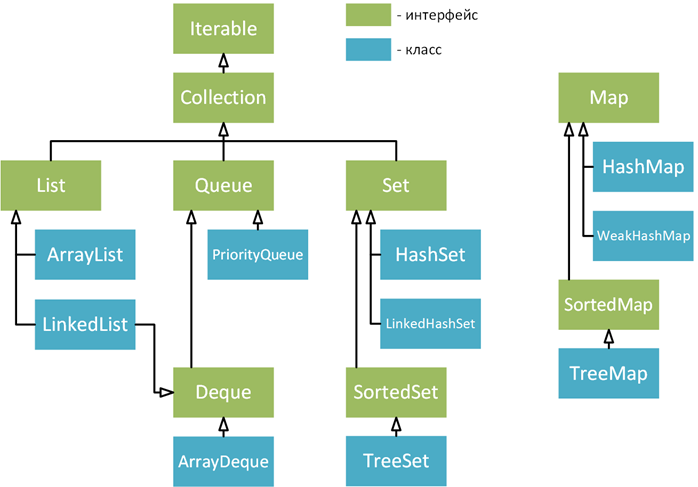

# Лекция 9. Коллекции

**Коллекции** - это хранилища или контейнеры, поддерживающие различные способы накопления и упорядочения объектов с целью обеспечения возможностей эффективного доступа к ним. Они представляют собой реализацию абстрактных структур данных, поддерживающих три основные операции:

- добавление нового элемента в коллекцию;
- удаление элемента из коллекции;
- изменение элемента в коллекции.

В качестве других операций могут быть реализованы следующие операции: заменить, просмотреть элементы, подсчитать их количество и так далее.

Для работы с коллекциями был создан Collection Framework. Коллекции в языке Java объединены в библиотеке классов `java.util` и представляют собой контейнеры для хранения и манипулирования объектами. В Java 5 в новом пакете `java.util.concurrent` появились ограниченно потокобезопасные коллекции, гарантирующие более высокую производительность в многопоточной среде для конкурирующих потоков. Также, начиная с версии 5, коллекции стали типизированными (*generic*), чтобы обезопасить коллекцию от появления ссылок на другие, не разрешенные логикой приложения типы.

В Java имеется несколько способов хранения объектов (или, точнее, ссылок на объекты). Самый простой вариант хранения объектов - массивы. Массивы обеспечивают самый эффективный способ хранения групп объектов. Однако массив имеет фиксированный размер, а, в общем случае, во время написания программы разработчик не знает точное количество объектов. К тому же массивы неэффективны при большой объеме элементов. Для таких случаев, в Java и в других языках реализован механизм коллекций объектов.

Рассмотрим основные интерфейсы коллекций в пакете `java.util`:

- `Map<K, V>` - карата отображения вида "ключ-значение" (такие структуры называют словарями или ассоциативными массивами);
- `Collection<E>` - вершине иерархии, базовый интерфейс для коллекций;
- `List<E>` - специализирует коллекции для обработки списков;
- `Set<E>` - специализирует коллекции для обработки множеств, содержащих уникальные элементы.

Ниже представлены основные интерфейсы и классы коллекций.

<p align="center">
  
</p>

## Интерфейс `Collection`

Этот интерфейс служит основанием, на котором построен весь каркас коллекций, поскольку он должен быть реализован почти всеми классами коллекций (кроме коллекций, реализующих интерфейс `Map`). Интерфейс `Collection` является обобщенным, ссылочная переменная типа `Collection` объявляется следующим образом

```java
Collection<String> collection;
```

Интерфейс `Collection` расширяет интерфейс `Iterable`. Это означает, что все коллекции можно перебирать, организовав цикл `foreach`. В интерфейсе `Collection` определяются основные методы, которые должны иметь все коллекции. Перечислим некоторые основные методы:

| Метод            | Описание                                                                  |
|------------------|---------------------------------------------------------------------------|
| `add(Object o)`    | Добавляет указанный объект в коллекцию                                    |
| `remove(Object o)` | Удаляет указанный объект из коллекции                                     |
| `clear()`          | Удаляет все элементы из коллекции                                         |
| `size()`           | Возвращает количество элементов в коллекции                               |
| `iterator()`       | Возвращает объект, который используется для доступа к элементам коллекции |

Объекты вводятся в коллекции методом `add()`. Следует, однако, иметь ввиду, что метод `add()` принимает аргумент типа `E`. Следовательно, добавляемые в коллекцию объекты должны быть совместимы с предполагаемым типом данных в коллекции. Вызвав метод `addAll()`, можно ввести все содержимое одной коллекции в другую.

Вызвав метод `remove()`, можно удалить из коллекции отдельный объект. Чтобы из коллекции удалить группу объектов, достаточно вызвать метод `removeAll()`. А для того чтобы удалить из коллекции все элементы, кроме указанных, следует вызвать метод `retainAll()`. Вызвав метод `removeIf()`, можно удалить из коллекции элемент, если он удовлетворяет условию, которое задается в качестве параметра predicate. И наконец, для полной очистки коллекции достаточно вызвать метод `clear()`.

Имеется также возможность определить, содержит ли коллекция определенный объект, вызвав метод `contains()`. Чтобы определить, содержит ли одна коллекция все члены другой, следует вызвать метод `containsAll()`. А определить, пуста ли коллекция, можно с помощью метода `isEmpty()`. Количество элементов, содержащихся в данный момент в коллекции, возвращает метод `size()`.

Оба метода `toArray()` возвращают массив, который содержит элементы, хранящиеся в коллекции. Первый из них возвращает массив класса `Object`, а второй - массив элементов того же типа, что и массив, указанный в качестве параметра этого метода. Обычно второй метод более предпочтителен, поскольку он возвращает массив элементов нужного типа. Эти методы оказываются важнее, чем может показаться не первый взгляд. Ведь обрабатывать содержимое коллекции, используя синтаксис массивов, иногда оказывается очень выгодно. Обеспечив связь коллекции с массивом, можно извлечь выгоду из обоих языковых средств Java.


Две коллекции можно сравнить на равенство, вызвав метод `equals()`. Точный смысл равенства может зависеть от конкретной коллекции. Например, метод `equals()` можно реализовать таким способом, чтобы он сравнивал значения элементов, хранимых в коллекции. В качестве альтернативы методу `equals()` можно сравнивать ссылки на эти элементы.
Еще один очень важный метод `iterator()` возвращает итератор, а метод `spliterator()` - итератор разделитесь для коллекции. Итераторы очень часто используются для обращения с коллекциями. И наконец, методы `stream()` и `parallelStream()` возвращают поток данных типа `Stream`, использующий коллекцию для своих элементов.

## Интерфейс List

**Список** (**List**) представляет собой динамический массив - упорядоченный набор элементов и может содержать повторяющиеся элементы. Вы можете получить доступ к любому элементу по индексу. Список является одним из наиболее используемых типов коллекций.

Основные свойства коллекций, реализующих интерфейс `List`:
список может включать одинаковые элементы;элементы в списке хранятся в том порядке, в котором они помещались;можно получить доступ к любому элементу по его порядковому номеру (индексу) внутри списка.

Начиная с версии Java 9, в интерфейс `List` внедрен фабричный метод `of()`, у которого имеется целый ряд перегруженных вариантов, возвращающих неизменяемую коллекцию на основе значений, составленную из переданных аргументов.
Особое назначение фабричного метода `of()` - предоставить удобный, эффективный способ для создания небольшой коллекции типа `List`. Во всех перегружаемых вариантах данного метода не допускается указывать пустые (null) элементы создаваемого списка. И в любом случае конкретная реализация интерфейса `List` не указывается.

```java
List<String> names = List.of("Петр", "Василий", "Александр");

// Выбросит исключение, так как коллекция неизменяемая (Immutable)
names.add("Сергей"); 
```

Существуют два основных класса, реализующих `List`.

### Класс ArrayList

Класс `ArrayList` с превосходной скоростью произвольного доступа к элементам, но относительно медленными операциями вставки и удаления элементов в середине. Пожалуй, самая часто используемая коллекция. `ArrayList` инкапсулирует в себе обычный массив, длина которого автоматически увеличивается при добавлении новых элементов.

Так как `ArrayList` использует массив, то время доступа к элементу по индексу выполняется за константное время (в отличие от класса `LinkedList`). При удалении произвольного элемента из списка, все элементы находящиеся "правее", смещаются на одну ячейку влево, при этом реальный размер массива (его емкость, `capacity`) не изменяется. Если при добавлении элемента массив будет полностью заполнен, будет создан новый массив размером `n * 3 / 2 + 1`, в него будут помещены все элементы из старого массива плюс новый, добавляемый элемент.

Несмотря на то, что емкость объектов типа `ArrayList` наращивается автоматически, ее можно увеличивать и вручную. вызывая метод `ensureCapacity()`. Это может потребоваться в том случае, если заранее известно, что в коллекции предполагается сохранить намного больше элементов, чем она содержит в данный момент. Увеличив емкость списочного массива в самом начале его обработки, можно избежать дорогостоящей операции постепенного наращивания списка.

С другой стороны, если потребуется уменьшить размер базового массива, на основе которого строится объект типа `ArrayList` до текущего количества хранящихся объектов, следует вызвать метод `trimToSize()`.

### Класс `LinkedList`

Связный список `LinkedList` представляет собой коллекцию с оптимальным последовательным доступом и низкозатратными операциями вставки и удаления в середине списка. Операция произвольного доступа `LinkedList` выполняет относительно медленно, но обладает более широкой функциональностью, чем `ArrayList`.

`LinkedList` состоит из узлов, каждый из которых содержит как собственно данные, так и две ссылки ("связки") на следующий и предыдущий узел списка. Доступ к произвольному элементу осуществляется за линейное время (но доступ к первому и последнему элементу списка всегда осуществляется за константное время - ссылки постоянно хранятся на первый и последний элементы, так что добавление элемента в конец списка вовсе не значит, что придется перебирать весь список в поисках последнего элемента).

В целом, в абсолютных величинах `LinkedList` проигрывает `ArrayList` и по потребляемой памяти и по скорости выполнения операций.

*В общем случае, следует использовать `ArrayList`. Коллекцию `LinkedList` имеет смысл использовать в случае, если происходит интенсивная вставка\удаление в середину списка либо необходимо гарантированное, заранее известное время добавления элемента в список.*

Рассмотрим основные методы интерфейса `List`

| Метод                                                    | Описание                                                                                                                                                                |
|----------------------------------------------------------|-------------------------------------------------------------------------------------------------------------------------------------------------------------------------|
| `void add(int index, E obj)`                             | Добавляет в список объект `obj` по индексу `index`                                                                                                                     |
| `boolean addAll(int index, Collection<? extends E> col)` | Добавляет в список все элементы коллекции `col` по индексу `index`. Если в результате добавления список был изменен, то возвращается `true`, иначе возвращается `false` |
| `E get(int index)`                                       | Возвращает из списка объект по индексу `index`                                                                                                                          |
| `int indexOf(Object obj)`                                | Возвращает индекс первого экземпляра заданного объекта в списке. Если заданный объект в списке отсутствует, возвращается значение -1                                    |
| `E remove(int index)`                                    | Удаляет объект по индексу index из списка, при этом метод возвращает удаленный объект                                                                                   |
| `E set(int index, E obj)`                                | Присваивает элементу по индексу `index` объект `obj` (фактически, записывает новую ссылку на объект поверх старой), метод возвращает старый объект                      |
| `List<E> sublist(int start, int end)`                    | Возвращает список элементов, которые находятся между индексами `start` и `end`                                                                                          |

Рассмотрим работу основных методов, заявленных в интерфейсе `List`

```java
// Создание обычного пустого списка
List<String> list = new ArrayList<>();
// Создание неизменяемого списка, Java 9+
List<String> strings = List.of("one", "two", "three", "four");

// Добавление элементов
list.add("one");
list.add("two");
list.add("three");
list.add("four");

// Удаление элемента с индексом 1
list.remove(1);

// Обход списка с помощью обычного цикла
for (int i = 0; i < list.size(); i++) {
    System.out.println(list.get(i));
}

// Обход списка с помощью foreach
for (String s : list) {
    System.out.println(s);
}

// Получение подсписка
List<String> subList = list.subList(1, 3);

// Изменение значение списка
// В строку old записывается старое значение
String old = list.set(0, "new");
```

Обратите внимание, что класс `ArrayList` преобразуется в `List` посредством восходящего преобразования. В идеале, большая часть кода должна взаимодействовать с этими интерфейсами (хотя это не всегда возможно), а точный тип указывается только в точке создания контейнера.

```java
// интерфейс класс, реализующий список
List<String> list = new ArrayList<>();
```

## Интерфейс `Queue`

Интерфейс `Queue` (**очередь**) расширяет интерфейс `Collection` и определяет поведение очереди, которая действует как список по принципу "первым вошел - первый вышел". Иначе говоря, объекты помещаются в один "конец" очереди, а извлекаются из другого "конца". Таким образом, порядок занесения объектов в контейнер будет совпадать с порядком его извлечения оттуда. Очереди также играют важную роль в параллельном программировании, потому что они обеспечивают безопасную передачу объектов между задачами.

Существуют разные виды очередей, порядок организации в которых основывается на некотором критерии. Интерфейс `Queue` является обобщенным, ссылочная переменная типа `Queue` объявляется следующим образом

```java
Queue<String> queue;
```

Перечислим основные методы, определенные в интерфейсе `Queue`

| Метод                     | Описание                                                                                                                                           |
|---------------------------|----------------------------------------------------------------------------------------------------------------------------------------------------|
| `E element()`             | Возвращает элемент из головы очереди. Возвращаемый элемент не удаляется. Если очередь пуста, генерируется исключение типа `NoSuchElementException` |
| `boolean offer(E object)` | Пытается ввести заданный object в очередь. Возвращает логическое значение `true`, если object введен, иначе - `false`                              |
|`E peek()`                 | Возвращает элемент из головы очереди. Если очередь пуста, возвращает пустое значение `null`. Возвращаемый элемент не удаляется из очереди          |
| `E poll()`                | Возвращает элемент из головы очереди и удаляет его. Если очередь пуста, возвращает значение `null`                                                 |
| `E remove()`              | Удаляет элемент из головы очереди, возвращая его. Генерирует исключение типа `NoSuchElementException`, если очередь пуста                          |

### Интерфейс Deque

Интерфейс `Deque` расширяет интерфейс `Queue` и определяет поведение двусторонней очереди, которая может функционировать как стандартная очередь по принципу "первым вошел - первым обслужен" или как стек по принципу "последним вошел - первым обслужен': Интерфейс `Deque` является обобщенным и объявляется приведенным ниже образом, где `Е` обозначает тип объектов, которые будет содержать двусторонняя очередь.

```java
interface Deque<E>
```

Следует обратить внимание, что в состав интерфейса Deque входят методы push() и pop(), благодаря которым этот интерфейс может функционировать как стек. Реализация интерфейса Deque в виде двусторонней очереди может быть ограниченной по емкости, то есть в такую очередь может быть введено ограниченное количество элементов.

### Класс `LinkedList`

Класс `LinkedList`, который мы рассматривали в связи с интерфейсом `List`, также реализует интерфейс `Deque` и поддерживает поведение очередей. Восходящее преобразование `LinkedList` в `Queue` позволяет использовать объект как очередь.

```java
List<String> list = new LinkedList<>();
list.add("one");
list.add("two");
list.add("three");
list.add("four");

Queue<String> queue = (Queue) list;
queue.offer("five");
queue.poll();
```

### Класс `PriorityQueue`

Класс `PriorityQueue` расширяет абстрактный класс `AbstractQueue` и реализует интерфейс `Queue`. Он служит для создания очереди по приоритетам на основании компаратора очереди.

В приоритетной очереди следующим извлекается элемент, обладающий наивысшим приоритетом.

:warning:**Например, в аэропорту клиент может быть обслужен вне очереди, если его самолет готовится к вылету. В системе передачи сообщений некоторые сообщения могут содержать более важную информацию; они должны быть срочно обработаны независимо от времени поступления.**:warning:

Если при построении очереди компаратор не указан, то применяется компаратор, выбираемый по умолчанию для того типа данных, который сохраняется в очереди. Компаратор по умолчанию размещает элементы очереди по нарастающей. Таким образом, в начале (голове) очереди окажется элемент с наименьшим значением.

С помощью компаратора можно задать другую схему сортировки элементов в очереди. Например, когда в очереди сохраняются элементы, содержащие метку времени, для этой очереди можно задать приоритеты таким образом, чтобы самые давние элементы располагались в начале очереди.

```java
Queue<Integer> queue = new PriorityQueue<>();
queue.offer(100);
queue.offer(20);
queue.offer(544);
queue.offer(11);
queue.offer(89);

while (queue.size() > 0)
System.out.println(queue.poll());

11
20
89
100
544
```

:warning:**Класс `PriorityQueue` имеет одну особенность. Так как очередь с приоритетами реализована с помощью кучи (бинарное дерево с определенными свойствами), то попытка вывести элементы с помощью цикла `foreach`, скорее всего, приведет к некорректному выводу элементов.**:warning:

### Класс `ArrayDeque`

Класс `ArrayDeque` расширяет класс `AbstractCollection` и реализует интерфейс `Deque`. Он не добавляет свои методы. Класс `ArrayDeque` создает динамический массив, не имеющий ограничений по емкости. (Интерфейс `Deque` поддерживает реализации с ограниченной емкостью, но не налагает на ее величину никаких ограничений). Класс `ArrayDeque` является обобщенным и объявляется следующим образом:

```java
class ArrayDeque<E>
```

В приведенном ниже примере демонстрируется применение класса ArrayDeque для организации стека

```java
ArrayDeque<Integer> stack = new ArrayDeque<>();
stack.push(10);
stack.push(20);
stack.push(30);
stack.push(40);

while (!stack.isEmpty())
    System.out.println(stack.pop());
```
