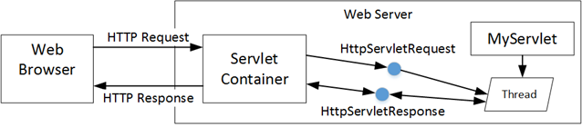
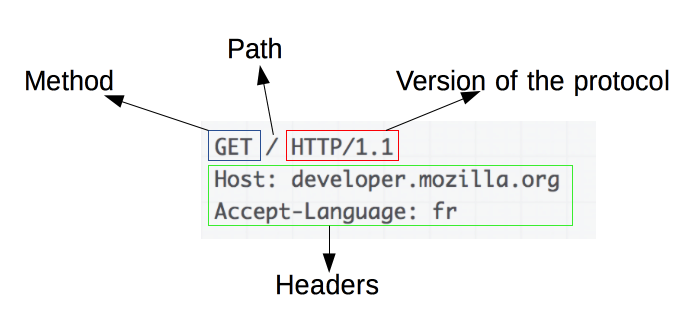
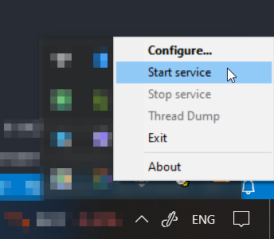
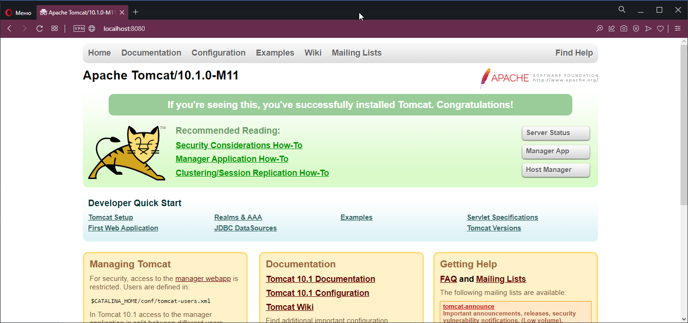
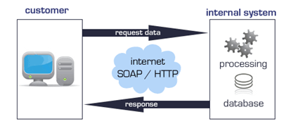

# Клиент-серверная архитектура. Создание простой RESTful веб-службы с помощью Spring Boot

## Клиент-серверная архитектура

Сервер - компьютер или программа, которая управляет ресурсами (информация, файлы, база данных) называется сервером этого ресурса или просто сервером.

Архитектура "клиент-сервер" определяет общие принципы организации взаимодействия, где имеются серверы (узлы-поставщики некоторых специфичных функций и сервисов) и клиенты, (потребители этих сервисов).

Между клиентами и серверами должны быть установлены правила взаимодействия, которые называются протоколом взаимодействия или протоколом обмена. Каждая часть взаимодействует друг с другом, обмениваясь сообщениями в заранее согласованном формате.

> Подробнее про клиент-серверное взаимодействие читайте [здесь](http://bit.ly/2qmKbHk)

<p align="center">
  
</p>

Компоненты трехзвенной архитектуры:

- клиент - этот компонент отвечает за представление данных конечному пользователю;
- выделенный сервер приложений - здесь содержится бизнес-логика приложения;
- сервер БД - предоставляет запрашиваемые данные.

Сервер приложений (application server) – сервисная программа, которая обеспечивает доступ клиентов к прикладным программам, выполняющимся на сервере.

Большинство серверов приложений имеют в своем составе веб-сервер. Это означает, что сервер приложений может делать все, на что способен веб-сервер. Кроме того, сервер приложений имеет компоненты и функции для поддержки сервисов уровня приложения, таких как пул соединений, поддержка транзакций и так далее.

> Информация о сервере приложений - http://bit.ly/2qt2Q4t. 
> Отличия веб-сервера и сервера приложений - http://bit.ly/2qlUaNe
> Подробнее про сервлеты и контейнеры сервлетов - http://bit.ly/2Q9GAaP

## Технология Java Servlets

На заре развития интернета не существовало технологий для создания динамических веб-страниц. В то время сайт представлял собой набор статических заранее написанных и сверстанных страниц с помощью языка разметки HTML. Если владелец сайта хотел обновить информацию на страничке, он делал это непосредственно на своем компьютере, после чего загружал на сервер обновленную версию HTML-страницы.

Среди предложенных решений по созданию динамических страниц, одной из первых была технология Java Servlets. В то время это была революционная технология, которая позволяла расширить возможности веб-серверов на основе модели запрос-ответ (request - response). Технология сервлетов позволяла веб-серверам обрабатывать HTTP-запросы и динамически генерировать веб-странички в зависимости от HTTP-запроса.

> На данный момент актуальной версией технологии является версия 5.0, спецификацию технологии смотрите [здесь](https://jakarta.ee/specifications/servlet/5.0/).

Несмотря на почтенный возраст, технология сервлетов претерпела серьезные изменения для того, чтобы соответствовать современной технологии разработки веб-приложений. На данный момент, технология сервлетов является наиболее часто используемой технологией для обработки HTTP запросов/откликов. Кроме того, сервлеты являются базой для почти всех Java-фреймворков, которые работают с HTTP протоколом (JSF, Struts, Spring MVC, BIRT и так далее).

Сервлет (Servlet), по сути, является классом Java, который используется для расширения возможностей сервером, предназначенных для размещения приложений. Сервлеты могут отвечать на запросы и генерировать отклики. Базовым классом для всех сервлетов является класс javax.servlet.GenericServlet. Этот класс определяет обобщенный, независимый от протокола сервлет.

Сервлеты являются базовыми элементами, на которых строится клиент-серверная архитектура 

Схема работы технологии сервлетов представлена на рисунке ниже

<p align="center">
  
</p>

1. клиент (например, веб-браузер) передает HTTP-запрос веб-серверу. В случае, если от веб-сервера требуется предоставить статический файл или какой-то ресурс (например, изображение), то он просто возвращает требуемый статический файл или ресурс;
2. если веб-сервер не может самостоятельно обработать HTTP-запрос (например, пользователь передает какие-то данные либо требуется предоставить динамическую страницу и так далее), веб-сервер передает этот запрос web-контейнеру (его еще называют servlet-контейнером);
3. контейнер определяет – какой сервлет может выполнить этот запрос, создает объекты классов HttpServletRequest и HttpServletResponse, создает thread, создает объект класса сервлета и передает ему объекты классов HttpServletRequest и HttpServletResponse;
4. контейнер вызывает метод сервлета service(), который вызывает соответствующий HTTP-запросу метод (например, если запрос был HTTP GET, то будет вызван метод doGet(), подробнее этот вопрос будет разбираться далее), которому, в качестве аргументов, передает объекты классов HttpServletRequest и HttpServletResponse;
5. соответствующий метод (например, метод doGet()) возвращает динамическую страницу внутри объекта класса HttpServletResponse, ссылку на который имеет контейнер;
6. после этого поток завершается, контейнер конвертирует объект класса HttpServletResponse в HTTP-отклик (HTTP response) и отдает его веб-серверу, который возвращает его клиенту.

## Протокол HTTP

Протокол HTTP лежит в основе обмена данными в Интернете. HTTP является протоколом клиент-серверного взаимодействия, что означает инициирование запросов к серверу самим получателем (браузером или другим клиентским приложением).

Клиенты и серверы взаимодействуют, обмениваясь одиночными сообщениями (а не потоком данных). Сообщения, отправленные клиентом называются запросами, а сообщения, отправленные сервером, называются ответами.

HTTP - это клиент-серверный протокол, то есть запросы отправляются какой-то одной стороной - участником обмена (user-agent). Чаще всего в качестве участника выступает веб-браузер, но им может быть кто угодно.

Каждый запрос (request) отправляется серверу, который обрабатывает его и возвращает ответ (response).

Участник обмена (user agent) - это любой инструмент или устройство, действующее от лица пользователя.

На другой стороне коммуникационного канала расположен сервер, который обслуживает (serve) пользователя, предоставляя ему документы по запросу. С точки зрения конечного пользователя, сервер всегда является некой одной виртуальной машиной, полностью или частично генерирующий документ, хотя фактически он может быть группой серверов, между которыми балансируется нагрузка, то есть перераспределяются запросы различных пользователей, либо сложным программным обеспечением, опрашивающим другие компьютеры.

### HTTP-запросы (HTTP-request)

<p align="center">
  
</p>

Запросы содержат следующие элементы:

- HTTP-метод, обычно глагол подобно GET, POST или существительное, как OPTIONS или HEAD, определяющее операцию, которую клиент хочет выполнить. Обычно, клиент хочет получить ресурс (используя GET) или передать значения HTML-формы (используя POST), хотя другие операции могут быть необходимы в других случаях;
- путь к ресурсу;
- заголовки (опционально), предоставляющие дополнительную информацию для сервера;
- для некоторых методов, таких как POST, тело метода, которое содержит отправленный ресурс.

### HTTP-ответы

Пример HTTP-ответа

<p align="center">
  
</p>

Ответы содержат следующие элементы:

- версию HTTP-протокола;
- HTTP код состояния, сообщающий об успешности запроса или причине неудачи;
сообщение состояния - краткое описание кода состояния;
- опционально: тело, содержащее пересылаемый ресурс.

Код состояния - это трехзначное число, которое отдает сервер на запрос клиента и благодаря которому корректируется дальнейшая обработка запрашиваемого документа. За числом всегда идет краткое пояснение кода на английском языке, отделенное пробелом - первичная инструкция клиенту.

Классы состояния - группа кодов, объединенных определенными признаками. На класс состояния указывает первая цифра в коде.

Выделяют пять классов:

- 1ХХ - информационные кода. Они отвечают за процесс передачи данных. Это временные коды, они информируют о том, что запрос принят и обработка будет продолжаться;
- 2ХХ - успешная обработка. Запрос был получен и успешно обработан сервером;
- 3ХХ - перенаправление (редирект). Эти ответы сервера гласят, что нужно предпринять дальнейшие действия для выполнения запроса. Например, сделать запрос по другому адресу;
- 4ХХ - ошибка клиента. Это значит, что запрос не может быть выполнен на стороне клиента;
- 5ХХ - ошибка сервера. Эти коды возникают из-за ошибок на стороне сервера. В данном случае клиент сделал все правильно, но сервер не может выполнить запрос.

Для кодов этого класса сервер обязательно показывает сообщение, что не может обработать запрос и по какой причине.

## Платформа Jakarta EE

Как язык программирования, в рамках одной версии Java везде приблизительно одинаковая. С точки зрения платформы, существуют разные вариации:

- Standard Edition (SE) - основной набор;
- Enterprise Edition (EE) - стандартная версия, с дополнительными интерфейсами корпоративных web-технологий;
- Micro Edition (ME) - для платформ, сильно ограниченных в ресурсах: Интернет Вещей, Raspberry Pi, умные телевизоры и так далее;
- Java Card - платформа для банковских и SIM-карт. Подмножество основного языка, с урезанной библиотекой, измененными байткодом и упором на безопасность;
- JavaFX - платформа для десктопных приложений, замена Swing.

Enterprise-версия Java изначально называлась J2EE, после Java 5, J2EE 1.5 превратилась в Java EE 5.

В 2018-ом компания Oracle рассталась с enterprise-версией, передала её open-source организации Eclipse Foundation, после чего Java EE была переименована в Jakarta EE.

Jakarta EE - это платформа, которая предлагает набор компонентов и API для разработки бизнес-приложений на Java. Она расширяет Java SE спецификациями для разработки и запуска масштабируемых, надежных и безопасных корпоративных приложений.

Jakarta EE - это, проще говоря, набор API и фреймворк для создания новых. Как таковая, эта платформа особенно актуальна для разработки бэкенда или серверной части.

### Создание тестового проекта на платформе Jakarta EE

Продемонстрируем использование технологии сервлетов на тестовом примере.

Для начала, загрузим и установим контейнер сервлетов Apache Tomcat.

> Актуальную 10ую версию Apache Tomcat можно скачать [здесь](https://tomcat.apache.org/download-10.cgi). Ищите Binary Distributions\Core.

При установке обязательно укажите путь к JRE, без него Apache Tomcat не будет работать.

После установки запустите приложение **Monitor Tomcat**. После этого, в трее вы увидите значок приложения. Нажмите на Start Service, после чего кнопка в трее должна стать зеленой.

<p align="center">
  
</p>

Далее перейдем в браузере по адресу http://localhost:8080 (Apache Tomcat по умолчанию использует порт 8080, если вы указали другой порт при установке или в настройках - используйте его). Если установка и запуск прошел без ошибок, вы должны увидеть в браузере стартовую страницу Apache Tomcat

<p align="center">
  
</p>

Далее откроем IntelliJ IDEA и создадим новый maven-проект, архетип не выбираем

<p align="center">
  
</p>

После создания проекта, у вас будет открыт файл pom.xml.

POM (Project Object Model) является базовым модулем Maven. Это специальный XML-файл, который всегда хранится в базовой директории проекта.

Файл POM содержит информацию о проекте и различных деталях конфигурации, которые используются Maven для создания проекта.

Этот файл также содержит задачи и плагины. Во время выполнения задач, Maven ищет файл pom.xml в базовой директории проекта. Он читает его и получает необходимую информацию, после чего выполняет задачи.

Для того, чтобы иметь возможность работать с сервлетами, необходимо скачать и подключить библиотеку `jakarta.servlet`, которая содержит необходимые классы и аннотации.

Для этого отредактируем pom.xml следующим образом - добавим элемент `<dependencies>`, в котором указываем нужную библиотеку и версию. Итоговый pom-файл будет выглядеть следующим образом

```xml
<?xml version="1.0" encoding="UTF-8"?>
<project xmlns="http://maven.apache.org/POM/4.0.0"
         xmlns:xsi="http://www.w3.org/2001/XMLSchema-instance"
         xsi:schemaLocation="http://maven.apache.org/POM/4.0.0 http://maven.apache.org/xsd/maven-4.0.0.xsd">
    <modelVersion>4.0.0</modelVersion>

    <groupId>ua.opu</groupId>
    <artifactId>hello_servlet</artifactId>
    <version>1.0-SNAPSHOT</version>

    <dependencies>
        <dependency>
            <groupId>jakarta.servlet</groupId>
            <artifactId>jakarta.servlet-api</artifactId>
            <version>5.0.0</version>
        </dependency>
    </dependencies>

    <properties>
        <maven.compiler.source>17</maven.compiler.source>
        <maven.compiler.target>17</maven.compiler.target>
    </properties>

</project>
```

Для того, чтобы Maven загрузил библиотеки, нажмите правой кнопкой на область кода, выберите `Maven -> Reload Project`.

Далее, создадим файл HelloServlet, где напишем следующий код

```java
@WebServlet("/")
public class HelloServlet extends HttpServlet {

    @Override
    protected void doGet(HttpServletRequest req, HttpServletResponse resp) throws ServletException, IOException {

        PrintWriter out = resp.getWriter();
        out.println("<h1>Hello! This is example!</h1>");
        out.close();
    }

    @Override
    protected void doPost(HttpServletRequest req, HttpServletResponse resp) throws ServletException, IOException {
        super.doPost(req, resp);
    }
}
```

Обратите внимание на аннотацию `@WebServlet("/")`. Она указывает Apache Tomcat, что данный класс обрабатывает запросы с указанием корня в качестве пути.

Далее, нам необходимо скомпилировать данный проект и "упаковать" его в war-файл, для того, чтобы загрузить его в сервлет-контейнер.

WAR (Web application ARchive) файлы используются для распространения Java web-приложений. WAR имеет такую же структуру, как и JAR-файл, единый сжатый файл, содержащий несколько файлов внутри него.

WAR-файлы используются для объединения JSP-файлов, сервлетов, Java class-файлов, XML-файлов, javascript-библиотек, JAR-библиотек, статических web-страниц и любых других ресурсов, необходимых для работы приложения.

WAR-файлы обычно разворачивают в контейнерах сервлетов, но также возможно разворачивать и в Java EE серверах приложений. Когда WAR-файл разворачивается в контейнере, контейнер обычно распаковывает его для доступа к файлам, а затем запускает приложение. На основе контейнеров сервлетов получается наиболее производительная платформа для Java web-приложений, WAR-файлы являются не только стандартом Java спецификации, но WAR-файлы нельзя редактировать, пока работает приложение. Любые изменения потребуют пересборки файла.

Для получения war-файла необходимо

## Веб-сервисы

Всемирная паутина является готовой платформой для создания и использования распределенных систем на основе веб-служб. Веб-сервер выступает в качестве сервера приложений, к которым обращаются не конечные пользователи, а сторонние приложения. Это позволяет многократно использовать функциональные элементы, устранить дублирование кода, упростить решение задач интеграции приложений.

Веб-служба или веб-сервис (web-service) – сетевая технология, обеспечивающая межпрограммное взаимодействие на основе веб-стандартов. W3C определяет веб-службу как «программную систему, разработанную для поддержки интероперабельного межкомпьютерного (machine-to-machine) взаимодействия через сеть».

<p align="center">
  
</p>

К моменту появления веб-служб уже существовали технологии, позволяющие приложениям взаимодействовать на расстоянии, где одна программа могла вызвать какой-нибудь другой метод в другой программе, которая при этом могла быть запущена на компьютере, расположенном в другом городе или даже стране. Это сокращенно называется RPC (Remote Procedure Calling – удаленный вызов процедур). В качестве примеров можно привести технологии CORBA, а для Java – RMI (Remote Method Invoking – удаленный вызов методов).

Идея веб-службы заключалась в создании такого RPC, который будет упаковываться в HTTP пакеты. Такой подход стал очень популярным, т.к. HTTP был хорошо известен, прост, понятен и обеспечивал лучшее «прохождение» через различные firewall`ы. Именно с появлением веб-сервисов развилась идея SOA – сервис-ориентированной архитектуры веб-приложений (Service Oriented Architecture).

API (интерфейсы прикладного программирования) предоставляют правила и определения, которые позволяют приложениям обмениваться данными и взаимодействовать друг с другом. API определяет типы вызовов и запросов, которые одно приложение может отправлять другому, как выполнять эти запросы, используемые форматы данных и соглашения, которым должны следовать клиенты.

API-интерфейсы также поддерживают «подключаемость» приложений, которые образуют более крупную систему, поскольку они позволяют двум приложениям - даже если они написаны на разных языках программирования и работают на разных платформах - общаться и взаимодействовать друг с другом.

### API-интерфейсы веб-сервисов

На сегодняшний день наибольшее распространение получили следующие протоколы реализации API:

- SOAP (Simple Object Access Protocol) – тройка стандартов SOAP/WSDL/UDDI. Сообщения упаковываются в виде структуры, которая называется конверт (envelope), которая включает идентификатор сообщения, заголовок и тело сообщения;
- REST (Representational State Transfer) – архитектурны стиль, который использует концепцию ресурсов и определяет операции через методы HTTP-протокола;
- XML-RPC (XML Remote Procedure Call) – вызов удаленных процедур, использующий XML для кодирования своих сообщений и HTTP в качестве транспортного механизма;
- gRPC (удаленный вызов процедур Google) – это архитектура RPC с открытым исходным кодом, разработанная Google для обеспечения высокоскоростной связи между микросервисами. gRPC позволяет разработчикам интегрировать сервисы, написанные на разных языках.

### Протокол REST

Передача состояния представления (Representational State Transfer (REST)) является архитектурным стилем, в котором веб-службы рассматриваются, как ресурсы и могут быть идентифицированы Унифицированными идентификаторами ресурсов (Uniform Resource Identifiers (URI)).

Веб-службы, разработанные в стиле REST и с учетом ограничений REST, известны как RESTful веб-службы.

Каждая единица информации в REST называется ресурсом и имеет однозначный URI, который является ее, своего рода, первичным ключом. То есть, например, третья книга с книжной полки будет иметь URI /book/3, а 35ая страница в этой книге – /book/3/page/35/. Отсюда и получается строго заданный формат. Причем совершенно не имеет значения, в каком формате находятся данные по адресу /book/3/page/35/ – это может быть и HTML, и отсканированная копия книги в виде jpeg-файла и документ Microsoft Word.

Над ресурсами выполняется ряд простых четко определенных операций. В качестве протокола передачи данных используется stateless-протокол, обычно HTTP.

При использовании протокола HTTP действия над данными выполняются с помощью HTTP-методов: GET (получить), PUT (добавить, заменить), POST (добавить, изменить, удалить), DELETE (удалить). Таким образом, действия CRUD (Create-Read-Update-Delete) могут выполняться как со всеми 4-мя методами, так и только с помощью GET и POST. Примеры запросов:

- GET /book/ – получить список всех книг;
- GET /book/3 – получить книгу номер 3;
- PUT /book/ – добавить книгу (данные в теле запроса);
- POST /book/3 – изменить книгу (данные в теле запроса);
- DELETE /book/3 – удалить книгу.

Как правило, необязательно поддерживать все методы, но, как правило, веб-служба должна поддерживать:

- GET – используется для получения существующих ресурсов;
- POST – используется для создания/обновления нового ресурса;
- PUT – используется для обновления/замены ресурса;
- DELETE – используется для удаления ресурса.

Кроме этого, служба может поддерживать такие методы как PATCH (обновление части ресурса), HEAD (возвращение заголовка ресурса, т.е. метаданных) и т.д.