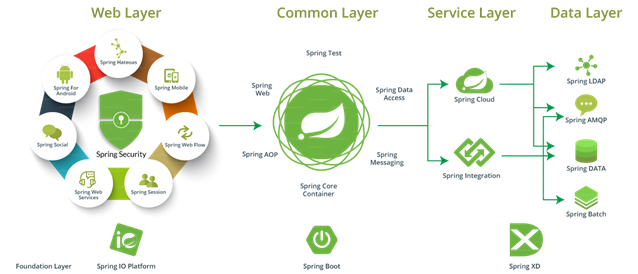
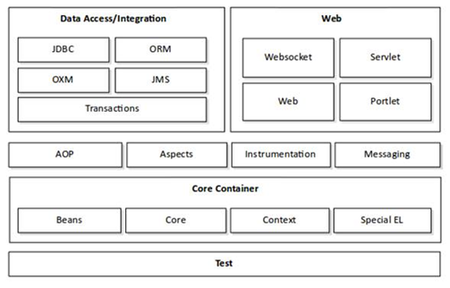
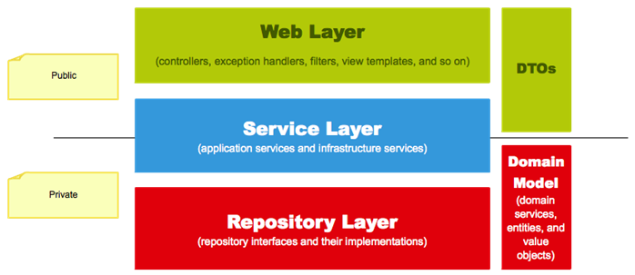
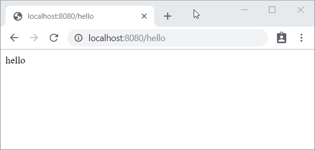
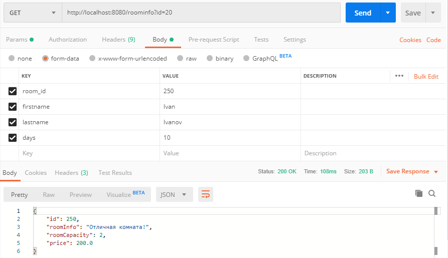
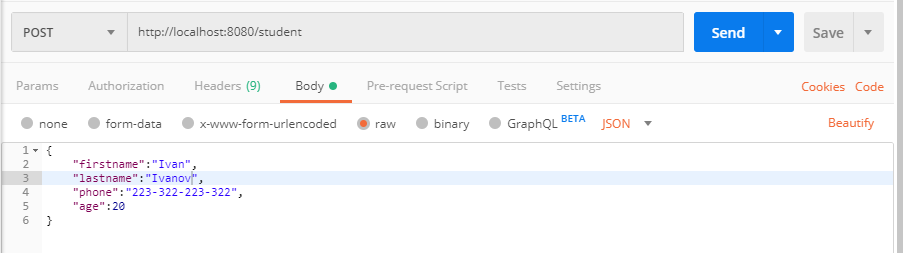

# Быстрое создание приложения с помощью Spring Boot. Архитектура Spring-приложения (web layer, service layer, repository layer)

## Фреймворк Spring

Spring – свободно-распространяемый легковесный фреймворк, призванный упростить разработку корпоративных и веб-приложений (можно использовать и для любых других типов приложений) на языке Java (является альтернативной стеку Jakarta EE).

<p align="center">
  
</p>

В данный момент Spring представляет собой целый набор модулей, которые можно использовать выборочно для тех или иных проектов.

<p align="center">
  
</p>

Дадим краткую характеристику некоторым модулям Spring:

- Spring Core – ядро платформы, предоставляет базовые средства для создания приложений — управление компонентами (бинами, beans), внедрение зависимостей, MVC фреймворк, транзакции, базовый доступ к БД. В основном это низкоуровневые компоненты и абстракции. По сути, неявно используется всеми другими компонентами;
- Spring MVC – обеспечивает архитектуру паттерна Model-View-Controller при помощи слабо связанных готовых компонентов для разработки веб-приложений;
- Spring Data – обеспечивает доступ к данным: реляционные и нереляционные БД, KV хранилища и т.п.;
- Spring Cloud – используется для микросервисной архитектуры;
- Spring Security – авторизация и аутентификация, доступ к данным, методам и т.п. OAuth, LDAP, и различные провайдеры.

### Spring Boot

Проект Spring Boot – решение, которое позволяет вам легко создавать полноценные приложения Spring, про которые можно сказать «просто запусти».

Spring Boot позволяет быстро создать и сконфигурировать (т.е. настроить зависимости между компонентами) приложение, упаковать его в исполняемый самодостаточный артефакт. Это то связующее звено, которое объединяет вместе набор компонентов в готовое приложение.

Особенности Spring Boot:

- создание полноценных Spring-приложений;
- встроенный сервлет-контейнер (Tomcat или Jetty);
- обеспечивает начальные pom-файлы для упрощения конфигурации Maven;
- используется автоконфигурация, где это возможно;
- используется принцип «convention over configuration». Для большинства конфигураций не нужно ничего настраивать.

Изучение фреймворка Spring лучше всего начать с установки требуемого программного обеспечения и разработки тестового приложения с помощью Spring Boot.

Создание Spring Boot проекта

Существует несколько способов создать Spring Boot проект. Из наиболее простых способов можно выделить:

- генерация готового проекта на сайте https://start.spring.io/ (проект Spring Initializr);
- создание проекта средствами IDE.

Создадим проект с помощью генерации проекта на сайте.

**TODO: Добавить процесс генерации и открытия проекта**

Еще раз напомним, что POM-файл (Project Object Model) – это XML-файл, который содержит информацию о деталях проекта, и конфигурации для создания проекта на Maven. Он всегда находится в базовом каталоге проекта. Во время выполнения задач, Maven ищет pom-файл в базовой директории проекта. Он читает его и получает необходимую информацию, после чего выполняет задачи.

Корневым элементом является элемент `<project>`. Внутри тега `project` содержится основная и обязательная информация о проекте.

**Зависимости** (**dependencies**) – это те библиотеки, которые непосредственно используются в проекте для компиляции кода или его тестирования.

Мы создаем RESTful веб-службу с помощью Spring Boot, поэтому нам нужно «подтянуть» для нашего проекта различные Spring-модули (библиотеки с классами, jar-файлы).

В обычных проектах нам бы было необходимо добавлять каждую зависимость вручную, но Spring Boot позаботился о нас и предоставил нам своего рода «мета-зависимости». Смысл их в том, что Spring Boot понимает, что если вы создаете web-приложение то вам нужен примерно одинаковый набор jar-файлов, поэтому чтобы не писать каждый jar-файл отдельно, мы указываем одну зависимость, а она уже «подтянет» за нас другие отдельные зависимости для создания веб-приложения.

Запустим приложение, зайдем в браузер и попробуем зайти на сайт.

**TODO: добавить запуск и тест сайта**

Как видите, Spring Boot приложение успешно запущено. Так как Spring Boot берет на себя большую часть рутинной работы по созданию и запуску приложения, давайте разберемся, что же происходит, когда мы запускаем приложение:

1. устанавливается конфигурация приложения по умолчанию;
2. запускается контекст приложения Spring (Spring application context) – это контейнер для кода, который работает на сервере (службы, контроллеры и т.д.). Все приложения Spring имеют этот контекст, который запускается при запуске приложения. Spring Boot создает этот контекст при запуске приложения;
3. выполняется сканирование пути к классам (class path scan). Чтобы добавить код в Spring Boot, необходимо создать свои классы и аннотировать их определенным образом. Например, если вы хотите добавить контроллер, вы создаете класс и аннотируете его с помощью аннотации `@Controller` и так далее. То есть, вы как бы помечаете ваши классы, что это контроллер, это сервис, это еще что-то. Spring сканирует эти классы и, в зависимости от нашего маркера, он работает с этими классами по-разному. То есть Spring сканирует ваш код и ищет классы с этими аннотациями (помимо маркеров, обычно в аннотациях содержатся другие метаданные, которые дают уточняющую информацию для Spring);
4. запускается Tomcat-сервер. Мы как раз зашли на сервер через URL и получили страницу с ошибкой, так как на сервере не был предусмотрен обработчик запроса с таким URL. Мы не скачивали Tomcat и не устанавливали его – все за нас сделал Spring Boot.

## Структура enterprise-приложения Spring

Простое приложение Spring имеет трехслойную структуру:

- Web layer – верхний слой приложения. Он отвечает за обработку ввода пользователя и возврат корректного ответа. Также веб-слой отвечает за обработку исключений, которые могут выбрасываться в других слоях приложения. Так как веб-слой является точкой входа в приложение, он также отвечает за аутентификацию и является первой линией защиты приложения;
- Service layer – слой сервисов, находится ниже веб-слоя. Этот слой содержит сервисы приложения и инфраструктуры. Сервисы приложения предоставляют публичный API сервисного слоя. Они также отвечают за транзакции и авторизацию. Инфраструктурные сервисы содержат код для взаимодействия с внешними ресурсами, такими как файловая система, базы данных, почтовые сервера и так далее. Часто эти сервисы используются несколькими сервисами приложения;
- Repository layer – самый нижний слой приложения. Он отвечает за взаимодействие с используемыми хранилищами данных.

<p align="center">
  
</p>

## Разработка web-слоя

Для обработки запросов и возврата данных необходимо предусмотреть соответствующие контроллеры REST-запросов, которые и будут составлять наш веб-слой.

Контроллер – это java-класс, методы которого призваны обрабатывать HTTP-запросы. Отличие обычного контроллера от REST-контроллера заключается в том, что в REST-контроллере каждый метод класса возвращает данные вместо представления. Рассмотрим пример простого REST-контроллера. Создадим в проекте пакет `controllers`, внутри которого создадим класс `HelloController`.

```java
@RestController
public class HelloController {}
```

Обратите внимание, что мы пометили класс аннотацией `@RestController`. Таким образом, мы даем знать Spring, что это не просто класс, а контроллер REST-запросов. В классе создадим метод, который будет возвращать строку.

```java
@RestController
public class HelloController {
    
    public String hello() {
        return "hello";
    }
}
```

Говорят, что методы контроллера «отображаются» на HTTP-запросы. Это значит, что при поступлении определенного HTTP-запроса (с определенным URL и HTTP-методом), будет вызван определенный метод контроллера, который вернет некоторые данные. Этим данные будут упакованы в HTTP-ответ и высланы обратно клиенту.

Нам необходимо сделать так, чтобы наш созданный метод был вызван, когда на сервер поступит HTTP-запрос с определенным URL, например `http://localhost:8080/hello`. Для этого необходимо пометить метод аннотацией `@GetMapping` c параметром `(“/hello”)` – часть URL, на который будет отображаться данный метод.

```java
@RestController
public class HelloController {

    @GetMapping("/hello")
    public String hello() {
        return "hello";
    }
}
```

**Для каждого из четырех основных HTTP-метода предусмотрена своя аннотация (`@GetMapping`, `@PostMapping`, `@PutMapping`, `@DeleteMapping`). Метод, помеченный определенной аннотацией, обрабатывает запросы только с определенным HTTP-методом.**

Запустим сервер, заходим на `http://localhost:8080/hello` и видим строку с ответом.

<p align="center">
  
</p>

Что произошло? Строка «hello» была помещена в тело HTTP-ответа, браузер получил text/plain с содержимым «hello» и просто вывел его на экран.

### Передача параметров в REST-запросах

Очень часто клиенту необходимо вместе с запросом передать некоторые параметры запроса, которые уточняют и конкретизируют запрос.

Параметры запроса можно передать несколькими способами. Рассмотрим следующие способы:

- указание параметра в URL-пути (`localhost:8080/rooms/256`);
- указание параметра в строке запроса, которая идет после URL-пути и отделяется символом `?` `(localhost:8080/rooms?id=256&param2=value2`);
- передача параметров в теле запроса (часто используется для передачи заполненной пользователем формы или передачи данных в формате JSON).

Рассмотрим, каким образом можно получить и обработать параметры запроса, переданные тем или иным способом.

#### Указание параметра в URL-пути

При создании метода-конечной точки (endpoint), в аннотации необходимо указать вариативную часть и назначить ей идентификатор

```java
@GetMapping("/room/{id}")
public void getRoomById() {}
```

Далее необходимо предусмотреть входной аргумент метода, куда Spring запишет значение вариативной части и указать аннотацию `@PathVariable` для этой переменной. Также необходимо указать идентификатор, который вы указали в аннотации `@GetMapping`.

```java
@GetMapping("/room/{id}")
public void getRoomById(@PathVariable(value = "id") int roomId) {
    // ...
}
```

В рамках одного запроса может быть несколько вариативных частей, которые можно считать и обработать

```java
@GetMapping("/room/{id1}/{id2}")
public void getRoomById(@PathVariable(value = "id1") int blockId, @PathVariable(value = "id2") int roomId) {
    // ...
}
```

#### Указание параметра в строке запроса

В этом случае, для каждого параметра запроса создается входной аргумент, указывается аннотация `@RequestParam`, а также указывается имя параметра.

```java
// запрос: http://localhost:8080/room?room_id=250&block_id=10
@GetMapping("/room")
public void getRoomById(@RequestParam(value = "room_id") int roomId, @RequestParam(value = "block_id") int blockId) {
    // ...
}
```

#### Передача параметров в теле запроса

Если в качестве клиента выступает браузер пользователя, данные от клиента на сервер передаются в виде полей формы, которые заполняет пользователь браузера. В этом случае параметры передаются в теле запроса с помощью метода `POST`.
Форма может иметь следующие MIME-типы:

- `application/x-www-form-urlencoded`: значения кодируются в кортежах с ключом, разделенных символом '&', с '=' между ключом и значением. Не буквенно-цифровые символы - percent encoded: это причина, по которой этот тип не подходит для использования с двоичными данными (вместо этого используйте `multipart/form-data`);
- `multipart/form-data`: каждое значение посылается как блок данных ("body part"), с заданными пользовательским клиентом разделителем ("boundary"), разделяющим каждую часть. Эти ключи даются в заголовки `Content-Disposition` каждой части `text/plain`.

Для обработки данных формы необходимо создать входной аргумент для каждого параметра, для каждого входного аргумента указать аннотацию `@RequestParam`, а также имя параметра.

```java
@PostMapping("/book")
public void bookRoom(@RequestParam(value = "room_id") int room_id,
                     @RequestParam(value = "firstname") String firstname,
                     @RequestParam(value = "lastname") String lastname,
                     @RequestParam(value = "days") int days) {
    // ...
}
```

**Существует несколько более простых способов получения данных формы, но в данном курсе они не рассматриваются. Вышеуказанный способ является самым простым и понятным на данном этапе изучения курса.**

### Передача данных между клиентом и сервером

Так как язык Java является ОО языком, нам было бы удобно работать с входящими и исходящими данными в объектном виде - было бы здорово, если бы REST-контроллер возвращал бы данные в виде объекта некоторого класса, а не в виде набора полей со значениями. Также было бы здорово, чтобы мы могли просто возвращать клиенту объект или коллекцию объектов некоторых классов без необходимости формировать Map из полей и значений.

Для реализации этого функционала, в Spring используется механизм **сериализации** и **десериализации**.

**Сериализация** - это преобразование объекта в последовательность байтов, так что объект можно легко сохранить в постоянное хранилище или передать по каналу связи. Затем поток байтов можно **десериализовать** - преобразовать в реплику исходного объекта.

Язык Java предоставляет стандартный механизм Java Serialization API для создания сериализуемых объектов, однако, он нам не подходит, так как ограничивает возможности для использования различных языков и технологий на стороне клиента и сервера.

Мы можем использовать сторонние библиотеки для сериализации объекта с помощью формата XML или JSON.

Использование формата JSON (http://bit.ly/32ZelBq) является более предпочтительным. Для сериализации и десериализации в Spring по-умолчанию используется библиотека Jackson.

**Библиотека Jackson позволяет гибко настроить процесс сериализаци и десериализации, однако, в рамках данного курса мы будем использовать стандартные механизмы сериализации и десериализации, чтобы уделять этому процессу как можно меньше внимания.**

Рассмотрим ситуацию, когда нам необходимо вернуть клиенту данные в объектном виде. Создадим класс с несколькими полями, создадим объект и вернем его в качестве результата GET-запроса.

```java
public class Room {
    private Integer id;
    private String roomInfo;
    private Integer roomCapacity;
    private double price;

    public Room(Integer id, String roomInfo, Integer roomCapacity, double price) {
        this.id = id;
        this.roomInfo = roomInfo;
        this.roomCapacity = roomCapacity;
        this.price = price;
    }
    // геттеры и сеттеры
}

@GetMapping("/roominfo")
public Room getRoomInfoById(@RequestParam(value = "room_id") int roomId) {
    return new Room(roomId, "Отличная комната!", 2, 200);
}
```

**Обратите внимание, что в код класса Room не зря были включены геттеры и сеттеры. Их наличие обязательно для сериализации и десериализации!**

Используем Postman для эмуляции клиента, сделаем GET-запрос и получим следующий результат

<p align="center">
  
</p>

Как мы видим, поля объекта были сериализованы с помощью формата JSON. Теперь клиент, после получения этих данных, сможет с помощью процесса десериализации получить объект и удобно работать с ним.

Теперь рассмотрим обратную ситуацию. Клиент делает POST-запрос и передает в теле запроса данные о новом студенте.

<p align="center">
  
</p>

На стороне сервера создаем класс `Student` с соответствующими полями.

```java
public class Student {

    private String firstname;
    private String lastname;
    private String phone;
    private int age;

    public Student(String firstname, String lastname, String phone, int age) {
        this.firstname = firstname;
        this.lastname = lastname;
        this.phone = phone;
        this.age = age;
    }

    // геттеры и сеттеры

    @Override
    public String toString() {
        return "Student{" +
                "firstname='" + firstname + '\'' +
                ", lastname='" + lastname + '\'' +
                ", phone='" + phone + '\'' +
                ", age=" + age +
                '}';
    }
}
```

Создаем конечную точку для обработки запроса. Обратите внимание, что мы используем аннотацию `@RequestBody`.

```java
@PostMapping("/student")
public void addStudent(@RequestBody Student student) {
    System.out.println(student);
}
```

Конфигурация HTTP-response с помощью класса `ResponseEntity`

Далеко не всегда ответ сервера состоит в возврате какого-то значения или какого-то объекта. Очень часто необходимо вернуть ответ с определенным HTTP-кодом и сообщением об ошибке, указать определенный заголовок и так далее.

В этом случае необходимо использовать класс `ResponseEntity`. Класс `ResponseEntity` является оберткой для ответа и дополнительно для HTTP заголовков и кода статуса. Он является обобщенным, что позволяет использовать любой тип в качестве тела ответа.

```java
@GetMapping("/student")
public ResponseEntity<?> getStudentById(@RequestParam(value = "id") int studentId) {
    if (studentId < 1) {
        return ResponseEntity.badRequest().body("Invalid id");
    } else {
        return ResponseEntity.ok(new Student("Ivan", "Ivanov", "223322", 20));
    }
}
```

Подробную информацию по поводу `ResponseEntity` читайте здесь - `https://www.baeldung.com/spring-response-entity`.