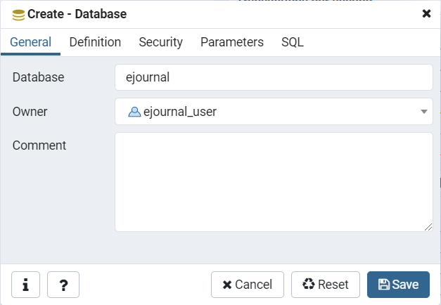
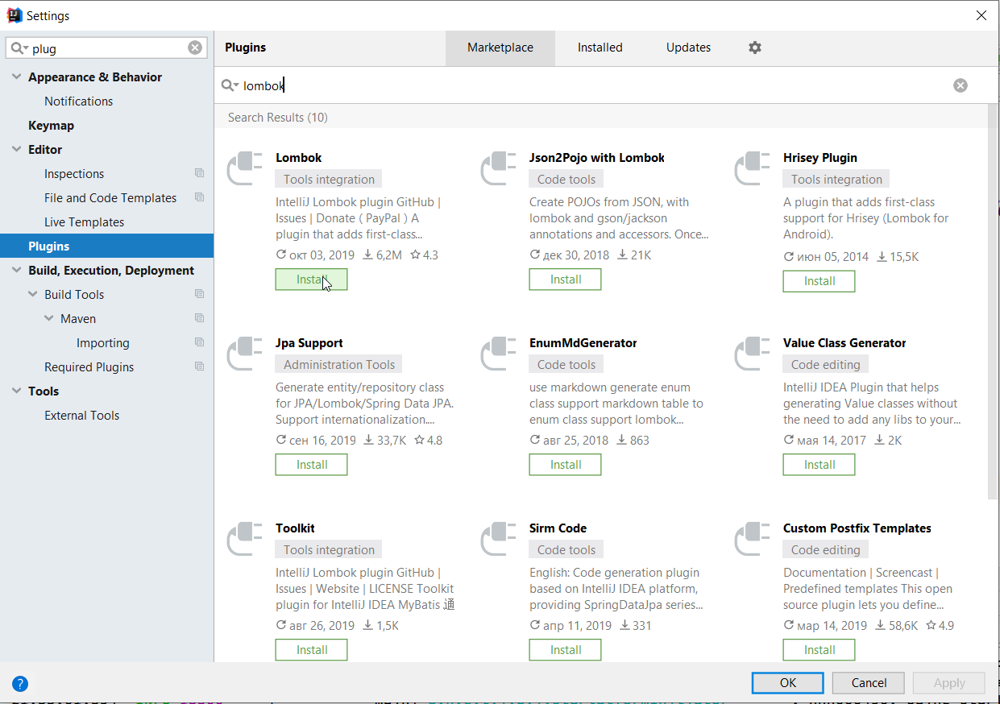
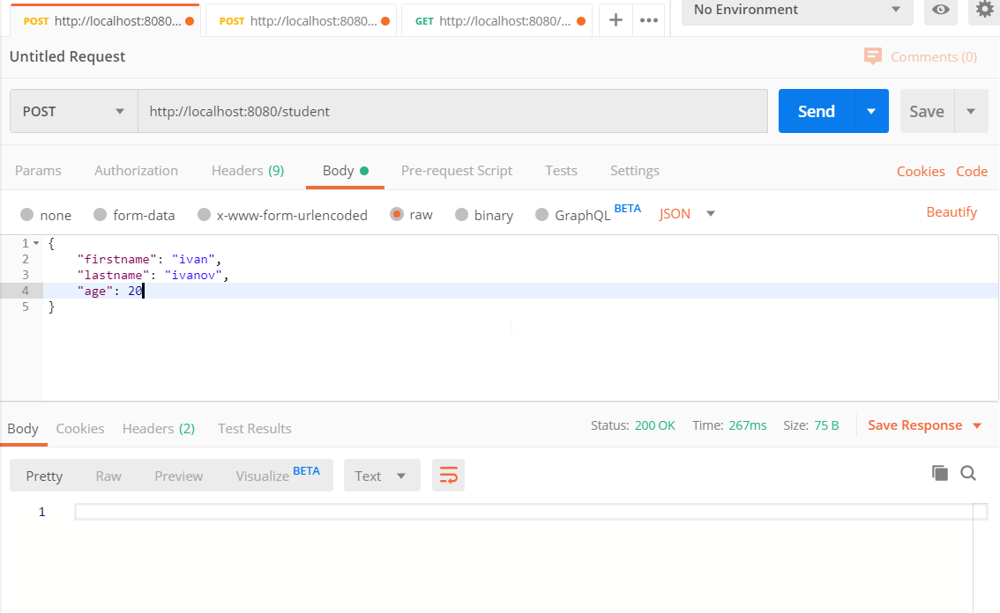
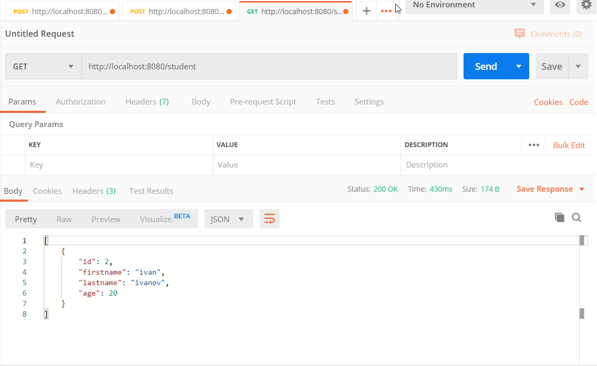
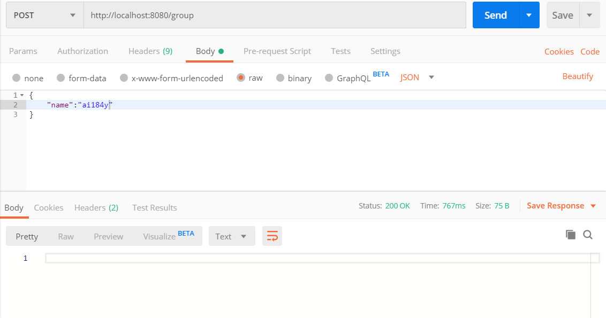
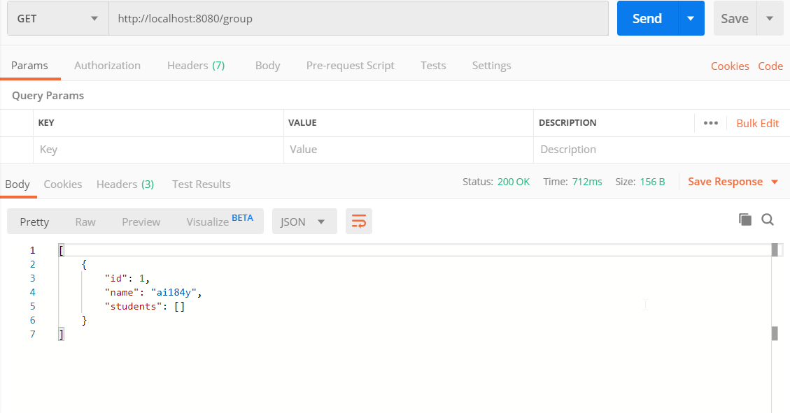
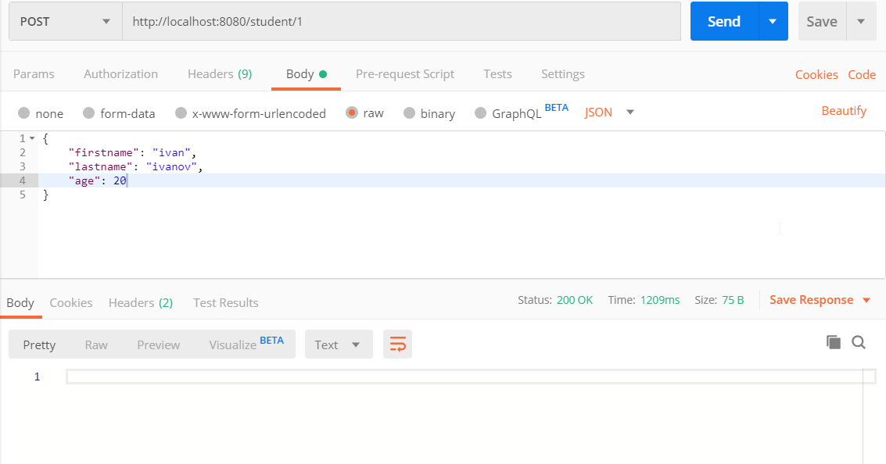
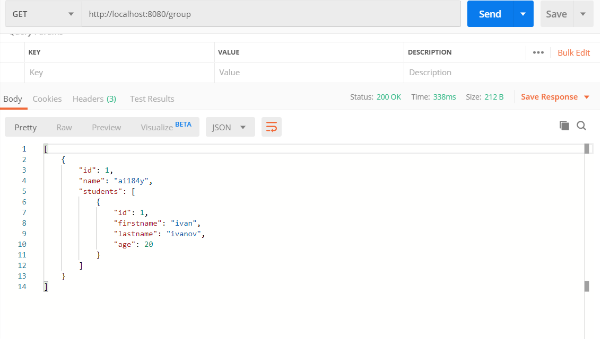

# Интеграция с СУБД. Технология ORM. Фреймворк Hibernate

В Spring имеется набор модулей для интеграции с различными технологиями хранения данных. Spring позволяет избавить разработчика от рутины при разработке программного кода, реализующего доступ к данным. Вместо возни с низкоуровневым доступом к данным можно положиться на Spring, который выполнит эту работу за вас, и сконцентрироваться на управлении данными в самом приложении.

## Что такое JDBC, драйвер, JPA, ORM и как это все между собой соотносится?

Как правило, каждая система управления базами данных (MySQL, PostgreSQL и так далее) имеет свой протокол взаимодействия с клиентами. Чтобы работать с базой данных, клиент должен соблюдать протокол взаимодействия с базой данных.

Чтобы программист не тратил время на самостоятельную реализацию протокола при разработке очередного приложения, разработчик сервера баз данных сам предоставляет всем желающим программный код, который общается с базой данных на понятном этой базе протоколе. Такой программный код и называется драйвером базы данных. Драйвер реализует протокол общения с БД и предоставляет API, которое позволяет нам общаться с базой данных, не вдаваясь в детали реализации протокола.

Как раз для этого разработчики Java предоставили стандарт **JDBC** (**Java DataBase Connectivity**) – специальное API, которое используется приложениями Java для взаимодействия с базой данных. Стандарт JDBC позволяет отправлять запросы к базе данных для выполнения операций выбора, вставки, обновления и удаления.

Если разработчики СУБД хотят, чтобы их база данных использовалась Java-разработчиками, они предоставляют JDBC-драйвер для их базы данных. Разработчики Java подключат драйвер и используют его для общения с той или иной базой данных. Если, в какой-то момент, разработчики захотят сменить СУБД, они просто меняют драйвер старой базы на драйвер новой. Благодаря стандарту JDBC, ничего менять в коде работы с базой данных не требуется.

### Что такое и зачем нужна технология ORM?

При написании объектно-ориентированного кода, который взаимодействует с базой данных, у разработчика возникает несколько проблем:

- данные в программе и в базе данных используют разные парадигмы (объектно-ориентированная и реляционная соответственно). Работу по преобразованию данных из одной парадигмы в другую ложатся на плечи программиста, что влечет за собой лишнюю работу и может приводить к ошибкам в процессе преобразования;
- программисту желательно абстрагироваться от конкретной схемы хранения данных. То есть, программисту желательно работать не с реляционной базой данных, а просто с некоторым «хранилищем», а конкретная реализация этого «хранилища» может быстро и безболезненно меняться.

 Для устранения этих проблем используется технология **ORM** (**Object-Relational Mapping**, «объектно-реляционное отображение») — технология программирования, которая связывает базы данных с концепциями объектно-ориентированных языков программирования, создавая «виртуальную объектную базу данных».

<p align="center">
  
</p>

Проще говоря, ORM – это прослойка, посредник между базой данных и объектным кодом. Используя ORM, программист не занимается формированием SQL-запросов и не думает в терминах «таблица», «записи» и «реляционные отношения», а просто работает с «хранилищем объектов» – он может туда записывать и получать объекты, не заботясь о подробностях их хранения.

В Java предусмотрен специальный стандарт **JPA** (**Java Persistence API**), который использует концепцию ORM. Существует несколько реализаций этого интерфейса, например, Hibernate, OpenJPA, EclipseLink и другие.

**Spring Data JPA** – обертка над JPA в Spring, которая предоставляет много полезных «фишек» разработчику. Она позволяет легче создавать Spring-управляемые приложения, которые используют новые способы доступа к данным, например нереляционные базы данных, map-reduce фреймворки, cloud сервисы, а так же уже хорошо улучшенную поддержку реляционных баз данных.

### Терминология JPA

Основное понятие JPA – сущность (Entity). Сущность – это Java-класс, который представляет бизнес-логику приложения и определяет данные, которые будут храниться в базе данных и извлекаться из нее.

Как правило, класс сущности представляет таблицу в базе данных, поля или свойства класса представляют собой колонки в таблице, а объект сущности представляет собой одну запись в таблице.

Важным моментом при работе с JPA являются аннотации, коих здесь будет очень много. Разберемся с некоторыми из них:

`@Entity` – позволяет серверу узнать, что это не просто какой-то класс, а сущность;
`@Id` – помечает первичный ключ в таблице. Вопрос составных ключей в данном занятии не рассматривается;
`@Table` – позволяет настраивать отображение класса в таблицу. В данном случае, мы можем указать, какое имя будет иметь соответствующая таблица в базе данных;
`@GeneratedValue` – указывает, что данное поле является генерируемым значением. Очень часто этой аннотацией помечают первичные ключи, чтобы они генерировались автоматически при добавлении новых записей в таблицу;
`@Column` – позволяет настраивать отображение колонки в таблице. В данном случае, мы можем указать, какое имя будет иметь соответствующая колонка в таблицу.

**Репозитории**. Главными компонентами для взаимодействий с БД в Spring Data являются репозитории. Каждый репозиторий работает со своим классом-сущностью.

В большинстве случаев, структура запросов к репозиторию будет одинаковая: «получить все записи», «получить записи, где столбец равен определенному значению» и так далее.

Spring Data JPA позволяет вам избежать рутинного создания запросов. Для этого вместо класса создадим интерфейс, который будет наследоваться от стандартного generic-интерфейса. Первый параметр означает тип класса-сущности, второй параметр – тип первичного ключа.

## Создание проекта и его интеграция с СУБД

Установим СУБД Postgres и запустим pgAdmin 4.

Создадим пользователя, после чего создадим базу данных для нашего приложения.

<p align="center">
  
</p>

Добавляем в `pom.xml` зависимости для работы с Spring Data JPA и JDBC драйвер для Postgres.

```xml
<dependencies>

    ...
    
    <!-- jpa, crud repository -->
    <dependency>
        <groupId>org.springframework.boot</groupId>
        <artifactId>spring-boot-starter-data-jpa</artifactId>
    </dependency>

    <!-- PostgreSQL -->
    <dependency>
        <groupId>org.postgresql</groupId>
        <artifactId>postgresql</artifactId>
    </dependency>
</dependencies>
```

Далее необходимо настроить подключение к СУБД и нужной базе данных.

Для настройки приложения Spring воспользуемся языком YAML. Для этого удалим файл `resources/application.properties` и создадим вместо него файл `application.yml`.

```xml
spring:
  jpa:
    database: POSTGRESQL
    show-sql: true
    hibernate:
      ddl-auto: create-drop
    properties:
      hibernate:
        dialect: org.hibernate.dialect.PostgreSQLDialect
  datasource:
    platform: postgres
    url: jdbc:postgresql://localhost:5432/ejournal
    username: ejournal_user
    password: 123456
    driverClassName: org.postgresql.Driver
```

Создадим класс сущности `Student`

```java
@Entity
@Table(name = "students")
public class Student {

    @Id
    @GeneratedValue(strategy = GenerationType.AUTO)
    private int id;

    @Column(name = "first_name")
    private String firstName;

    @Column(name = "last_name")
    private String lastName;

    private int age;
}
```

Для уменьшения количества кода, мы будем использовать плагин `Lombok`.

Проект Lombok — это плагин компилятора, который добавляет в Java новые «ключевые слова» и превращает аннотации в Java-код, уменьшая усилия на разработку и обеспечивая некоторую дополнительную функциональность.

Lombok преобразует аннотации в исходном коде в Java-операторы до того, как компилятор их обработает: зависимость lombok отсутствует в рантайме, поэтому использование плагина не увеличит размер сборки.

При использовании Lombok наш исходный код не будет валидным кодом Java. Поэтому потребуется установить плагин для IDE, иначе среда разработки не поймёт, с чем имеет дело. Lombok поддерживает все основные Java IDE. Интеграция бесшовная. Все функции вроде «показать использования» и «перейти к реализации» продолжают работать как и раньше, перемещая вас к соответствующему полю/классу.

<p align="center">
  
</p>

Далее подключим библиотеку в `pom.xml`.

```xml
<dependencies>

    ...

    <dependency>
        <groupId>org.projectlombok</groupId>
        <artifactId>lombok</artifactId>
        <optional>true</optional>
    </dependency>
</dependencies>
```

Вернемся в класс `Student`, добавим аннотацию для геттеров, сеттеров, а также конструктор со всеми параметрами.

```java
@Entity
@Table(name = "students")
@Data
public class Student {

    @Id
    @GeneratedValue(strategy = GenerationType.AUTO)
    private int id;

    @Column(name = "first_name")
    private String firstName;

    @Column(name = "last_name")
    private String lastName;

    private int age;
}
```

### Программирование слоя сервисов

`Service` – это Java класс, который содержит в себе основную бизнес-логику. В основном сервис использует готовые DAO/Repositories или же другие сервисы, для того чтобы предоставить конечные данные для пользовательского интерфейса. Сервисы, как правило, вызываются контроллерами или другими сервисами.

```java
@org.springframework.stereotype.Service
public class Service {

    public void addStudent(Student student, int id) {
        // Добавление нового студента
    }

    public List<Student> getAllStudents() {
        // Получение списка студентов
    }
}
```

Объект службы создается контейнером Spring, каждая служба является «одиночкой» (синглтоном), который создается в момент запуска приложения и уничтожается в момент закрытия приложения. Обратите внимание на аннотацию `@Service`. Этой аннотацией мы сообщаем контейнеру Spring, что это не просто класс, а класс сервиса.

Итак, мы создали службу, у которой есть два публичных метода. Первый метод добавляет нового студента, второй метод возвращает список всех студентов. В дальнейшем служба будет обращаться к объекту репозитория за данными, а пока что оставим код таким, какой он есть.

Вернемся к созданию веб-слоя. Создадим класс контроллера, создадим две конечные точки: для добавления студента и для получения списка всех студентов.

```java
@RestController
public class Controller {

    @Autowired
    private Service service;

    @PostMapping("/student")
    public void addStudent(@RequestBody Student student) {
        service.addStudent(student);
    }

    @GetMapping("/student")
    public List<Student> getAllStudents() {
        return service.getAllStudents();
    }
}
```

Обратите внимание, что мы не создаем объект службы, а получаем его «извне» с помощью аннотации `@Autowired`. Контейнер Spring «внедрит» ссылку на объект службы в поле `service`.

```java
@Entity
@Table(name = "groups")
@Data
public class Group {

    @Id
    @GeneratedValue(strategy = GenerationType.AUTO)
    private int id;
    private String name;

    @OneToMany(mappedBy = "group")
    private List<Student> studentList;
}
```

### Работа с репозиторием

Главными компонентами для взаимодействий с БД в Spring Data являются репозитории. Каждый репозиторий работает со своим классом-сущностью.

В большинстве случаев, структура запросов к репозиторию будет одинаковая: «получить все записи», «получить записи, где столбец равен определенному значению» и так далее.

Spring Data JPA позволяет вам избежать рутинного создания запросов. Для этого вместо класса создадим интерфейс, который будет наследоваться от стандартного generic-интерфейса. Первый параметр означает тип класса-сущности, второй параметр – тип первичного ключа.

```java
public interface StudentRepository extends JpaRepository<Student, Integer> {
}
```

Теперь перейдем в класс службы и создадим ссылку на объект репозитория.

```java
@org.springframework.stereotype.Service
public class Service {

    @Autowired
    private StudentRepository studentRepo;

    public void addStudent(Student student) {
        studentRepo.save(student);
    }

    public List<Student> getAllStudents() {
        return studentRepo.findAll();
    }
}
```

Обратите внимание, что мы не создавали класс, который реализует интерфейс `StudentRepository`, тогда откуда мы его получим объект интерфейсного типа?

Дело в том, что Spring сгенерирует класс за нас. Этот сгенерированный класс будет иметь набор стандартных операций для работы с сущностями. В нашем случае, это операция `findAll()`, которая возвращает все сущности в таблице `student`.

Запустим сервер и выполним два клиентских запроса - один на создание студента, второй - на получение списка всех студентов.

Добавляем нового студента

<p align="center">
  
</p>

Теперь получим список всех студентов.

<p align="center">
  
</p>

### Реализация отношения "один-ко-многим"

Как мы знаем, важной составляющей реляционных баз данных является отношения между таблицами "один-к-одному", "один-ко-многим", "многие-ко-многим".

Реализуем отношение "один-ко-многим". Создадим сущность `Group` - студенческая группа. В студенческой группе может быть от 0 до N студентов.

Прежде всего перейдем в сущность `Student`. Добавим поле `group`, который будет ссылаться на студенческую группу, в которой будет состоять студент. Так как в группе может быть много студентов, указываем аннотацию `@ManyToOne`. Также указываем аннотацию `@JoinColumn`, которая указывает на имя колонки, которая будет содержать Foreign Key.

**Технология ORM позволяет создавать двусторонние связи между таблицами. В этом случае, при выдаче JSON, может возникнуть бесконечный цикл. Чтобы его избежать, укажем аннотацию `@JsonIgnore`. В этом случае, колонка group будет проигнорирована в процессе сериализации\десериализации.**

```java
@Entity
@Data
@AllArgsConstructor
@NoArgsConstructor
public class Student {

    @Id
    @GeneratedValue(strategy = GenerationType.IDENTITY)
    private int id;
    private String firstname;
    private String lastname;
    private int age;

    @ManyToOne (fetch = FetchType.LAZY,optional = false)
    @JoinColumn(name = "group_id",nullable = false)
    @JsonIgnore
    private Group group;
}
```

Далее создадим сущность `Group`.

```java
@Entity
@Data
@AllArgsConstructor
@NoArgsConstructor
@Table(name = "groups")
public class Group {

    @Id
    @GeneratedValue(strategy = GenerationType.IDENTITY)
    private int id;
    private String name;

    @OneToMany(mappedBy = "group", cascade = CascadeType.ALL)
    private List<Student> students;

    public void addStudent(Student student) {
        students.add(student);
    }
}
```

Обратите внимание, что отношение один-ко-многим мы моделируем с помощью обычной коллекции. Указываем аннотацию `@OneToMany`, также в свойстве mappedBy указываем, какое поле "держит" отношение со стороны студента.

Далее модифицируем класс контроллера. Создадим конечные точки для добавления новой группы, а также для получения списка всех групп. Также модифицируем конечную точку для добавления студента, чтобы указать id группы, в которую необходимо добавить студента.

```java
@RestController
public class Controller {

    @Autowired
    private Service service;

    @PostMapping("/student/{group_id}")
    public void addStudent(@RequestBody Student student, @PathVariable(name = "group_id") int group_id) {
        service.addStudent(student, group_id);
    }

    @GetMapping("/student")
    public List<Student> getAllStudents() {
        return service.getAllStudents();
    }

    @PostMapping("/group")
    public void addGroup(@RequestBody Group group) {
        service.addGroup(group);
    }

    @GetMapping("/group")
    public List<Group> getAllGroups() {
        return service.getAllGroups();
    }
}
```

Теперь создадим репозиторий для сущности `Group`.

```java
public interface GroupRepository extends JpaRepository<Group, Integer> {}
```

Далее модифицируем класс сервиса. Добавим методы для добавления новой группы, а также для получения списка всех групп. Также модифицируем метод добавления новой группы. Метод работает следующим образом: получаем объект группы по id, после чего добавляем ссылку на группу в поле group объекта `Student`.

```java
@org.springframework.stereotype.Service
public class Service {

    @Autowired
    private StudentRepository studentRepo;

    @Autowired
    private GroupRepository groupRepo;

    public void addStudent(Student student, int id) {
        Group g = groupRepo.getOne(id);
        student.setGroup(g);
        studentRepo.save(student);
    }

    public List<Student> getAllStudents() {
        return studentRepo.findAll();
    }

    public void addGroup(Group group) {
        groupRepo.saveAndFlush(group);
    }

    public List<Group> getAllGroups() {
        return groupRepo.findAll();
    }
}
```

Запустим приложение и проверим его работу. Сначала добавим группу, после чего получим список групп.

Добавим новую группу

<p align="center">
  
</p>

Получим список групп

<p align="center">
  
</p>

Теперь добавим нового студента

<p align="center">
  
</p>

Получим список всех групп

<p align="center">
  
</p>