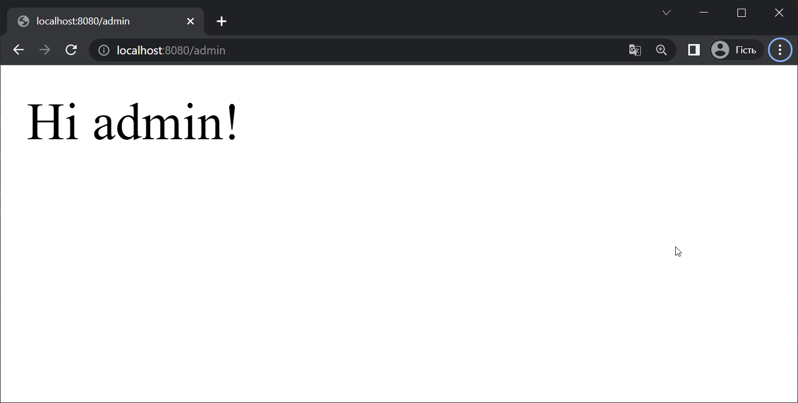

# Работа со Spring Security, часть 1

Spring Security – это фреймворк обеспечения безопасности, предоставляющий возможность декларативного управления безопасностью приложений на основе фреймворка Spring. В нем представлены базовые инструменты безопасности, которые без труда расширяются для решения разных задач.

## Основные понятия в Spring Security

- **Authentication** (аутентификация) - используется для подтверждения личности зарегистрированного пользователя. Проверка подлинности - это процесс проверки учетных данных: идентификатора пользователя (имени, адреса, электронной почты, номера телефона) и пароля. Процесс аутентификации - проверка того, что пользователь именно тот, за кого себя выдает;
- **Authorization** (авторизация) - происходит после того, как личность пользователя успешно аутентифицируется системой. Процесс авторизации определяет, имеет ли прошедший проверку человек доступ к определенным ресурсам: информации, файлам, базе данных;
- **Principal** - текущий пользователь или текущий аккаунт (если у одного физического лица или программы есть несколько аккаунтов, то тогда ему будет соответствовать несколько возможных principal`ов). Иногда, в общем случае, principal - это субъект, который принимает участие в осуществлении процедур безопасности. В качестве principal могут выступать люди, компьютеры, службы, процессы или их группа;
- **Granted Authority** - полномочие на выполнение некоторой операции (добавление пользователя, изменение данных, удаление сотрудника и так далее);
- **Role** - набор полномочий в виде роли в системе. Например, `ROLE_ADMIN` имеет набор полномочий (`READ`, `COMMENT`, `EDIT`, `DELETE`), а `ROLE_USER` имеет набор полномочий только (`READ`, `COMMENT`).

## Знакомство со Spring Security

Для подключения Spring Security необходимо добавить зависимость

```xml
<dependency>
    <groupId>org.springframework.boot</groupId>
    <artifactId>spring-boot-starter-security</artifactId>
</dependency>
```

Создадим новый Spring Boot - проект, подключим Spring MVC, Thymeleaf и Spring Security.

```xml
<?xml version="1.0" encoding="UTF-8"?>
<project ...>

    ...

    <dependencies>
        <dependency>
            <groupId>org.springframework.boot</groupId>
            <artifactId>spring-boot-starter-thymeleaf</artifactId>
        </dependency>
        <dependency>
            <groupId>org.springframework.boot</groupId>
            <artifactId>spring-boot-starter-web</artifactId>
        </dependency>
        <dependency>
            <groupId>org.springframework.boot</groupId>
            <artifactId>spring-boot-starter-security</artifactId>
        </dependency>
    </dependencies>
</project>
```

Если мы сразу запустим наше приложение и попробуем зайти в браузере в корневой путь, мы увидим форму для аутентификации пользователя.

<p align="center">
  
</p>

Форма логина находится по адресу `/login`. Форма для выхода из учетной записи находится по адресу `/logout`.

При подключении Spring Security, мы получаем по умолчанию следующие настройки безопасности:

- все HTTP-запросы требуют аутентификации;
- роли и полномочия не определены;
- аутентификация происходит с помощью простой страницы с формой;
- в системе есть только один пользовать с логином `user`.

Пароль для пользователя user можно обнаружить в логах при старте приложения, он каждый раз генерируется заново.

```plain
Using generated security password: cd2954e3-fb16-4943-970e-b650153b584a
```

### Настройки аутентификации

Для того, чтобы настроить аутентификацию пользователя, нам необходимо сконфигурировать кодировку паролей.

Создадим конфигурационный класс `SecurityConfig` и добавим в него бин `PasswordEncoder`.

```java
@Configuration
public class SecurityConfig {
    
    @Bean
    public PasswordEncoder passwordEncoder() {
        return new BCryptPasswordEncoder();
    }
}
```

Кодировщик паролей (PasswordEncoder) используется при добавлении новых пользователей и при аутентификации существующих.

Библиотека Spring Security предоставляет несколько стандартных кодировщиков паролей:

- `BCryptPasswordEncoder` - алгоритм хеширования BCrypt;
- `NoOpPasswordEncoder` - пароль не хешируется;
- `Pbkdf2PasswordEncoder` - кодировка PBKDF2;
- `SCryptPasswordEncoder` - алгоритм хеширования SCrypt;
- `StandardPasswordEncoder` - алгоритм хеширования SHA-256.

Нужно понимать, что пароль никогда не хранится в открытом виде.

Когда регистрируется новый пользователь, введенный пароль кодируется и в базу данных записывается закодированный пароль (как правило, хеш пароля, который получен по определенному алгоритму).

Во время аутентификации, введенный пароль кодируется тем же алгоритмом и закодированное значение сравнивается со значением из базы данных. Если оба значения совпадают - значит пароль введен верно.

Далее необходимо настроить хранилище пользователей. Для этого нужно объявить бин типа `UserDetailsService`. Тип `UserDetailsService` является интерфейсом, в котором объявлен всего один метод `loadUserByUsername()`.

```java
public interface UserDetailsService {
    UserDetails loadUserByUsername(String username) throws UsernameNotFoundException;
}
```

Этот метод принимает введенный пользователем логин и использует его для получения объекта `UserDetails`. Если объект с таким логином получить не удалось, метод выбрасывает исключение `UsernameNotFoundException`.

Библиотека Spring Security предоставляет несколько стандартных реализаций интерфейса `UserDetailsService`:

- хранилища пользователей в памяти;
- хранилище пользователей на основе JDBC;
- хранилище пользователей на основе LDAP.

Также, разработчик может предоставить свою реализацию данного интерфейса.

Для начала, попробуем создать хранилище пользователей в памяти. Такой вариант возможен, если в вашем приложении есть всего несколько пользователей и их количество не будет меняться.

Для быстрой настройки аутентификации необходимо переопределить метод `configure()` в классе-наследнике `WebSecurityConfigurerAdapter`. Обратите внимание, что метод `configure()` является перегруженным - существует три реализации этого метода. Для настройки аутентификации нам нужен метод, который принимает объект типа `AuthenticationManagerBuilder`.


Создадим хранилище в памяти с двумя пользователями "user" и "admin". Добавление пользователей происходит с помощью цепочки вызовов методов. Второй и следующие пользователи добавляются после метода `and()`.

```java
@Configuration
@EnableWebSecurity
public class SecurityConfig extends WebSecurityConfigurerAdapter {
    
    @Bean
    public PasswordEncoder passwordEncoder() {
        return NoOpPasswordEncoder.getInstance();
    }
    
    // Настройка аутентификации
    @Override
    protected void configure(AuthenticationManagerBuilder auth) throws Exception {
        auth.inMemoryAuthentication()
                .withUser("user")
                .password("userpass")
                .roles("USER")
                .and()
                .withUser("admin")
                .password("adminpass")
                .roles("ADMIN");
    }
}
```

Добавим REST-контроллер с обработкой GET-методов для путей `/`, `/user` и `/admin`.

```java
@RestController
public class DefaultController {

    @GetMapping("/")
    public String root() {
        return "Hi all";
    }

    @GetMapping("/user")
    public String user() {
        return "Hi user!";
    }

    @GetMapping("/admin")
    public String admin() {
        return "Hi admin!";
    }
}
```

Далее запустим приложение, зайдем по адресу `http://localhost:8080` и попробуем воспользоваться учетными данными для user или для admin.

<p align="center">
  
</p>

Если логин и пароль были введены верно мы получим результат обработки запроса методом контроллера.

<p align="center">
  
</p>

На данный момент мы настроили процесс аутентификации, но не процесс авторизацию. Это значит, что любой кто прошел аутентификацию, может выполнить любые запросы к серверу.

Для того, чтобы разграничить доступ к ресурсам сервера, необходимо настроить процесс авторизации, чтобы указать кто и как может пользоваться ресурсами сервера. Давайте реализуем следующую логику авторизации:

- доступ по адресу `/` может осуществить любой;
- доступ по адресу `/user` может осуществить пользователь с ролью `USER` или `ADMIN`;
- доступ по адресу `/admin` может осуществить только пользователь с ролью `ADMIN`.

Для настройки авторизации нам тоже необходимо переопределить метод `configure()`, но перегруженный вариант, который принимает объект типа `HttpSecurity`.

```java
@Override
protected void configure(HttpSecurity http) throws Exception {
    http.authorizeRequests()
            .antMatchers("/admin").hasRole("ADMIN")
            .antMatchers("/user").hasAnyRole("ADMIN", "USER")
            .antMatchers("/").permitAll()
            .and().formLogin();
}
```

Для указания пути используются Ant-style path patterns - специальная нотация для указания шаблонов пути. Подробную информацию читайте [здесь](https://docs.spring.io/spring-framework/docs/current/javadoc-api/org/springframework/util/AntPathMatcher.html).

Для каждого шаблона пути необходимо указать, пользователь с какой ролью авторизован для запроса с данным шаблоном пути. Если для авторизации нужна конкретная роль - используйте метод `hasRole()`, если для авторизации достаточно одной из ролей - метод `hasAnyRole()`. Метод `formLogin()` говорит о том, что для передачи данных учетной записи будет использоваться http-форма.

Запустим приложение и попробуем сделать запрос с адресом `http://localhost:8080/user`. Откроется окно с формой логина. Если мы введем данные для `user` или `admin`, мы успешно авторизуемся и получим данные от метода контроллера.

<p align="center">
  
</p>

Если мы попытаемся перейти по адресу `http://localhost:8080/admin` без ввода логина и пароля или с учетной записью user, то получим ошибку 403 - запрошенный ресурс недоступен из-за ограничений безопасности.

<p align="center">
  
</p>

Если же мы перейдем по адресу `http://localhost:8080/admin` с вводом учетной записи admin, то успешно получим ответ от сервера.

<p align="center">
  
</p>
