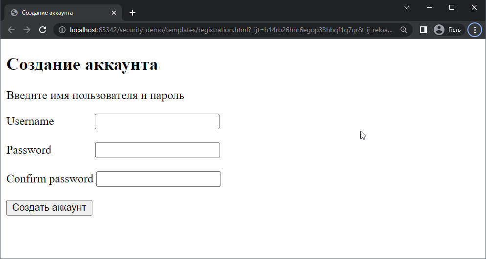

# Работа со Spring Security, часть 2

***Полный код файлов приведен в учебном проекте, который находится в директории с лекцией***

На данном занятии мы разберем использование Spring Security для регистрации и последующей аутентификации пользователя.

Напомним, что аутентификация - это проверка пользователя на то, является ли он тем, за кого себя выдает. Приложение спрашивает "кто ты?", а пользователь, например, вводит имя и пароль. Приложение проверяет, что такому имени действительно соответствует такой пароль и отвечает "ок, проверка пройдена".

Авторизация - это выдача прав (либо отказ в их выдаче). Этот процесс происходит уже после того, как пользователь подтвердил свою идентичность. Допустим, пользователь прошел аутентификацию и хочет попасть на url:

```plain
/admin
```

Приложение проверяет, какие стоят права у данного пользователя, и либо впускает его, либо нет.

Например, `user` может зайти на url `/user`, а `admin` на `/user` и еще на другие `url`.

## Создание проекта

Создадим новый Spring MVC проект. В нашем проекте будет 3 окна:

- окно логина (`/login`);
- окно регистрации (`/registration`);
- приветственная страница для пользователя (`/` или `/welcome`).

В новом проекте необходимо добавить следующие зависимости:

- Spring Data JPA
- Spring Security
- Thymeleaf
- Spring MVC
- PostgreSQL driver
- Lombok

### Регистрация пользователя

Создадим шаблон `registration.html` для страницы регистрации. Страница будет выглядеть следующим образом

<p align="center">
  
</p>

Логика работы сценария регистрации пользователя будет следующая:

1. Пользователь вводит логин, пароль и подтверждает пароль;
2. Введенные данные проходят валидацию;
3. если данные не проходят валидацию, пользователю показываются сообщения об ошибках полей.
4. Новый пользователь записывается в базу данных;
5. Система автоматически аутентифицирует пользователя с введенными данными;
6. После аутентификации, система перенаправляет пользователя на приветственную страницу.

#### Создание сущностей

Создадим сущность `User`, которая будет моделировать пользователя в базе данных. Полный код класса представлен в учебном проекте, здесь просто укажем основные поля пользователя.

```java
public class User {

    private Long id;
    private String username;
    private String password;

    @Transient
    private String confirmPassword;

    // Отношения многие-ко-многим
    private Set<Role> roles;
}
```

Обратите внимание на аннотацию `@Transient` для поля `confirmPassword`. Она указывает JPA, что данное поле не надо сохранять в базе данных. В нашем случае, это поле будет использоваться только для того, чтобы провести валидацию пароля, в базе данных оно не нужно.

Также обратите внимание, что сущность `User` находится в отношениях многие-ко-многим с сущностью `Role`. Один пользователь может иметь много ролей в системе, одна роль может соответствовать многим пользователям.

Добавим сущность `Role`. Она отвечает за роль в сценариях аутентификации (`ROLE_USER`, `ROLE_ADMIN` и так далее).

```java
public class Role {

    private long id;
    private String name;
    
    // Отношения многие-ко-многим
    private Set<User> users;
}
```

#### Создание сервисов

Создадим сервис для сущности `User`. Сервис будет содержать два метода - сохранение нового пользователя в БД и получение объекта пользователя по его логину (если такой пользователь существует).

```java
public class UserService {

    private final UserRepository userRepository;
    private final RoleRepository roleRepository;
    private final PasswordEncoder passwordEncoder;

    public void save(User user) {
        user.setPassword(passwordEncoder.encode(user.getPassword()));
        Set<Role> roles = new HashSet<>();
        roles.add(roleRepository.findById(1L).get());
        user.setRoles(roles);
        userRepository.save(user);
    }

    public User findByUsername(String username) {
        return userRepository.findByUsername(username);
    }
}
```

Давайте разберем последовательность действий в методе `save()`. Сначала мы должны зашифровать пароль, который ввел пользователь. Для этого, мы воспользуемся бином `PasswordEncoder` (мы его добавим позже, в настройках безопасности).

После этого, мы получаем из БД объект `Role` с `id = 1` (это будет `ROLE_USER`), устанавливаем эту роль пользователю и сохраняем пользователя в БД,

#### Создание репозиториев

Далее необходимо создать репозитории для сущностей `User` и `Role`. В интерфейс репозитория для сущности `User` мы добавим метод `findByUsername()`, который возвращает объект пользователя по его `username`. Этот метод понадобится нам для проверки уникальности логина при регистрации и для программной аутентификации пользователя после регистрации.

```java
public interface UserRepository extends JpaRepository<User, Long> {
    User findByUsername(String username);
}
```

```java
public interface RoleRepository extends JpaRepository<Role, Long> {}
```

#### Создание валидатора для формы регистрации

В предыдущим лекциях, для валидации формы мы использовали специальные аннотации, которые устанавливали для тех или иных полей сущности.

В этот раз необходимо обеспечить более сложную логику валидации данных, поэтому мы создадим свой класс валидатора, который будем использовать в сценарии регистрации нового пользователя.

Собственный класс валидатора должен наследоваться от интерфейса `Validator` из пакета `org.springframework.validation`. В данном интерфейсе объявлены следующие методы

```java
public interface Validator {
    boolean supports(Class<?> clazz);
    void validate(Object target, Errors errors);
}
```

Метод `supports()` определят, может ли разработанный валидатор произвести валидацию объектов указанного класса?

Метод `validate()` производит валидацию объекта `target`, и в случае возникновения ошибок, регистрирует их в объекте `errors`.

Давайте придумаем правила валидации для регистрационной формы:

- поле `username` не должно быть пустым;
- поле `username` должно быть длиной от 8 до 32 символов;
- поле `username` должно быть уникальным в системе;
- поле `password` не должно быть пустым;
- поле `password` должно быть длиной от 8 до 32 символов;
- поле `password` должно совпадать с полем `confirmPassword`.

Создадим класс UserValidator и реализуем эту логику валидации

```java
public class UserValidator implements Validator {

    private final UserService userService;

    @Override
    public boolean supports(Class<?> clazz) {
        return User.class.equals(clazz);
    }

    @Override
    public void validate(Object target, Errors errors) {
        User user = (User) target;

        // Поле username не должно быть пустым
        ValidationUtils.rejectIfEmptyOrWhitespace(errors, "username", "", "This field is required.");
        // Поле username должно быть длиной от 8 до 32 символов
        if (user.getUsername().length() < 8 || user.getUsername().length() > 32) {
            errors.rejectValue("username", "", "Username must be between 8 and 32 characters");
        }
        // Поле username должно быть уникальным в системе
        if (userService.findByUsername(user.getUsername()) != null) {
            errors.rejectValue("username", "", "Username is already exists.");
        }

        // Поле password не должно быть пустым
        ValidationUtils.rejectIfEmptyOrWhitespace(errors, "password", "", "This field is required.");
        // Поле password должно быть длиной от 8 до 32 символов
        if (user.getPassword().length() < 8 || user.getPassword().length() > 32) {
            errors.rejectValue("password", "", "password must be between 8 and 32 characters");
        }
        // Поле password должно совпадать с полем confirmPassword
        if (!user.getConfirmPassword().equals(user.getPassword())) {
            errors.rejectValue("password", "", "Passwords don't match!");
        }
    }
}
```

Для проверки поля на пустоту, мы используем готовый метод `rejectIfEmptyOrWhitespace()` из класса `ValidationUtils`. Для регистрации ошибок валидации, мы используем метод `rejectValue` объекта `errors`. Мы передаем название поля, название кода (используется для поддержки нескольких языков, мы просто передадим пустую строку) и текст ошибки валидации.

Для проверки `username` на уникальность, мы используем созданный ранее сервис `UserService` и пытаемся получить из БД объект пользователя для `username`, который введет при регистрации. Если мы получим объект - значит в БД уже есть пользователь с таким `username`, поэтому мы регистрируем ошибку валидации.

#### Создание контроллеров

Теперь необходимо создать контроллер и добавить методы для обработки запросов, которые возникают в сценарии регистрации пользователя.

Пока нам необходимо обработать передачу браузера страницы с формой регистрации и метод для обработки этой формы.

```java
public class UserController {

    private final UserService userService;
    private final UserValidator userValidator;

    // Передача браузеру страницы с формой
    @RequestMapping(value = {"/registration"}, method = RequestMethod.GET)
    public String registration(Model model) {
        model.addAttribute("userForm", new User());

        return "registration";
    }

    // Обработка данных формы
    @RequestMapping(value = "/registration", method = RequestMethod.POST)
    public String registration(@ModelAttribute("userForm") User userForm, BindingResult result, Model model) {
        
        // Валидация с помощью валидатора
        userValidator.validate(userForm, result);

        // Если есть ошибки - показ формы с сообщениями об ошибках
        if (result.hasErrors()) {
            return "registration";
        }

        // Сохранение пользователя в базе
        userService.save(userForm);

        // Перенаправление на приветственную страницу
        return "redirect:/welcome";
    }
}
```

#### Настройка аутентификации и авторизации

Теперь необходимо настроить Spring Security для обеспечения процесса аутентификации и авторизации.

Создадим класс SecurityConfig, в котором настроить аутентификацию и авторизацию.

```java
public class SecurityConfig extends WebSecurityConfigurerAdapter {

    UserDetailsServiceImpl userDetailsService;

    @Bean
    public PasswordEncoder passwordEncoder() {
        return NoOpPasswordEncoder.getInstance();
    }

    @Override
    protected void configure(AuthenticationManagerBuilder auth) throws Exception {
        auth.userDetailsService(userDetailsService).passwordEncoder(passwordEncoder());
    }

    @Override
    protected void configure(HttpSecurity http) throws Exception {
        http.authorizeRequests()
                .antMatchers("/registration", "/login").permitAll()
                .antMatchers("/", "/welcome").hasRole("USER")
                .and()
                .formLogin();
    }
}
```

Обратите внимание на объект класса UserDetailsServiceImpl. Данный класс будет рассмотрен ниже, он реализует интерфейс UserDetailsService.

Данный интерфейс является одним из ключевых в процессе аутентификации и он содержит всего один метод

```java
public interface UserDetailsService {
    UserDetails loadUserByUsername(String username) throws UsernameNotFoundException;
}
```


Самым фундаментальным объектом в Spring Security является `SecurityContextHolder`. В нем хранится информация о текущем контексте безопасности приложения, который включает в себя подробную информацию о пользователе (principal), работающим с приложением. Spring Security использует объект `Authentication`, пользователя авторизованной сессии.

"Пользователь" - это просто объект. В большинстве случаев он может быть приведен к классу `UserDetails`. `UserDetails` можно представить, как адаптер между БД пользователей и тем, что требуется Spring Security внутри `SecurityContextHolder`.

Для создания `UserDetails` используется интерфейс `UserDetailsService`, с единственным методом.

```java
UserDetails loadUserByUsername(String username) throws UsernameNotFoundException 
```

В пакете `model` создадим класс сущности `Role`, который будет хранить роли в системе.

```java
@Entity
@Data
public class Role {

    @Id
    @GeneratedValue(strategy = GenerationType.AUTO)
    private long id;

    @Column(name = "name")
    private String name;

    @ManyToMany(mappedBy = "roles")
    private Set<User> users;
}
```

Обратите внимание, что таблицы `Role` и `User` будут находиться в отношении "многие-ко-многим".

Далее, в пакете `model`, создадим класс сущности `User`, который моделирует пользователя в системе.

```java
@Entity
@Table(name = "users")
@Data
public class User {

    @Id
    @GeneratedValue(strategy = GenerationType.AUTO)
    private Long id;

    @Column(name = "username")
    private String username;

    @Column(name = "password")
    private String password;

    @Transient
    private String confirmPassword;

    @ManyToMany
    @JoinTable(
            name ="user_roles",
            joinColumns = @JoinColumn(name = "user_id"),
            inverseJoinColumns = @JoinColumn(name = "role_id")
    )
    private Set<Role> roles;
}
```

Аннотация `@Transient` означает, что данное поле не будет сериализовано при добавлении сущности в БД.

Далее необходимо реализовать доступ к данным. Соединение с базой является важнейшей составляющей приложения. Как правило, выделяется часть кода, модуль, отвечающий за передачу запросов в БД и обработку полученных от нее ответов.

Для доступа к базе данных, как правило, используется шаблон проектирования **DAO** (Data Access Object). DAO - это абстрактный интерфейс к какому-либо типу базы данных или механизму хранения. По сути, DAO это прослойка между БД и системой. В Spring Data этот слой называется **Repository**.

Создадим интерфейс `RoleDao` и `UserDao` в пакете `dao`.

```java
public interface RoleDao extends JpaRepository<Role, Long> {
}
```

Обратите внимание, что для сущности `UserDao` мы определили метод интерфейса, который будет возвращать объект `User` по `username` пользователя.

```java
public interface UserDao extends JpaRepository<User, Long> {
    User findByUsername(String username);
}
```

Далее необходимо создать классы для слоя сервисов. В пакете `services` объявим интерфейс `UserService` и класс `UserServiceImpl`, который реализует этот интерфейс.

```java
public interface UserService {
    void save(User user);
    User findByUsername(String username);
}
```

```java
@Service
public class UserServiceImpl implements UserService {

    private UserDao userDao;
    private RoleDao roleDao;
    private BCryptPasswordEncoder passwordEncoder;

    @Autowired
    public UserServiceImpl(UserDao userDao, RoleDao roleDao, BCryptPasswordEncoder passwordEncoder) {
        this.userDao = userDao;
        this.roleDao = roleDao;
        this.passwordEncoder = passwordEncoder;
    }

    @Override
    public void save(User user) {
        user.setPassword(passwordEncoder.encode(user.getPassword()));
        Set<Role> roles = new HashSet<>();
        roles.add(roleDao.getById(1L));
        user.setRoles(roles);
        userDao.save(user);
    }

    @Override
    public User findByUsername(String username) {
        return userDao.findByUsername(username);
    }
}
```

Далее необходимо написать реализацию интерфейса `UserDetailsService` - класс `UserDetailsServiceImpl`.

Интерфейс `UserDetailsService` используется для получения данных пользователя. В нем объявлен всего один метод `loadUserByUsername()`.

```java
public interface UserDetailsService {
    UserDetails loadUserByUsername(String username) throws UsernameNotFoundException;
}
```

Этот метод принимает введенный пользователем логин и использует его для получения объекта `UserDetails`. Если объект с таким логином получить не удалось, метод выбрасывает исключение `UsernameNotFoundException`.

Возвращаемый `UserDetails` представляет собой интерфейс, который предоставляет геттеры, которые гарантируют not-null результаты аутентификационной информации, такие как имя пользователя, пароль, предоставленные полномочия и является ли учетная запись пользователя заблокированной или нет.

```java
public class UserDetailsServiceImpl implements UserDetailsService {

    private UserDao userDao;

    public UserDetailsServiceImpl(UserDao userDao) {
        this.userDao = userDao;
    }

    @Override
    @Transactional(readOnly = true)
    public UserDetails loadUserByUsername(String username) throws UsernameNotFoundException {
        User user = userDao.findByUsername(username);

        Set<GrantedAuthority> grantedAuthorities = new HashSet<>();

        for (Role role : user.getRoles()) {
            grantedAuthorities.add(new SimpleGrantedAuthority(role.getName()));
        }

        return new org.springframework.security.core.userdetails.User(user.getUsername(), user.getPassword(), grantedAuthorities);
    }
}
```