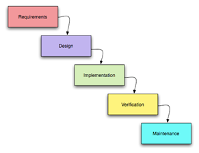
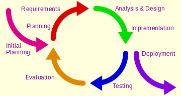
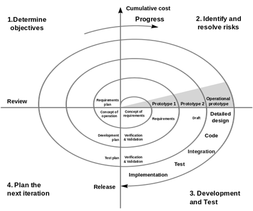
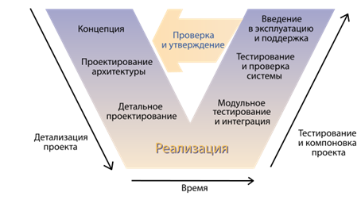
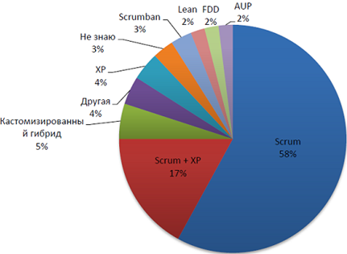
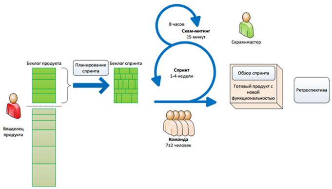
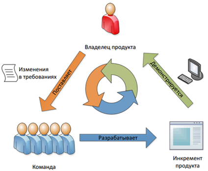

# Практическая работа 1. Методология Scrum. Написание user stories и формирование backlog`а продукта

## ЦЕЛЬ ПРАКТИЧЕСКОЙ РАБОТЫ

- изучить принципы гибкой методологии Scrum;
- определить пользователей и написать user stories (пользовательские истории) для разрабатываемого приложения;
- сформировать бэклог продукта на основе написанных пользовательских историй;
- сформировать Storyboard и макеты окон.

## ЗАДАНИЕ НА ПРАКТИЧЕСКУЮ РАБОТУ

1. Придумать тему для курсовой работы и заполнить задание на курсовую работу.
2. Работа с пользовательскими историями:
   - Сформировать видение системы;
   - Определить пользовательские роли;
   - Написать пользовательские истории (хотя бы для первого спринта):
     - краткое описание;
     - приоритет (от 1 до 10);
     - критерии приемки;
     - детали истории.
3. Из историй сформировать бэклог продукта (приоритезированный список историй).

## ХОД РАБОТЫ

Разработку программного обеспечения можно представить в виде набора определенных процессов:

- формирование требований к ПО (сбор и анализ). Требования к ПО – это описание функциональных возможностей и ограничений, накладываемых на программную систему. Успешно разработанное программное обеспечение – программное обеспечение, соответствующее требованиям. Результатом этого процесса является сформированный SRS (Software Requirement Specification) – законченное описание программной системы, которую нужно разработать;
- на основе сформированных требований осуществляется проектирование программного обеспечения – этап разработки ПО, в рамках которого исследуются структура и взаимосвязи элементов разрабатываемой системы. Прорабатывается архитектура системы, определяются требования к программному обеспечению. Результатом данного процесса является набор документов – проектная документация (Software Architecture Document, Software Design Document) – набор документов, которые могут включать диаграммы, блок-схемы, макеты и т.д. Проектируются:
  - архитектура (выбор структурных элементов, их интерфейсов, объединение элементов в блоки, способ объединения этих элементов и т.д);
  - устройство компонентов ПО;
  - UI приложения.
- разработка программного продукта осуществляется на основе разработанной проектной документации. Фактически, на этом этапе пишется программный код – кодируются алгоритмы, выбираются и кодируются структуры данных. На этом этапе, как правило, пишется техническая документация. Результатом этого этапа является написанный программный код, а также техническая документация;
- тестирование программного обеспечения осуществляется на основе разработанного программного кода и ставит перед собой две цели:
  - выявить ошибки (ситуации, при которых поведение программы является неправильным, нежелательным или не соответствующим требованиям);
  - продемонстрировать заказчику, что ПО соответствует требованиям.
- сопровождение программного обеспечения происходит после передачи ПО в эксплуатацию. На этом этапе происходит улучшение, оптимизация и устранение выявленных дефектов.

Также, в качестве отдельных ключевых процессов иногда выделяют отладку программного обеспечения и внедрение программного обеспечения:

- отладка программного обеспечения – выполняется после этапа тестирования, состоит в нахождении, локализации и устранении ошибок. В отличии от тестирования, на этапе отладки обнаруживают причину ошибки (на этапе тестирование происходит обнаружение факта ошибки);
- внедрение программного обеспечения – происходит после процесса отладки и состоит в установке ПО (очень часто это не просто запуск инсталлятора, программная система может умещаться на десятках клиентов, серверов, мобильных устройств и т.д.), настройки ПО под условия заказчика, а также обучение пользователей работе с программным продуктом.

Последовательность выполнения и взаимное отношение этих процессов называют моделью разработки программного продукта. То есть, вышеперечисленные этапы могут выполняться в разных последовательностях, повторяться, применяться не ко всему программному продукту, а только к его части – всё это определяет модель разработки ПО. Существует множество моделей разработки ПО. Приведем иллюстрации некоторых из них:

  

  

  

  

### Гибкая методология

Гибкая методология разработки (Agile software development) – серия подходов к разработке программного обеспечения (начало 00-х годов). Суть agile-похода изложена в «манифесте», но коротко ее можно сформулировать так:
разработка ведется короткими циклами (итерациями, называется «спринт») продолжительностью 1-4 недели;
в конце каждой итерации заказчик получает ценное для него приложение (или его часть), которое можно использовать в бизнесе;
команда разработки сотрудничает с заказчиком в ходе всего проекта;
изменения в проекте приветствуется и быстро включаются в работу.

**Agile-манифест:**

1. Наивысшим приоритетом для нас является удовлетворение потребностей 
заказчика, благодаря регулярной и ранней поставке ценного программного 
обеспечения;
2. Изменение требований приветствуется, даже на поздних стадиях разработки. Agile-процессы позволяют использовать изменения для обеспечения заказчику конкурентного преимущества;
3. Работающий продукт следует выпускать как можно чаще, с периодичностью от пары недель до пары месяцев;
4. На протяжении всего проекта разработчики и представители бизнеса должны ежедневно работать вместе;
5. Над проектом должны работать мотивированные профессионалы. Чтобы работа была сделана, создайте условия, обеспечьте поддержку и полностью доверьтесь им;
6. Непосредственное общение является наиболее практичным и эффективным способом обмена информацией как с самой командой, так и внутри команды;
7. Работающий продукт — основной показатель прогресса;
8. Инвесторы, разработчики и пользователи должны иметь возможность поддерживать постоянный ритм бесконечно. Agile помогает наладить такой устойчивый процесс разработки;
9. Постоянное внимание к техническому совершенству и качеству проектирования повышает гибкость проекта;
10. Простота — искусство минимизации лишней работы — крайне необходима;
11. Самые лучшие требования, архитектурные и технические решения рождаются у самоорганизующихся команд;
12. Команда должна систематически анализировать возможные способы улучшения эффективности и соответственно корректировать стиль своей работы.

Существует много методологий гибкой разработки (XP, Lean, FDD, Scrum, Scrumban и так далее). Наиболее популярной из них является Scrum.

  

### Методология Scrum

Организуйте работу в вашей организации в небольших кроссфункциональных командах, которые содержат всех необходимых специалистов. Выделите человека – скрам-мастера, который будет отвечать за соблюдение процессов в команде и конструктивную атмосферу.

  

Требования разбейте на небольшие, ориентированные на пользователей, функциональные части, которые максимально независимы друг от друга, в результате чего получите беклог продукта. Затем упорядочите элементы беклога по их важности и произведите относительную оценку объемов каждой истории. Выделите отдельного человека – владельца продукта, который будет отвечать за требования и их приоритеты, замыкая на себя всех заинтересованных лиц.

Всю работу ведите короткими (от 1 до 4 недель) фиксированными итерациями – спринтами, поставляя в конце каждого из них законченный функционал, который можно при необходимости вывести на рынок – инкремент продукта. Команда согласно своей скорости набирает задачи на неизменяемую по времени итерацию – спринт.

Каждый день проводится скрам-митинг, на котором команда синхронизирует свою работу и обсуждает проблемы. В процессе работы члены команды берут в работу элементы беклога согласно приоритету.

В конце каждого спринта проводите обзор спринта, чтобы получить обратную связь от владельца продукта, и ретроспективу спринта, чтобы оптимизировать ваши процессы. После этого владелец продукта может изменить требования и их приоритеты и запустить новый спринт.

  

#### Роли

В Scrum принято выделять три основных роли: владелец продукта, скрам-мастер и команда:

- Product owner (владелец продукта) – это человек, ответственный за создание требований и их приоритезацию;
- Scrum-master (скрам-мастер) – член команды, который отвечает за процессы в Scrum (координация работы, митинги и т.д.);
- Команда – разработчики, которые реализуют требования владельца продукта.

#### Артефакты (документы для Scrum):

- Product backlog (Бэклог продукта) – приоритезированный список требований с оценкой трудозатрат. Обычно состоит из бизнес-требований, которые приносят конкретную бизнес-ценность и называются элементы бэкглога;
- Sprint backlog (бэклог спринта) – часть беклога продукта, с самой высокой важностью и суммарной оценкой, не превышающей скорость команды, отобранная для спринта;
- Инкремент продукта – новая функциональность продукта, созданная во время спринта.

#### Бэклог продукта

Как было сказано выше бэклог продукта состоит из бизнес-требований, которые обычно оформляются в виде пользовательских историй (user story). Давайте взглянем более подробно, что представляет собой отдельная история пользователя:
- уникальный числовой идентификатор истории;
- название истории пользователя – короткое описание функционала с точки зрения пользователя, сформулированное в виде тройки «Роль», «Действие», «Цель»;
- важность – уникальный числовой приоритет истории пользователя, чем она выше, тем раньше данную историю необходимо сделать;
- оценка – числовая относительная оценка истории пользователя по специальной шкале. В рамках данной практической работы не используется.

Данные поля являются фактически обязательными, но достаточно часто используются и дополнительные поля:

- подробное описание – текстовое и графическое описание истории пользователя. Применяется, прежде всего, в распределенных командах для хранения знаний о функционале продукта;
- демонстрация - достаточно подробный сценарий, позволяющий провести демонстрацию истории пользователя. Например, для вышеприведенной истории пользователя с авторизацией, можно использовать следующие краткие сценарии для демонстрации:
  - пользователь вводит логин «root» и пароль «pass», и переходит на страницу личного профиля на сайте;
  - пользователь вводит логин «root» и пароль «wrongpass», и получает сообщение «Введен неправильный логин или пароль»;
- категория – используется для повышения управляемости с помощью категоризации задач. В качестве категорий могут выступать как продуктовые категории («темы» и «эпики» в терминологии Scrum), так и категории типа «Оптимизация производительности», «Техническая история» и тому подобные.

#### Пример приложения

Итак, у нас есть потребность в реализации системы, которая бы позволила пользователям хранить и обмениваться фотографиями. Ожидается, что прибыль от системы будет достигаться за счет процента с продаж пользователями своих фотографий, также, возможно, за счет рекламы третьих компаний.

Это короткое предложение – ничто иное как видение (vision) системы. Его вполне достаточно для того, чтобы начать описывать истории. Но сначала, давайте идентифицируем группы пользователей – истории будут рассказаны от их имени. Знание о будущих пользователях поможет нам сфокусироваться на нуждах каждого из них, не упустив важные моменты в требованиях к системе. И так, разными аспектами системы будут пользоваться такие обобщенные пользовательские роли:

- «пользователи» – хранят и обмениваются своими фотографиями;
- «рекламодатели» – размещают свою рекламу, ориентированную на «пользователей» системы;
- в результате обсуждения видения системы возникает необходимость в появлении еще одной роли «администраторы» – они будут обеспечивать поддержку системы для блага других пользователей.

Возможно, потом появятся другие роли, про которые мы пока не знаем. Для начала достаточно этих.

Так, имея роли пользователей и их основные задачи, попробуем описать самые важные истории, которые могли бы нам рассказать о будущей системе. Истории предлагается писать в таком формате:

**Как <пользователь>, я могу <действие>, для того, чтобы <цель>**

где:

- **<пользователь>** – одна из обобщенных пользовательских ролей;
- **<действие>** – действие, выполняемое пользователем посредством взаимодействия с системой;
- **<цель>** – конечная цель текущей задачи, выполняемой пользователем посредством взаимодействия с системой.**

Этот формат себя хорошо зарекомендовал – он поможет нам во время продумывания и последующего обсуждения историй персонализировать себя с тем или иным пользователям, помогая лучше представить детали их взаимодействия с системой. Последняя часть <цель> может быть опущена, если цель истории и так ясна.

Придумаем истории:

- как пользователь я могу хранить свои фотографии в системе, чтобы иметь возможность показать или продать их другим пользователям;
- как рекламодатель я могу помещать свою рекламу в системе, ориентированную на пользователей;
- как администратор я могу управлять фотографиями пользователей, так чтобы контент сайта был легальным.

Во время обсуждения первой истории, product owner и команда приходят к тому, что пользователи системы должны быть авторизированы системой перед выполнением каких-либо действий с фотографиями. Это приводит к появлению новой пользовательской роли «гостя» – группы людей, которые неавторизированы системой или вообще пока не имеют пользовательской учетной записи.

- Как гость я могу зарегистрироваться в системе для получения пользовательской учетной записи и последующей работы;
- Как гость я могу войти в систему под ранее созданной учетной записью, для последующей работы.

Пользуясь принципом симметричности требований, product owner и заказчик принимают решение, что пользователь должен иметь возможность удалить свою учетную запись в случае необходимости:

- Как пользователь я могу удалить свою учетную запись и перестать быть пользователем системы.

Обсуждая концепцию учетных записей, рождаются также следующие истории:

- Как пользователь я могу изменить данные своей учетной записи;
- Как пользователь я могу сделать некоторые поля своей учетной записи видимыми для других пользователей.

Во время обсуждения историй, product owner и команда приходят к пониманию уровня детализации, который необходим на текущей фазе и принимают совместные решения, пополняя истории все бОльшим количеством информации.

Рассмотрим историю

- Как гость я могу зарегистрироваться в системе для получения пользовательской учетной записи и последующей работы.

Во время обсуждения этой истории с командой product owner`у задают вопрос о том какая информация нужна для создания пользовательской учетной записи. Обсуждая различные варианты, заказчик и команда приходят к тому, что для первой версии системы достаточно будет проверенного электронного адреса плюс имени пользователя и его пароля.

К истории дописывается этот комментарий. Теперь история выглядит так:

- Как гость я могу зарегистрироваться в системе для получения пользовательской учетной записи и последующей работы:
  - Нужен проверенный email и выбранные пользователем имя и пароль.

В ходе дальнейших высказываний кто-то из тестировщиков задает резонный вопрос о минимальной длине пароля и проверке на уникальности имени. Продолжая дискуссию, команда и заказчики приходят к мнению, что необходимо описать основные критерии готовности истории, чтобы команда понимала ожидания и знала, когда объявлять историю готовой:

- Как гость я могу зарегистрироваться в системе для получения пользовательской учетной записи и последующей работы:
Нужен проверенный email и выбранные пользователем имя и пароль.
  - Тест 1: пользователь не может ввести пароль меньше 6 символов
  - Тест 2: пользователь не может ввести имя меньше 3 и больше 20 символов;
  - Тест 3: пользователь должен иметь уникальное имя в системе;
  - Тест 4: после регистрации пользователь должен получить email для активизации своей учетной записи;
  - Тест 5: пользователь не может войти в систему, если учетная запись не была активизирована;
  - Тест 6: при успешном входе система приветствует пользователя текстом «Добро пожаловать, <имя пользователя>»

Возможно во время реализации, тестирования и приема истории возникнут ещё какие-то дополнительные моменты. В этом случае они могут быть описаны в виде уточняющих тестов или как комментарии. Возможно из этих дополнения появятся новые истории.

Таким образом истории пополняются деталями по мере необходимости, эволюционируя от коротких высказываний до детализированных и согласованных требований со встроенными критериями готовности.

Пользуясь знанием рынка, а также здравым смыслом, product owner выстраивает список историй таким образом, чтобы максимизировать возврат вложений от проекта.

- Как гость я могу зарегистрироваться в системе для получения пользовательской учетной записи и последующей работы;
- Как гость я могу войти в систему под ранее созданной учетной записью, для последующей работы.
- Как пользователь я могу хранить свои фотографии в системе, чтобы иметь возможность показать или продать их другим пользователям.
- Как администратор я могу управлять фотографиями пользователей, так чтобы контент сайта был легальным.
- Как пользователь я могу изменить данные своей учетной записи.
- Как рекламодатель я могу помещать свою рекламу в системе, ориентированную на пользователей.
- Как пользователь я могу сделать некоторые поля своей учетной записи видимыми для других пользователей.
- Как пользователь я могу удалить свою учетную запись и перестать быть пользователем системы.

Истории выстроены в порядке, который, во-первых, логичен с точки зрения product owner`а и команды, а во-вторых ценность историй уменьшается сверху вниз. Таким образом, если, к примеру, на половине проекта наступает нехватка ресурсов (скажем, после реализации истории для администратора системы), заказчики смогут получить выгоду от продукта, так как наиболее важные истории уже будут реализованы.

Кроме инструментария ранжирования историй, в руках у заказчика есть и другие мощные средства, позволяющие повысить эффективность своих финансовых вложений. К примеру, одна из описанных на ранней фазе проекта историй в какой-то момент может показаться слишком большой в сравнении с другими, что усложняет понимание её приоритета:

- как пользователь я могу хранить свои фотографии в системе, чтобы иметь возможность показать или продать их другим пользователям.

В этом случае заказчик и команда могут попробовать разбить ее на несколько более мелких историй, каждая из которых может получить свой приоритет:

- как пользователь я могу хранить свои фотографии в системе, чтобы иметь возможность показать их другим пользователям;
- Как пользователь я могу хранить свои фотографии в системе, чтобы иметь возможность продать их другим пользователям.

При этом нужно учесть, что начальная история не разбивается на две «под-истории», а замещается двумя новыми. Это не разбиение историй на подзадачи для постановки их программистам, это всего лишь переформулировка требований для более эффективного управления ими.

#### Модель INVEST

Хорошая user story должна соответствовать модели «INVEST»:

- **I**ndependent. Reduced dependencies = easier to plan (история должна быть, по возможности, независима от других историй);
- **N**egotiable. Details added via collaboration (детали истории должны дополняться в результате обсуждения);
- **V**aluable. Provides value to the customer (история должна давать бизнес-ценность заказчику);
- **E**stimable. Too big or too vague = not estimable (история не должна быть слишком большой и расплывчатой);
- **S**mall. Can be done in less than a week by the team (история должна быть реализована менее чем за неделю);
- **T**estable. Good acceptance criteria (ясный критерий приемки).

Практические советы по написанию пользовательских историй:

- Лучше написать много историй поменьше, чем несколько громоздких;
- Каждая история в идеале должна быть написана избегая технического жаргона – чтобы клиент мог приоритезировать истории и включать их в итерации;
- Истории должны быть написаны таким образом, чтобы их можно было протестировать;
- Тесты должны быть написаны до кода;
- Как можно дольше стоит избегать UI. История должна выполняться без привязки к конкретным элементам;
- Каждая история должна содержать оценку;
- История должна иметь концовку – т.е. приводить к конкретному результату;
- История должна вмещаться в итерацию.