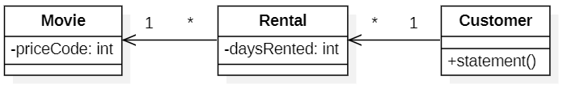

# Рефакторинг

Рефакторинг - процесс изменения программного проекта, в ходе которого поведение кода остается неизменным при усовершенствовании его внутренней структуры. Это систематизированный способ очистки кода, минимизирующий возможность появления новых ошибок. По сути, рефакторинг кода представляет собой улучшение проекта уже после того, как этот код написан.

Рефакторинг позволяет, взяв плохой и беспорядочный проект, превратить его в явно спроектированный код. Каждый шаг этого преобразования очень прост. Это может быть перемещение поля из одного класса в другой, выделение части исходного текста из метода и перемещение её в отдельный метод. Кумулятивный эффект таких малозаметных изменений может привести к существенному улучшению программы.

Во-первых, цель рефакторинга заключается в упрощении понимания и модификация исходных текстов программ.
Во- вторых, рефакторинг не меняет видимое поведение программы.

## Пример рефакторинга

<p align="center">
  
</p>

## Приемы рефакторинга

Рефакторинг — это контролируемый процесс улучшения кода, без написания новой функциональности. Результат рефакторинга — это чистый код и простой дизайн.

Чистый код — это код, который просто читать, писать и поддерживать. Чистый код улучшает предсказуемость разработки и повышает качество продукта.

Техники рефакторинга описывают конкретные методы борьбы с грязным кодом. Большинство рефакторингов имеет как достоинства, так и недостатки. Поэтому любой рефакторинг должен быть мотивирован и обдуман.

### Составление методов

Значительная часть рефакторинга посвящается правильному составлению методов. В большинстве случаев, корнем всех зол являются слишком длинные методы. Хитросплетения кода внутри такого метода, прячут логику выполнения и делают метод крайне сложным для понимания, а значит и изменения.

Рефакторинги этой группы призваны уменьшить сложность внутри метода, убрать дублирование кода и облегчить последующую работу с ним.

#### Извлечение метода

Чем больше строк кода в методе, тем сложнее разобраться в том, что он делает. Это основная проблема, которую решает этот рефакторинг.

Извлечение метода не только убивает множество запахов в коде, но и является одним из этапов множества других рефакторингов.

Достоинства

- улучшает читабельность кода. Постарайтесь дать новому методу название, которое бы отражало суть того, что он делает. Например, `createOrder()`, `renderCustomerInfo()` и так далее;

- убирает дублирование кода. Иногда код, вынесенный в метод, можно найти и в других местах программы. В таком случае, имеет смысл заменить найденные участки кода вызовом вашего нового метода;
- изолирует независимые части кода, уменьшая вероятность ошибок (например, по вине переопределения не той переменной).

Например, есть следующий код

```java
void printOwing() {
  Enumeration elements = orders.elements();
  double outstanding = 0.0;

  // print banner
  System.out.println ("*****************************");
  System.out.println ("****** Customer totals ******");
  System.out.println ("*****************************");

  // print owings
  while (elements.hasMoreElements()) {
    Order each = (Order) elements.nextElement();
    outstanding += each.getAmount();
  }

  // print details
  System.out.println("name: " + name);
  System.out.println("amount: " + outstanding);
}
```

Мы можем извлечь код, выводящий баннер, в отдельный метод

```java
void printOwing() {
  Enumeration elements = orders.elements();
  double outstanding = 0.0;

  printBanner();

  // print owings
  while (elements.hasMoreElements()) {
    Order each = (Order) elements.nextElement();
    outstanding += each.getAmount();
  }

  // print details
  System.out.println("name: " + name);
  System.out.println("amount: " + outstanding);
}

void printBanner() {
  System.out.println("*****************************");
  System.out.println("****** Customer totals ******");
  System.out.println("*****************************");
}
```

Основная проблема в извлечении сложных методов кроется в локальных переменных. Далее попытаемся извлечь метод вывода деталей

```java
void printOwing() {
  Enumeration elements = orders.elements();
  double outstanding = 0.0;

  printBanner();

  // print owings
  while (elements.hasMoreElements()) {
    Order each = (Order) elements.nextElement();
    outstanding += each.getAmount();
  }

  printDetails(outstanding);
}

void printBanner() {
  System.out.println("*****************************");
  System.out.println("****** Customer totals ******");
  System.out.println("*****************************");
}

void printDetails(double outstanding) {
  System.out.println("name: " + name);
  System.out.println("amount: " + outstanding);
}
```

Так как код вывода деталей использовал локальную переменную `outstanding`, мы сделали ее параметром метода и теперь передаем её из исходного метода.

Теперь давайте попробуем извлечь код расчета задолженности

```java
void printOwing() {
  printBanner();
  getOutstanding();
  printDetails(outstanding);
}

void printBanner() {
  System.out.println("*****************************");
  System.out.println("****** Customer totals ******");
  System.out.println("*****************************");
}

void printDetails(double outstanding) {
  System.out.println("name: " + name);
  System.out.println("amount: " + outstanding);
}

void getOutstanding() {
  Enumeration elements = orders.elements();
  double outstanding = 0.0;
  while (elements.hasMoreElements()) {
    Order each = (Order) elements.nextElement();
    outstanding += each.getAmount();
  }
}
```

Здесь могут возникнуть сложности с локальными переменными `elements` и `outstanding`. Возможно, эти значения могли использоваться в оставшемся коде основного метода.

Здесь проблема возникла с переменной `outstanding`, которая используется в методе вывода деталей.

В таком случае, метод расчета задолженности будет возвращать посчитанное значение, которое потом будет передано в метод вывода деталей.

```java
void printOwing() {
  printBanner();
  double outstanding = getOutstanding();
  printDetails(outstanding);
}

void printBanner() {
  System.out.println("*****************************");
  System.out.println("****** Customer totals ******");
  System.out.println("*****************************");
}

void printDetails(double outstanding) {
  System.out.println("name: " + name);
  System.out.println("amount: " + outstanding);
}

double getOutstanding() {
  Enumeration elements = orders.elements();
  double outstanding = 0.0;
  while (elements.hasMoreElements()) {
    Order each = (Order) elements.nextElement();
    outstanding += each.getAmount();
  }
  return outstanding;
}
```

Чек-лист проведения рефакторинга

1. создайте новый метод и назовите его так, чтобы название отражало суть того, что будет делать этот метод.
2. скопируйте беспокоящий вас фрагмент кода в новый метод. Удалите этот фрагмент из старого места и замените вызовом вашего нового метода.
3. найдите все переменные, которые использовались в этом фрагменте кода. Если они были объявлены внутри этого фрагмента и не используются вне его, просто оставьте их без изменений — они станут локальными переменными нового метода.

4. если переменные объявлены перед интересующим вас участком кода, значит, их следует передать в параметры вашего нового метода, чтобы использовать значения, которые в них находились ранее. Иногда от таких переменных проще избавиться с помощью замены переменных вызовом метода.
5. если вы видите, что локальная переменная как-то изменяется в вашем участке кода, это может означать, что её изменённое значение понадобится дальше в основном методе. Проверьте это. Если подозрение подтвердилось, значение этой переменной следует возвратить в основной метод, чтобы ничего не сломать.

#### Встраивание метода

Основная причина — тело метода состоит из простого делегирования к другому методу. Само по себе такое делегирование — не проблема. Но если таких методов довольно много, становится очень легко в них запутаться.

Проблема

```java
class PizzaDelivery {
  // ...
  int getRating() {
    return moreThanFiveLateDeliveries() ? 2 : 1;
  }

  boolean moreThanFiveLateDeliveries() {
    return numberOfLateDeliveries > 5;
  }
}
```

Решение

```java
class PizzaDelivery {
  // ...
  int getRating() {
    return numberOfLateDeliveries > 5 ? 2 : 1;
  }
}
```

Зачастую методы не бывают слишком короткими изначально, а становятся такими в результате изменений в программе. Поэтому не стоит бояться избавляться от ставших ненужными методов.

Достоинства: минимизируя количество бесполезных методов, мы уменьшаем общую сложность кода.

Чек-лист проведения рефакторинга

- убедитесь, что метод не переопределяется в подклассах. Если он переопределяется, воздержитесь от рефакторинга;
- Найдите все вызовы метода. Замените эти вызовы содержимым метода;
- Удалите метод.

#### Извлечение переменной

Проблема. Есть сложное для понимания выражение

```java
void renderBanner() {
  if ((platform.toUpperCase().indexOf("MAC") > -1) &&
       (browser.toUpperCase().indexOf("IE") > -1) &&
        wasInitialized() && resize > 0 )
  {
    // do something
  }
}
```

Решение. Поместите результат выражения или его части в отдельные переменные, поясняющие суть выражения.

```java
void renderBanner() {
  final boolean isMacOs = platform.toUpperCase().indexOf("MAC") > -1;
  final boolean isIE = browser.toUpperCase().indexOf("IE") > -1;
  final boolean wasResized = resize > 0;

  if (isMacOs && isIE && wasInitialized() && wasResized) {
    // do something
  }
}
```

Главная мотивация этого рефакторинга — сделать более понятным сложное выражение, разбив его на промежуточные части. Это может быть:

- условие оператора if() или части оператора ?: в C-подобных языках;
- длинное арифметическое выражение без промежуточных результатов;
- длинное склеивание строк.

Выделение переменной может стать первым шагом к последующему извлечению метода, если вы увидите, что выделенное выражение используется и в других местах кода.

Достоинства: улучшает читабельность кода. Постарайтесь дать выделенным переменным хорошие названия, которые будут отражать точно суть выражения. Так вы сделаете код читабельным и сумеете избавиться от лишних комментариев. Например, `customerTaxValue`, `cityUnemploymentRate`, `clientSalutationString` и так далее.

Недостатки:

- появляются дополнительные переменные. Но этот минус компенсируется простотой чтения кода;
- при рефакторинге выражений условных операторов помните о том, что программа обычно оптимизирует выполнение условных выражений и не выполняет дальнейшие проверки, если уже понятен финальный результат выражения. Например, если в выражении `if (a() || b())` ... метод `a` вернет `true`, то программа не станет выполнять `b` — что бы он ни вернул, результирующее выражение всё равно будет истинным.

Однако, после извлечения частей этого выражения в переменные, оба метода будут вызываться постоянно, что может негативно сказаться на производительности, особенно если эти методы выполняют какую-то ресурсоёмкую работу.

Рассмотрим следующий метод

```java
double price() {
  // Price consists of: base price - discount + shipping cost
  return quantity * itemPrice -
    Math.max(0, quantity - 500) * itemPrice * 0.05 +
    Math.min(quantity * itemPrice * 0.1, 100.0);
}
```

Сначала определим базовую цену basePrice как количество товаров в заказе, умноженное на стоимость одной единицы.

```java
double price() {
  // Price consists of: base price - discount + shipping cost
  final double basePrice = quantity * itemPrice;
  
  return basePrice -
    Math.max(0, quantity - 500) * itemPrice * 0.05 +
    Math.min(basePrice * 0.1, 100.0);
}
```

Определим скидку за количество купленного товара `quantityDiscount`, а расчет вынесем в отдельную переменную.

```java
double price() {
  // Price consists of: base price - discount + shipping cost
  final double basePrice = quantity * itemPrice;
  final double quantityDiscount = Math.max(0, quantity - 500) * itemPrice * 0.05;
  
  return basePrice - quantityDiscount +
    Math.min(basePrice * 0.1, 100.0);
}
```

Последняя часть расчетов - это доставка `shipping`. Здесь также используем отдельную переменную.

```java
double price() {
  // Price consists of: base price - discount + shipping cost
  final double basePrice = quantity * itemPrice;
  final double quantityDiscount = Math.max(0, quantity - 500) * itemPrice * 0.05;
  final double shipping = Math.min(basePrice * 0.1, 100.0);
  
  return basePrice - quantityDiscount + shipping;
}
```

Чек-лист проведения рефакторинга:

- вставьте новую строку перед интересующим вас выражением и объявите там новую переменную. Присвойте этой переменной часть сложного выражения;
- замените часть вынесенного выражения новой переменной;
- повторите это для всех сложных частей выражения.

#### Встраивание переменной

Проблема. Есть временная переменная, которой присваивается результат простого выражения (и больше ничего).

```java
boolean hasDiscount(Order order) {
  double basePrice = order.basePrice();
  return basePrice > 1000;
}
```

Решение/ Замените обращения к переменной этим выражением.

```java
boolean hasDiscount(Order order) {
  return order.basePrice() > 1000;
}
```

Встраивание локальной переменной почти всегда используется как часть замены переменной вызовом метода или для облегчения извлечения метода.

Достоинства. Сам по себе данный рефакторинг не несёт почти никакой пользы. Тем не менее, если переменной присваивается результат выполнения какого-то метода, у вас есть возможность немного улучшить читабельность программы, избавившись от лишней переменной.

Недостатки. Иногда с виду бесполезные временные переменные служат для кеширования, то есть сохранения результата какой-то дорогостоящей операции, который будет в ходе работы использован несколько раз повторно. Перед тем как осуществлять рефакторинг, убедитесь, что в вашем случае это не так.

Чек-лист проведения рефакторинга:

- найдите все места, где используется переменная, и замените их выражением, которое ей присваивалось;
- удалите объявление переменной и строку присваивания ей значения.

#### Замена переменной вызовом метода

Проблема. Вы помещаете результат какого-то выражения в локальную переменную, чтобы использовать её далее в коде.

```java
double calculateTotal() {
  double basePrice = quantity * itemPrice;
  if (basePrice > 1000) {
    return basePrice * 0.95;
  }
  else {
    return basePrice * 0.98;
  }
}
```

Решение. Выделите все выражение в отдельный метод и возвращайте результат из него. Замените использование вашей переменной вызовом метода. Новый метод может быть использован и в других методах.

```java
double calculateTotal() {
  if (basePrice() > 1000) {
    return basePrice() * 0.95;
  }
  else {
    return basePrice() * 0.98;
  }
}

double basePrice() {
  return quantity * itemPrice;
}
```

Применение данного рефакторинга может быть подготовительным этапом для применения выделения метода для какой-то части очень длинного метода.

Кроме того, иногда можно найти это же выражение и в других методах, что заставляет задуматься о создании общего метода для его получения.

Достоинства:

- улучшает читабельность кода. Намного проще понять, что делает метод `getTax()` чем строка `orderPrice() * -2`;
- помогает убрать дублирование кода, если заменяемая строка используется более чем в одном методе.

Вопрос производительности

При использовании этого рефакторинга может возникнуть вопрос, не скажется ли результат рефакторинга не лучшим образом на производительности программы. Честный ответ — да, результирующий код может получить дополнительную нагрузку за счёт вызова нового метода. Однако в наше время быстрых процессоров и хороших компиляторов такая нагрузка вряд ли будет заметна. Зато взамен мы получаем лучшую читабельность кода и возможность использовать новый метод в других местах программы.

Тем не менее, если ваша временная переменная служит для кеширования результата действительно трудоёмкого выражения, имеет смысл остановить этот рефакторинг после выделения выражения в новый метод.

Рассмотрим следующий код

```java
class Product {
  // ...
  public double getPrice() {
    int basePrice = quantity * itemPrice;
    double discountFactor;
    if (basePrice > 1000) {
      discountFactor = 0.95;
    }
    else {
      discountFactor = 0.98;
    }
    return basePrice * discountFactor;
  }
}
```

Давайте по очереди заменим переменные `basePrice` и `discountFactor` вызовами соответствующих методов. Для начала нужно убедиться, что переменным в пределах метода значение присваивается только один раз. Можно объявить эти переменные ключевым словом `final`. В таком случае компилятор укажет все места, где переменным пытаются повторно присвоить значения.

Создадим метод `basePrice()` и перенесем в него выражение, формирующее переменную `basePrice`. После этого заменим переменную вызовом метода

```java
class Product {
  // ...
  public double getPrice() {
    final double discountFactor;
    
    if (basePrice() > 1000) {
      discountFactor = 0.95;
    }
    else {
      discountFactor = 0.98;
    }
    return basePrice() * discountFactor;
  }

  private int basePrice() {
    return quantity * itemPrice;
  }
}
```

Теперь создадим метод для `discountFactor` и заменим переменную вызовом метода.

```java
class Product {
  // ...
  public double getPrice() {
    return basePrice() * discountFactor();
  }
  
  private int basePrice() {
    return quantity * itemPrice;
  }

  private double discountFactor() {
    if (basePrice() > 1000) {
      return 0.95;
    }
    else {
      return 0.98;
    }
  }
}
```

Чек-лист проведения рефакторинга:

- убедитесь, что переменной в пределах метода присваивается значение только один раз. Если это не так, используйте расщепление переменной для того, чтобы гарантировать, что переменная будет использована только для хранения результата вашего выражения;
- используйте извлечение метода для того, чтобы переместить интересующее вас выражение в новый метод. Убедитесь, что этот метод только возвращает значение и не меняет состояние объекта. Если он как-то влияет на видимое состояние объекта, используйте разделение запроса и модификатора;
- замените использование переменной вызовом вашего нового метода.

#### Расщепление переменной

Проблема. Есть локальная переменная, которая используется для хранения разных промежуточных значений внутри метода (за исключением переменных циклов).

```java
double temp = 2 * (height + width);
System.out.println(temp);
temp = height * width;
System.out.println(temp);
```

Решение. Используйте разные переменные для разных значений. Каждая переменная должна отвечать только за одну определённую вещь.

```java
final double perimeter = 2 * (height + width);
System.out.println(perimeter);
final double area = height * width;
System.out.println(area);
```

Если вы «экономите» переменные внутри функции, повторно используете их для различных несвязанных целей, у вас обязательно начнутся проблемы в тот момент, когда потребуется внести какие-то изменения в код, содержащий эти переменные. Вам придётся перепроверять все случаи использования переменной, чтобы удостовериться в отсутствии ошибки в коде.

Достоинства:

- каждый элемент программы должен отвечать только за одну вещь. Это сильно упрощает поддержку кода в будущем, так как вы можете спокойно заменить этот элемент, не опасаясь побочных эффектов;
- улучшается читабельность кода. Если переменная создавалась очень давно, да еще и в спешке, она могла получить элементарное название, которое не объясняет сути хранимого значения, например, `k`, `a2`, `value` и так далее. У вас есть шанс исправить ситуацию, назначив новым переменным хорошие названия, отражающие суть хранимых значений. Например, `customerTaxValue`, `cityUnemploymentRate`, `clientSalutationString` и так далее;
- этот рефакторинг помогает в дальнейшем выделить повторяющиеся участки кода в отдельные методы.

Рассмотрим код метода расчета расстояния перемещения мяча в пространстве в зависимости от времени и сил, действующих на него.

```java
public double getDistanceTraveled(int time) {
  double result;
  double acc = primaryForce / mass;
  int primaryTime = Math.min(time, delay);
  result = 0.5 * acc * primaryTime * primaryTime;

  int secondaryTime = time - delay;
  if (secondaryTime > 0) {
    double primaryVel = acc * delay;
    acc = (primaryForce + secondaryForce) / mass;
    result +=  primaryVel * secondaryTime + 0.5 * acc * secondaryTime * secondaryTime;
  }
  return result;
}
```

В данном примере есть переменная `acc`, которая устанавливается в нем дважды. Она выполняет две задачи: содержит первоначальное ускорение, вызванное первой силой и позднее ускорение, вызванное обеими силами. Следовательно, эту переменную следует "расщепить", чтобы каждая ее часть отвечала только за одну задачу.

Для первого вхождения переменной, изменим ее название на то, которое отражает ее предназначение. После этого, укажем её как `final`. После этого, объявляем первоначальную переменную в месте второго присваивания ей некоторого начального значения. 

```java
public double getDistanceTravelled(int time) {
  double result;
  final double primaryAcceleration = primaryForce / mass;
  int primaryTime = Math.min(time, delay);
  result = 0.5 * primaryAcceleration * primaryTime * primaryTime;

  int secondaryTime = time - delay;
  if (secondaryTime > 0) {
    double primaryVel = primaryAcceleration * delay;
    double acc = (primaryForce + secondaryForce) / mass;
    result +=  primaryVel * secondaryTime + 0.5 * acc * secondaryTime * secondaryTime;
  }
  return result;
}
```

Даем переменной `acc` "правильное" название.

```java
public double getDistanceTravelled(int time) {
  double result;
  final double primaryAcceleration = primaryForce / mass;
  int primaryTime = Math.min(time, delay);
  result = 0.5 * primaryAcceleration * primaryTime * primaryTime;

  int secondaryTime = time - delay;
  if (secondaryTime > 0) {
    double primaryVel = primaryAcceleration * delay;
    final double secondaryAcceleration = (primaryForce + secondaryForce) / mass;
    result +=  primaryVel * secondaryTime + 0.5 * secondaryAcceleration * secondaryTime * secondaryTime;
  }
  return result;
}
```

Чек-лист проведения рефакторинга:

- найдите место в коде, где переменная в первый раз заполняется каким-то значением. В этом месте переименуйте ее, причем новое название должно соответствовать присваиваемому значению;
- подставьте её новое название вместо старого в тех местах, где использовалось это значение переменной;
- повторите операцию для случаев, где переменной присваивается новое значение.

#### Удаление присваиваний параметрам

Проблема. Параметру метода присваивается какое-то значение.

```java
int discount(int inputVal, int quantity) {
  if (quantity > 50) {
    inputVal -= 2;
  }
  // ...
}
```

Решение. Вместо параметра воспользуйтесь новой локальной переменной.

```java
int discount(int inputVal, int quantity) {
  int result = inputVal;
  if (quantity > 50) {
    result -= 2;
  }
  // ...
}
```

Причины проведения этого рефакторинга такие же, как и при расщеплении переменной, но в данном случае речь идёт о параметре, а не о локальной переменной.

Во-первых, если параметр передаётся по ссылке, то после изменения его значения внутри метода, оно передается аргументу, который подавался на вызов этого метода. Очень часто это происходит случайно и приводит к печальным последствиям. Даже если в вашем языке программирования параметры обычно передаются по значению, а не по ссылке, сам код может вызвать замешательство у тех, кто привык считать иначе.

Во-вторых, множественные присваивания разных значений параметру приводят к тому, что вам становится сложно понять, какие именно данные должны находиться в параметре в определенный момент времени. Проблема усугубляется, если ваш параметр и то, что он должен хранить, описаны в документации, но фактически, его значение может не совпадать с ожидаемым внутри метода.

Достоинства:

- каждый элемент программы должен отвечать только за одну вещь. Это сильно упрощает поддержку кода в будущем, так как вы можете спокойно заменить этот элемент, не опасаясь побочных эффектов;
- этот рефакторинг помогает в дальнейшем выделить повторяющиеся участки кода в отдельные методы.

Рассмотрим следующий код

```java
int discount(int inputVal, int quantity, int yearToDate) {
  if (inputVal > 50) {
    inputVal -= 2;
  }
  if (quantity > 100) {
    inputVal -= 1;
  }
  if (yearToDate > 10000) {
    inputVal -= 4;
  }
  return inputVal;
}
```

Создадим отдельную переменную, значение которой будем изменять. Изначально оно равно параметру метода. После этого объявим параметры метода как `final`.

```java
int discount(final int inputVal, final int quantity, final int yearToDate) {
  int result = inputVal;
  if (inputVal > 50) {
    result -= 2;
  }
  if (quantity > 100) {
    result -= 1;
  }
  if (yearToDate > 10000) {
    result -= 4;
  }
  return result;
}
```

Чек-лист проведения рефакторинга:

- создайте локальную переменную и присвойте ей начальное значение вашего параметра;
- во всем коде метода после этой строки замените использование параметра вашей локальной переменной.

#### Замена метода объектов методов

Проблема. Есть длинный метод, в котором локальные переменные так сильно переплетены, что это делает невозможным применение «извлечения метода».

```java
class Order {
  // ...
  public double price() {
    double primaryBasePrice;
    double secondaryBasePrice;
    double tertiaryBasePrice;
    // Perform long computation.
  }
}
```

Решение. Преобразуйте метод в отдельный класс так, чтобы локальные переменные стали полями этого класса. После этого можно без труда разделить метод на части.

```java
class Order {
  // ...
  public double price() {
    return new PriceCalculator(this).compute();
  }
}

class PriceCalculator {
  private double primaryBasePrice;
  private double secondaryBasePrice;
  private double tertiaryBasePrice;
  
  public PriceCalculator(Order order) {
    // Copy relevant information from the
    // order object.
  }
  
  public double compute() {
    // Perform long computation.
  }
}
```

Метод слишком длинный, и вы не можете его разделить из-за хитросплетения локальных переменных, которые сложно изолировать друг от друга.

Первым шагом к решению проблемы будет выделение всего этого метода в отдельный класс и превращение его локальных переменных в поля.

Во-первых, это позволит вам изолировать проблему в пределах этого класса, а во-вторых, расчистит дорогу для разделения большого метода на методы поменьше, которые, к тому же, не подходили бы к смыслу оригинального класса.

Достоинства:

- изоляция длинного метода в собственном классе позволяет остановить бесконтрольный рост метода. Кроме того, даёт возможность разделить его на подметоды в рамках своего класса, не засоряя служебными методами оригинальный класс.

Недостатки:
- создаётся ещё один класс, повышая общую сложность программы.

Рассмотрим следующий пример

```java
class Account {
  // ...
  int gamma(int inputVal, int quantity, int yearToDate) {
    int importantValue1 = (inputVal * quantity) + delta();
    int importantValue2 = (inputVal * yearToDate) + 100;
    if ((yearToDate - importantValue1) > 100) {
      importantValue2 -= 20;
    }
    int importantValue3 = importantValue2 * 7;
    // and so on…
    return importantValue3 - 2 * importantValue1;
  }
  // ...
}
```

Мы видим, что в одном из методов класса есть множество запутанных вычислений и хитросплетение локальных переменных. Всё это затрудняет дальнейший рефакторинг класса.

Создадим новый класс. Создадим в этом классе неизменяемое поле для хранения объекта исходного класса.

```java
class Account {
  // ...
  int gamma(int inputVal, int quantity, int yearToDate) {
    int importantValue1 = (inputVal * quantity) + delta();
    int importantValue2 = (inputVal * yearToDate) + 100;
    if ((yearToDate - importantValue1) > 100) {
      importantValue2 -= 20;
    }
    int importantValue3 = importantValue2 * 7;
    // and so on…
    return importantValue3 - 2 * importantValue1;
  }
  // ...
}

class Gamma {
  private final Account account;
}
```

Перенесем переменные из метода, который мы хотим отделить, а также создадим поля для каждого из параметров метода.

```java
class Account {
  // ...
  int gamma(int inputVal, int quantity, int yearToDate) {
    int importantValue1 = (inputVal * quantity) + delta();
    int importantValue2 = (inputVal * yearToDate) + 100;
    if ((yearToDate - importantValue1) > 100) {
      importantValue2 -= 20;
    }
    int importantValue3 = importantValue2 * 7;
    // and so on…
    return importantValue3 - 2 * importantValue1;
  }
  // ...
}

class Gamma {
  private final Account account;
  private int importantValue1;
  private int importantValue2;
  private int importantValue3;
  private int inputVal;
  private int quantity;
  private int yearToDate;
}
```

Создадим конструктор, который будет принимать параметры метода и сохранять их в полях класса для дальнейшего использования.

```java
class Account {
  // ...
  int gamma(int inputVal, int quantity, int yearToDate) {
    int importantValue1 = (inputVal * quantity) + delta();
    int importantValue2 = (inputVal * yearToDate) + 100;
    if ((yearToDate - importantValue1) > 100) {
      importantValue2 -= 20;
    }
    int importantValue3 = importantValue2 * 7;
    // and so on…
    return importantValue3 - 2 * importantValue1;
  }
  // ...
}

class Gamma {
  private final Account account;
  private int importantValue1;
  private int importantValue2;
  private int importantValue3;
  private int inputVal;
  private int quantity;
  private int yearToDate;

  public Gamma(Account source, int inputValArg, int quantityArg, int yearToDateArg) {
    this.account = source;
    inputVal = inputValArg;
    quantity = quantityArg;
    yearToDate = yearToDateArg;
  }
}
```

Теперь перемещаем исходный метод

```java
class Account {
  // ...
  int gamma(int inputVal, int quantity, int yearToDate) {
    int importantValue1 = (inputVal * quantity) + delta();
    int importantValue2 = (inputVal * yearToDate) + 100;
    if ((yearToDate - importantValue1) > 100) {
      importantValue2 -= 20;
    }
    int importantValue3 = importantValue2 * 7;
    // and so on…
    return importantValue3 - 2 * importantValue1;
  }
  // ...
}

class Gamma {
  private final Account account;
  private int importantValue1;
  private int importantValue2;
  private int importantValue3;
  private int inputVal;
  private int quantity;
  private int yearToDate;

  public Gamma(Account source, int inputValArg, int quantityArg, int yearToDateArg) {
    this.account = source;
    inputVal = inputValArg;
    quantity = quantityArg;
    yearToDate = yearToDateArg;
  }
  
  public int compute() {
    int importantValue1 = (inputVal * quantity) + delta();
    int importantValue2 = (inputVal * yearToDate) + 100;
    if ((yearToDate - importantValue1) > 100) {
      importantValue2 -= 20;
    }
    int importantValue3 = importantValue2 * 7;
    // and so on…
    return importantValue3 - 2 * importantValue1;
  }
}
```

Избавимся от локальных переменных, заменив их на поля. При этом следует модифицировать любые вызовы методов `Account` так, чтобы оим выполнялись через поле `account`.

```java
class Account {
  // ...
  int gamma(int inputVal, int quantity, int yearToDate) {
    int importantValue1 = (inputVal * quantity) + delta();
    int importantValue2 = (inputVal * yearToDate) + 100;
    if ((yearToDate - importantValue1) > 100) {
      importantValue2 -= 20;
    }
    int importantValue3 = importantValue2 * 7;
    // and so on…
    return importantValue3 - 2 * importantValue1;
  }
  // ...
}

class Gamma {
  private final Account account;
  private int importantValue1;
  private int importantValue2;
  private int importantValue3;
  private int inputVal;
  private int quantity;
  private int yearToDate;

  public Gamma(Account source, int inputValArg, int quantityArg, int yearToDateArg) {
    this.account = source;
    inputVal = inputValArg;
    quantity = quantityArg;
    yearToDate = yearToDateArg;
  }
  
  public int compute() {
    importantValue1 = (inputVal * quantity) + account.delta();
    importantValue2 = (inputVal * yearToDate) + 100;
    if ((yearToDate - importantValue1) > 100) {
      importantValue2 -= 20;
    }
    importantValue3 = importantValue2 * 7;
    // and so on…
    return importantValue3 - 2 * importantValue1;
  }
}
```

После этого необходимо заменить тело старого метода на вызов метода в новом классе.

```java
class Account {
  // ...
  int gamma(int inputVal, int quantity, int yearToDate) {
    return new Gamma(this, inputVal, quantity, yearToDate).compute();
  }
  // ...
}

class Gamma {
  private final Account account;
  private int importantValue1;
  private int importantValue2;
  private int importantValue3;
  private int inputVal;
  private int quantity;
  private int yearToDate;

  public Gamma(Account source, int inputValArg, int quantityArg, int yearToDateArg) {
    this.account = source;
    inputVal = inputValArg;
    quantity = quantityArg;
    yearToDate = yearToDateArg;
  }
  
  public int compute() {
    importantValue1 = (inputVal * quantity) + account.delta();
    importantValue2 = (inputVal * yearToDate) + 100;
    if ((yearToDate - importantValue1) > 100) {
      importantValue2 -= 20;
    }
    importantValue3 = importantValue2 * 7;
    // and so on…
    return importantValue3 - 2 * importantValue1;
  }
}
```

Теперь мы можем легко применить извлечение метода к методу `compute()`.

```java
class Account {
  // ...
  int gamma(int inputVal, int quantity, int yearToDate) {
    return new Gamma(this, inputVal, quantity, yearToDate).compute();
  }
  // ...
}

class Gamma {
  private final Account account;
  private int importantValue1;
  private int importantValue2;
  private int importantValue3;
  private int inputVal;
  private int quantity;
  private int yearToDate;

  public Gamma(Account source, int inputValArg, int quantityArg, int yearToDateArg) {
    this.account = source;
    inputVal = inputValArg;
    quantity = quantityArg;
    yearToDate = yearToDateArg;
  }

  public int compute() {
    importantValue1 = (inputVal * quantity) + account.delta();
    importantValue2 = (inputVal * yearToDate) + 100;
    importantThing();
    importantValue3 = importantValue2 * 7;
    // and so on…
    return importantValue3 - 2 * importantValue1;
  }

  void importantThing() {
    if ((yearToDate - importantValue1) > 100) {
      importantValue2 -= 20;
    }
  }
}
```

Чек-лист проведения рефакторинга:
- создайте новый класс. Дайте ему название, основываясь на предназначении метода, который рефакторите;
- в новом классе создайте приватное поле для хранения ссылки на экземпляр класса, в котором раньше находился метод. Эту ссылку потом можно будет использовать, чтобы брать из оригинального объекта нужные данные, если потребуется;
- создайте отдельное приватное поле для каждой локальной переменной метода;
-создайте конструктор, который принимает в параметрах значения всех локальных переменных метода, а также инициализирует соответствующие приватные поля;
- объявите основной метод и скопируйте в него код оригинального метода, заменив локальные переменные приватным полями;
- замените тело оригинального метода в исходном классе созданием объекта-метода и вызовом его основного метода.

#### Замена алгоритма

Проблема. Вы хотите заменить существующий алгоритм другим?

```java
String foundPerson(String[] people){
  for (int i = 0; i < people.length; i++) {
    if (people[i].equals("Don")){
      return "Don";
    }
    if (people[i].equals("John")){
      return "John";
    }
    if (people[i].equals("Kent")){
      return "Kent";
    }
  }
  return "";
}
```

Решение. Замените тело метода, реализующего старый алгоритм, новым алгоритмом.

```java
String foundPerson(String[] people){
  List candidates =
    Arrays.asList(new String[] {"Don", "John", "Kent"});
  for (int i=0; i < people.length; i++) {
    if (candidates.contains(people[i])) {
      return people[i];
    }
  }
  return "";
}
```

Причины рефакторинга:

- поэтапный рефакторинг — не единственный способ улучшить программу. Иногда вы сталкиваетесь с таким нагромождением проблем в методе, что его гораздо проще переписать заново;- с другой стороны, вы могли найти алгоритм, который куда проще и эффективнее текущего. В этом случае надо просто заменить старый алгоритм новым;
- с течением времени ваш алгоритм может оказаться включен в набор известной библиотеки или фреймворка, и вы можете пожелать избавиться от собственной реализации, чтобы облегчить себе поддержку программы;
- требования к работе программы могут измениться настолько сильно, что старый алгоритм невозможно просто «допилить» до соответствия им.

Чек-лист проведения рефакторинга:

- убедитесь, что вы по максимуму упростили текущий алгоритм. Перенесите несущественный код в другие методы с помощью извлечения метода. Чем меньше «движущихся частей» останется в исходном алгоритме, тем проще будет его заменить;
- создайте ваш новый алгоритм в новом методе. Замените старый алгоритм новым и запустите тесты программы;
- если результаты не сходятся, верните старую реализацию и сравните результаты. Выясните, почему результаты не совпадают. Нередко, причиной могут быть ошибки в старом алгоритме, но с большей вероятностью не работает что-то в новом;
- когда все тесты начнут проходить, окончательно удалите старый алгоритм.

### Перемещение функций между объектами

Рефакторинги этой группы показывают как безопасно перемещать функциональность из одних классов в другие, создавать новые классы, а также скрывать детали реализации из публичного доступа.

#### Перемещение метода

Проблема. Метод используется в другом классе больше, чем в собственном.

Решение. Создайте новый метод в классе, который использует его больше других, и перенесите туда код из старого метода. Код оригинального метода превратите в обращение к новому методу в другом классе либо уберите его вообще.

Причины рефакторинга:

- вы хотите переместить метод в класс, который содержит данные, с которыми, в основном, работает этот метод. Этим вы увеличиваете связность внутри классов;
- вы хотите переместить метод, чтобы убрать или уменьшить зависимость класса, вызывающего этот метод, от класса, в котором он находился. Это может быть полезно, если вызывающий класс уже имеет зависимость от класса, куда вы планируете перенести метод. Таким образом, вы уменьшаете связанность между классами.

Рассмотрим пример:

```java
class Account {
  // ...
  private AccountType type;
  private int daysOverdrawn;

  public double overdraftCharge() {
    if (type.isPremium()) {
      double result = 10;
      if (daysOverdrawn > 7) {
        result += (daysOverdrawn - 7) * 0.85;
      }
      return result;
    }
    else {
      return daysOverdrawn * 1.75;
    }
  }
  public double bankCharge() {
    double result = 4.5;
    if (daysOverdrawn > 0) {
      result += overdraftCharge();
    }
    return result;
  }
}

class AccountType {
  // ...
}
```

Представим, что будет введено несколько новых типов счетов со своими правилами начисления платы за овердрафт (превышение кредита). Мы хотим перенести метод начисления этой оплаты внутрь класса, представляющего тип счета.

Скопируем метод `overdraftCharge()` в класс `AccountType`

```java
class Account {
  // ...
  private AccountType type;
  private int daysOverdrawn;

  public double overdraftCharge() {
    if (type.isPremium()) {
      double result = 10;
      if (daysOverdrawn > 7) {
        result += (daysOverdrawn - 7) * 0.85;
      }
      return result;
    }
    else {
      return daysOverdrawn * 1.75;
    }
  }
  public double bankCharge() {
    double result = 4.5;
    if (daysOverdrawn > 0) {
      result += overdraftCharge();
    }
    return result;
  }
}

class AccountType {
  // ...
  public double overdraftCharge() {
    if (isPremium()) {
      double result = 10;
      if (daysOverdrawn > 7) {
        result += (daysOverdrawn - 7) * 0.85;
      }
      return result;
    }
    else {
      return daysOverdrawn * 1.75;
    }
  }
}
```

Поле `daysOverdrawn` осталось в оригинальном классе. Передадим значение поля как параметр. После этого, тело метода `overdraftCharge()` в классе `Account` заменяем простым делегированием

```java
class Account {
  // ...
  private AccountType type;
  private int daysOverdrawn;

  public double overdraftCharge() {
    return type.overdraftCharge(daysOverdrawn);
  }
  public double bankCharge() {
    double result = 4.5;
    if (daysOverdrawn > 0) {
      result += overdraftCharge();
    }
    return result;
  }
}

class AccountType {
  // ...
  public double overdraftCharge(int daysOverdrawn) {
    if (isPremium()) {
      double result = 10;
      if (daysOverdrawn > 7) {
        result += (daysOverdrawn - 7) * 0.85;
      }
      return result;
    }
    else {
      return daysOverdrawn * 1.75;
    }
  }
}
```

После этого можно избавиться от делегирования и вызывать метод `overdraftCharge()` класса `AccountType` напрямую

```java
class Account {
  // ...
  private AccountType type;
  private int daysOverdrawn;

  public double bankCharge() {
    double result = 4.5;
    if (daysOverdrawn > 0) {
      result += type.overdraftCharge(daysOverdrawn);
    }
    return result;
  }
}

class AccountType {
  // ...
  public double (int daysOverdrawn) {
    if (isPremium()) {
      double result = 10;
      if (daysOverdrawn > 7) {
        result += (daysOverdrawn - 7) * 0.85;
      }
      return result;
    }
    else {
      return daysOverdrawn * 1.75;
    }
  }
}
```

В нашем примере метод `overdraftCharge()` обращался к единственному полю, поэтому мы смогли передать его значение в параметре. Если бы метод `overdraftCharge()` вызывал какой-то другой метод класса `Account`, то нам бы не удалось это сделать. В таких ситуациях требуется передавать в параметрах объект исходного класса.


```java
class Account {
  // ...
  private AccountType type;
  private int daysOverdrawn;

  public double bankCharge() {
    double result = 4.5;
    if (daysOverdrawn > 0) {
      result += type.overdraftCharge(this);
    }
    return result;
  }
}

class AccountType {
  // ...
  public double overdraftCharge(Account account) {
    if (isPremium()) {
      double result = 10;
      if (account.getDaysOverdrawn() > 7) {
        result += (account.getDaysOverdrawn() - 7) * 0.85;
      }
      return result;
    }
    else {
      return account.getDaysOverdrawn() * 1.75;
    }
  }
}
```

Чек-лист проведения рефакторинга:

- проверьте все фичи, используемые старым методом в его же классе. Возможно, их тоже следует переместить. Руководствуйтесь таким правилом — если фича используется только интересующим вас методом, её точно следует переносить. Если фича используется и другими методами, возможно, следует перенести и эти методы. Иногда гораздо проще перенести пачку методов, чем настраивать взаимодействие между ними в разных классах;
- проверьте, не определён ли метод в суперклассах и подклассах приемника. Если это так, вам придётся либо отказаться от идеи переноса, либо реализовать в классе-получателе подобие полиморфизма, чтобы обеспечить различную функциональность метода, которая была разнесена по классам-донорам;
- объявите новый метод в классе-приёмнике. Возможно, следует придумать для метода новое имя, которое в новом классе будет подходить ему больше;
- определите, как вы будете обращаться к классу-получателю. Вполне возможно, у вас уже есть поле или метод, которые возвращают подходящий объект, но если нет, нужно будет написать новый метод или поле, в котором бы хранился объект класса-получателя;
- теперь у вас есть способ обратиться к объекту-получателю и новый метод в его классе. С этим всем вы уже можете превратить старый метод в обращение к новому методу;
- оцените, есть ли возможность удалить старый метод вообще? При этом нужно будет во всех местах, где используется этот метод, поставить обращение к новому.

#### Перемещение поля

Проблема. Поле используется в другом классе больше, чем в собственном.

Решение. Создайте поле в новом классе и перенаправьте к нему всех пользователей старого поля.

Зачастую поля переносятся как часть извлечение одного класса из другого. Решить, в каком из классов должно остаться поле, бывает непросто. Тем не менее, у нас есть неплохой рецепт — поле должно быть там, где находятся методы, которые его используют (либо там, где этих методов больше).

Это правило поможет вам и в других случаях, когда поле попросту находится не там, где нужно.

Рассмотрим следующий пример